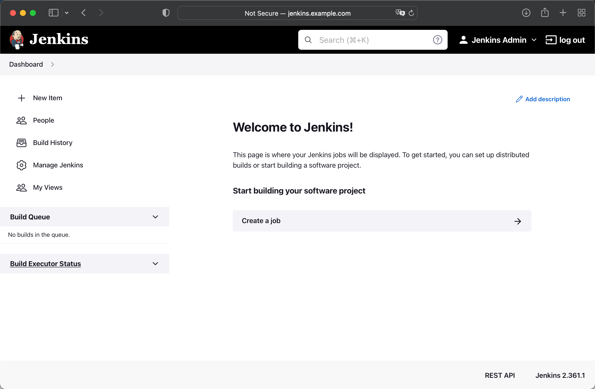

# 离线部署

// TODO(daniel-hutao): to update according helm-installer plugin added.

本文将和你介绍如何在离线环境中使用 DevStream。

!!! info "提醒"

    当前并不是所有 DevStream 插件都支持离线部署，具体支持情况请查看具体的插件文档确认。
    本文以 Jenkins + Harbor 两个插件为例演示离线部署流程。

## 1、下载 dtm 和 DevStream Plugins

首先你需要下载 DevStream 的命令行（CLI）工具 `dtm` 和所需的 DevStream 插件（plugins）。

### 1.1、下载 dtm

你可以在 [Release](https://github.com/devstream-io/devstream/releases/) 页面找到当前最新版本 `dtm`，然后点击下载。
需要注意的是当前 `dtm` 提供了多个版本，分别是：

1. Darwin/arm64
2. Darwin/amd64
3. Linux/amd64

你需要选择自己需要的正确版本。下载到本地后，你可以选择将其重命名，移入包含在"$PATH"的目录里并赋予其可执行权限，比如在 Linux 上你可以执行如下命令完成这些操作：

```shell
mv dtm-linux-amd64 /usr/local/bin/dtm
chmod +x dtm
```

接着你可以通过如下命令验证 dtm 的权限以及版本等是否正确：

```shell
$ dtm version
0.9.1
```

### 1.2、下载 plugins

```shell
dtm init --download-only --plugins="jenkins, harbor" -d=plugins
```

这条命令执行成功后，你可以在本地 plugins 目录下看到如下文件：

```shell
$ ls
harbor-linux-amd64_0.9.1.md5  harbor-linux-amd64_0.9.1.so  jenkins-linux-amd64_0.9.1.md5  jenkins-linux-amd64_0.9.1.so
```

## 2、下载镜像

如果 DevStream 的某个插件是使用容器化方式部署一个应用，那么其在支持离线部署的时候，就一定会提供镜像列表。比如 Jenkins 和 Harbor 的镜像列表分别如下：

1. [Jenkins images](../plugins/helm-installer/jenkins/jenkins-images.txt)
2. [Harbor images](../plugins/helm-installer/harbor/harbor-images.txt)

你可以通过如下命令将镜像列表下载到本地：

```shell
curl -o jenkins-images.txt https://raw.githubusercontent.com/devstream-io/devstream/main/docs/plugins/jenkins/jenkins-images.txt
curl -o harbor-images.txt https://raw.githubusercontent.com/devstream-io/devstream/main/docs/plugins/harbor/harbor-images.txt
```

另外 DevStream 提供了一个工具脚本用于帮助你快速将这些镜像下载到本地并且上传到私有镜像仓库，你可以通过如下命令下载这个脚本并赋予可执行权限：

```shell
curl -o image-pull-push.sh https://raw.githubusercontent.com/devstream-io/devstream/main/hack/image-pull-push.sh
chmod +x image-pull-push.sh
```

如果你还没有一个私有镜像仓库，可以参考[这篇文章](./image-registry.zh.md)快速部署一个 Docker Registry。

接下来，你就可以通过下述命令快速完成镜像的下载和上传了：

```shell
# 查看工具脚本的使用方法和注意事项等
./image-pull-push.sh -h # (1)
# 设置镜像仓库地址，按需修改
export IMAGE_REPO_ADDR=harbor.devstream.io
# 下载 xxx-images.txt 中所有镜像并保存到本地压缩包中
./image-pull-push.sh -f harbor-images.txt -r ${IMAGE_REPO_ADDR} -s
./image-pull-push.sh -f jenkins-images.txt -r ${IMAGE_REPO_ADDR} -s
# 从压缩包中 load 镜像并 push 到私有镜像仓库（如果镜像仓库需要登录，则需要先手动执行 docker login）
./image-pull-push.sh -f harbor-images.txt -r ${IMAGE_REPO_ADDR} -l -u
./image-pull-push.sh -f jenkins-images.txt -r ${IMAGE_REPO_ADDR} -l -u
```

1. 强烈建议你先看下本脚本的使用说明和示例

!!! note "注意"

    如果你下载镜像的机器和内部私有镜像仓库之间网络隔离，那么你可以在镜像下载到本地压缩包后，先将该压缩包复制到能够访问镜像仓库的机器上，然后再执行 load 和 push 等操作。

## 3、下载 Helm Chart 包

你可以通过如下命令下载 Harbor 和 Jenkins 的 Helm chart 包：

```shell
helm repo add harbor https://helm.goharbor.io
helm repo update
helm search repo harbor -l
helm pull harbor/harbor --version=1.10.0
```

```shell
helm repo add jenkins https://charts.jenkins.io
helm repo update
helm search repo jenkins -l
helm pull jenkins/jenkins --version=4.2.5
```

执行完上述命令后，你可以在本地看到如下文件：

```shell
$ ls
harbor-1.10.0.tgz jenkins-4.2.5.tgz
```

## 4、准备配置文件

这时候部署 Jenkins 和 Harbor 所需要的"物料"就准备好了。你可以准备配置文件，开始部署 Jenkins 和 Harbor。

### 4.1、编写插件配置（plugin config）

你可以这样编写两个插件的配置：

=== "jenkins 插件"

    jenkins 插件的参考配置：

    ```yaml title="Plugin Config with jenkins"
    ---
    # plugin config
    tools:
    - name: jenkins
      instanceID: default
      dependsOn: [ ]
      options:
        chart:
          chartPath: "./jenkins-4.2.5.tgz"
          valuesYaml: |
            serviceAccount:
              create: true
              name: jenkins
            persistence:
              storageClass: ""
            controller:
              image: [[ imageRepo ]]/devstreamdev/jenkins
              tag: 2.361.1-jdk11-dtm-0.1
              imagePullPolicy: "IfNotPresent"
              sidecars:
                configAutoReload:
                  image: [[ imageRepo ]]/kiwigrid/k8s-sidecar:1.15.0
              adminUser: "admin"
              adminPassword: "changeme"
              ingress:
                enabled: true
                hostName: [[ jenkinsURL ]]
            # Enable HTML parsing using OWASP Markup Formatter Plugin (antisamy-markup-formatter), useful with ghprb plugin.
            enableRawHtmlMarkupFormatter: true
            # Jenkins Configuraction as Code, refer to https://plugins.jenkins.io/configuration-as-code/ for more details
            # notice: All configuration files that are discovered MUST be supplementary. They cannot overwrite each other's configuration values. This creates a conflict and raises a ConfiguratorException.
            JCasC:
              defaultConfig: true
            agent:
              image: [[ imageRepo ]]/jenkins/inbound-agent
              tag: 4.11.2-4
            backup:
              image:
                repository: [[ imageRepo ]]/maorfr/kube-tasks
                tag: 0.2.0
    ```

    关于 jenkins 插件的详细文档可以看[ jenkins 插件文档](../plugins/helm-installer/helm-installer.zh.md)。

=== "harbor 插件"

    harbor 插件的参考配置：

    ```yaml title="Plugin Config with harbor"
    ---
    # plugin config
    tools:
    - name: harbor
      instanceID: default
      dependsOn: [ ]
      options:
        chart:
          chartPath: "./harbor-1.10.0.tgz"
          valuesYaml: |
            externalURL: http://[[ harborURL ]]
            expose:
              type: ingress
              tls:
                enabled: false
              ingress:
                hosts:
                  core: [[ harborURL ]]
            nginx:
              image:
                repository: [[ imageRepo ]]/goharbor/nginx-photon
                tag: v2.5.3
            portal:
              image:
                repository: [[ imageRepo ]]/goharbor/harbor-portal
                tag: v2.5.3
            core:
              image:
                repository: [[ imageRepo ]]/goharbor/harbor-core
                tag: v2.5.3
            jobservice:
              image:
                repository: [[ imageRepo ]]/goharbor/harbor-jobservice
                tag: v2.5.3
            registry:
              registry:
                image:
                  repository: [[ imageRepo ]]/goharbor/registry-photon
                  tag: v2.5.3
              controller:
                image:
                  repository: [[ imageRepo ]]/goharbor/harbor-registryctl
                  tag: v2.5.3
            chartmuseum:
              enabled: false
              image:
                repository: [[ imageRepo ]]/goharbor/chartmuseum-photon
                tag: v2.5.3
            trivy:
              enabled: false
              image:
                repository: [[ imageRepo ]]/goharbor/trivy-adapter-photon
                tag: v2.5.3
            notary:
              enabled: false
              server:
                image:
                  repository: [[ imageRepo ]]/goharbor/notary-server-photon
                  tag: v2.5.3
              signer:
                image:
                  repository: [[ imageRepo ]]/goharbor/notary-signer-photon
                  tag: v2.5.3
            database:
              internal:
                image:
                  repository: [[ imageRepo ]]/goharbor/harbor-db
                  tag: v2.5.3
            redis:
              internal:
                image:
                  repository: [[ imageRepo ]]/goharbor/redis-photon
                  tag: v2.5.3
            exporter:
              image:
                repository: [[ imageRepo ]]/goharbor/harbor-exporter
                tag: v2.5.3
            persistence:
              persistentVolumeClaim:
                registry:
                  storageClass: ""
                  accessMode: ReadWriteOnce
                  size: 5Gi
                jobservice:
                  storageClass: ""
                  accessMode: ReadWriteOnce
                  size: 1Gi
                database:
                  storageClass: ""
                  accessMode: ReadWriteOnce
                  size: 1Gi
                redis:
                  storageClass: ""
                  accessMode: ReadWriteOnce
                  size: 1Gi
    ```    
    关于 harbor 插件的详细文档可以看[ harbor 插件文档](../plugins/helm-installer/helm-installer.zh.md)。

### 4.2、编写主配置和变量配置

除了插件配置外，我们还需要准备"主配置"（core config）和"变量配置"（variable config）：

最简单的 core config 是以 **local** 作为 Backend，也就是将状态保存到本地文件；
企业 On premise 环境部署可以选择使用 **k8s** Backend 将状态通过 `kube-apiserver` 存入 etcd，两种方式配置分别如下：

=== "Core Config with 'local' Backend"

    ```yaml title="local Backend"
    varFile: "" # If not empty, use the specified external variables config file
    toolFile: "" # If not empty, use the specified external tools config file
    pluginDir: "./plugins" # If empty, use the default value: ~/.devstream/plugins, or use -d flag to specify a directory
    state: # state config, backend can be local, s3 or k8s
      backend: local
      options:
        stateFile: devstream.state
    ```

=== "Core Config with 'k8s' Backend"

    ```yaml title="k8s Backend"
    varFile: "" # If not empty, use the specified external variables config file
    toolFile: "" # If not empty, use the specified external tools config file
    pluginDir: "./plugins" # If empty, use the default value: ~/.devstream/plugins, or use -d flag to specify a directory
    state: # state config, backend can be local, s3 or k8s
      backend: k8s
      options:
        namespace: devstream # optional, default is "devstream", will be created if not exists
        configmap: state # optional, default is "state", will be created if not exists
    ```

同时前面插件配置里还引用了一个变量，你可以这样编写对应的变量配置：

```yaml
---
# variable config
imageRepo: harbor.devstream.io
jenkinsURL: jenkins.example.com
harborURL: harbor.example.com
```

### 4.3、组装完整的配置文件

这时候"主配置"、"变量配置"和"插件配置"都有了，你可以选择将其分别保存到三个不同的文件中，在"主配置"里通过`varFile`和`toolFile`去引用另外两个配置文件，
也可以选择直接将三个配置写入一个文件，就像这样：

```yaml title="config.yaml"
---
# core config
varFile: "" # If not empty, use the specified external variables config file
toolFile: "" # If not empty, use the specified external tools config file
pluginDir: "./plugins" # If empty, use the default value: ~/.devstream/plugins, or use -d flag to specify a directory
state: # state config, backend can be local, s3 or k8s
  backend: k8s
  options:
    namespace: devstream # optional, default is "devstream", will be created if not exists
    configmap: state # optional, default is "state", will be created if not exists

---
# variable config
imageRepo: harbor.devstream.io
jenkinsURL: jenkins.example.com
harborURL: harbor.example.com

---
# plugin config
tools:
- name: jenkins
  instanceID: default
  dependsOn: [ ]
  options:
    chart:
      chartPath: "./jenkins-4.2.5.tgz"
      valuesYaml: |
        serviceAccount:
          create: true
          name: jenkins
        persistence:
          storageClass: ""
        controller:
          image: [[ imageRepo ]]/devstreamdev/jenkins
          tag: 2.361.1-jdk11-dtm-0.1
          imagePullPolicy: "IfNotPresent"
          sidecars:
            configAutoReload:
              image: [[ imageRepo ]]/kiwigrid/k8s-sidecar:1.15.0
          adminUser: "admin"
          adminPassword: "changeme"
          ingress:
            enabled: true
            hostName: [[ jenkinsURL ]]
        # Enable HTML parsing using OWASP Markup Formatter Plugin (antisamy-markup-formatter), useful with ghprb plugin.
        enableRawHtmlMarkupFormatter: true
        # Jenkins Configuraction as Code, refer to https://plugins.jenkins.io/configuration-as-code/ for more details
        # notice: All configuration files that are discovered MUST be supplementary. They cannot overwrite each other's configuration values. This creates a conflict and raises a ConfiguratorException.
        JCasC:
          defaultConfig: true
        agent:
          image: [[ imageRepo ]]/jenkins/inbound-agent
          tag: 4.11.2-4
        backup:
          image:
            repository: [[ imageRepo ]]/maorfr/kube-tasks
            tag: 0.2.0
- name: harbor
  instanceID: default
  dependsOn: [ ]
  options:
    chart:
      chartPath: "./harbor-1.10.0.tgz"
      valuesYaml: |
        externalURL: http://[[ harborURL ]]
        expose:
          type: ingress
          tls:
            enabled: false
          ingress:
            hosts:
              core: [[ harborURL ]]
        nginx:
          image:
            repository: [[ imageRepo ]]/goharbor/nginx-photon
            tag: v2.5.3
        portal:
          image:
            repository: [[ imageRepo ]]/goharbor/harbor-portal
            tag: v2.5.3
        core:
          image:
            repository: [[ imageRepo ]]/goharbor/harbor-core
            tag: v2.5.3
        jobservice:
          image:
            repository: [[ imageRepo ]]/goharbor/harbor-jobservice
            tag: v2.5.3
        registry:
          registry:
            image:
              repository: [[ imageRepo ]]/goharbor/registry-photon
              tag: v2.5.3
          controller:
            image:
              repository: [[ imageRepo ]]/goharbor/harbor-registryctl
              tag: v2.5.3
        chartmuseum:
          enabled: false
          image:
            repository: [[ imageRepo ]]/goharbor/chartmuseum-photon
            tag: v2.5.3
        trivy:
          enabled: false
          image:
            repository: [[ imageRepo ]]/goharbor/trivy-adapter-photon
            tag: v2.5.3
        notary:
          enabled: false
          server:
            image:
              repository: [[ imageRepo ]]/goharbor/notary-server-photon
              tag: v2.5.3
          signer:
            image:
              repository: [[ imageRepo ]]/goharbor/notary-signer-photon
              tag: v2.5.3
        database:
          internal:
            image:
              repository: [[ imageRepo ]]/goharbor/harbor-db
              tag: v2.5.3
        redis:
          internal:
            image:
              repository: [[ imageRepo ]]/goharbor/redis-photon
              tag: v2.5.3
        exporter:
          image:
            repository: [[ imageRepo ]]/goharbor/harbor-exporter
            tag: v2.5.3
        persistence:
          persistentVolumeClaim:
            registry:
              storageClass: ""
              accessMode: ReadWriteOnce
              size: 5Gi
            jobservice:
              storageClass: ""
              accessMode: ReadWriteOnce
              size: 1Gi
            database:
              storageClass: ""
              accessMode: ReadWriteOnce
              size: 1Gi
            redis:
              storageClass: ""
              accessMode: ReadWriteOnce
              size: 1Gi
```

## 5、开始部署

现在你可以通过如下命令开始部署 Jenkins 和 Harbor 了：

```shell
dtm apply -f config.yaml -y
```

!!! note "注意"

    你的 k8s 环境需要有一个 default StorageClass 和一个可用的 Ingress 控制器。

如果成功执行，你可以看到类似如下日志：

```text
2022-09-27 09:08:05 ℹ [INFO]  Apply started.
2022-09-27 09:08:05 ℹ [INFO]  Using dir <./plugins> to store plugins.
2022-09-27 09:08:05 ℹ [INFO]  Using configmap backend. Namespace: devstream, ConfigMap name: state.
2022-09-27 09:08:05 ℹ [INFO]  Tool (jenkins/default) found in config but doesn't exist in the state, will be created.
2022-09-27 09:08:05 ℹ [INFO]  Tool (harbor/default) found in config but doesn't exist in the state, will be created.
2022-09-27 09:08:05 ℹ [INFO]  Start executing the plan.
2022-09-27 09:08:05 ℹ [INFO]  Changes count: 2.
2022-09-27 09:08:05 ℹ [INFO]  -------------------- [  Processing progress: 1/2.  ] --------------------
2022-09-27 09:08:05 ℹ [INFO]  Processing: (jenkins/default) -> Create ...
2022-09-27 09:08:05 ℹ [INFO]  The chart package already exists in the cache directory.
2022-09-27 09:08:05 ℹ [INFO]  Creating or updating helm chart ...
2022/09/27 09:08:06 creating 13 resource(s)
2022/09/27 09:08:06 beginning wait for 13 resources with timeout of 5m0s
2022/09/27 09:08:06 StatefulSet is not ready: jenkins/jenkins. 0 out of 1 expected pods are ready
...
2022/09/27 09:08:46 StatefulSet is not ready: jenkins/jenkins. 0 out of 1 expected pods are ready
2022/09/27 09:08:48 release installed successfully: jenkins/jenkins-4.2.5
2022-09-27 09:08:48 ✔ [SUCCESS]  Tool (jenkins/default) Create done.
2022-09-27 09:08:48 ℹ [INFO]  -------------------- [  Processing progress: 2/2.  ] --------------------
2022-09-27 09:08:48 ℹ [INFO]  Processing: (harbor/default) -> Create ...
2022-09-27 09:08:48 ℹ [INFO]  The chart package already exists in the cache directory.
2022-09-27 09:08:48 ℹ [INFO]  Creating or updating helm chart ...
2022/09/27 09:08:49 creating 28 resource(s)
2022/09/27 09:08:49 beginning wait for 28 resources with timeout of 10m0s
2022/09/27 09:08:49 Deployment is not ready: harbor/harbor-core. 0 out of 1 expected pods are ready
...
2022/09/27 09:09:17 Deployment is not ready: harbor/harbor-core. 0 out of 1 expected pods are ready
2022/09/27 09:09:19 Deployment is not ready: harbor/harbor-jobservice. 0 out of 1 expected pods are ready
...
2022/09/27 09:09:37 Deployment is not ready: harbor/harbor-jobservice. 0 out of 1 expected pods are ready
2022/09/27 09:09:39 release installed successfully: harbor/harbor-1.10.0
2022-09-27 09:09:39 ✔ [SUCCESS]  Tool (harbor/default) Create done.
2022-09-27 09:09:39 ℹ [INFO]  -------------------- [  Processing done.  ] --------------------
2022-09-27 09:09:39 ✔ [SUCCESS]  All plugins applied successfully.
2022-09-27 09:09:39 ✔ [SUCCESS]  Apply finished.
```

## 6、验证部署结果

你可以通过如下方式验证 Jenkins 和 Harbor 两个工具的部署结果。

### 6.1、DNS 配置

如果你执行 `kubectl get ingress -A` 命令，可以看到 Ingress 信息：

```shell
NAMESPACE   NAME             CLASS   HOSTS                 ADDRESS      PORTS   AGE
harbor      harbor-ingress   nginx   harbor.example.com    10.18.7.29   80      40s
jenkins     jenkins          nginx   jenkins.example.com   10.18.7.29   80      5m
```

!!! Tip "说明"

    演示环境是一台云主机，其内部 IP 是 10.18.7.29，公网 IP 是 11.22.33.44，
    所以下面很多地方也可以成内部 IP，但是为了方便，下文一律以公网 IP 为例。

前面 Jenkins 和 Harbor 三个工具的配置文件里我们都设置了域名，你可以直接将这些域名与 IP 的映射关系配置到 DNS 服务器里。

如果没有 DNS 服务器，你也可以直接将域名与 IP 的映射关系配置到 `/etc/hosts` 以及 `CoreDNS` 的 ConfigMap `kube-system/coredns` 里让域名生效。比如：

1. 修改 `/etc/hosts` 文件，添加这条记录：

    ```shell title="dns record"
    11.22.33.44 jenkins.example.com harbor.example.com
    ```

2. 修改 `CoreDNS` 的配置，在 ConfigMap `kube-system/coredns` 中添加静态解析记录：

    1. 执行命令：`kubectl edit cm coredns -n kube-system`；
    2. 在 hosts 部分添加和 /etc/hosts 一样的记录。下面 Corefile 配置供参考：
    ```json
    .:53 {
        errors
        health {
           lameduck 5s
        }
        ready
        kubernetes cluster.local in-addr.arpa ip6.arpa {
           pods insecure
           fallthrough in-addr.arpa ip6.arpa
           ttl 30
        }
        prometheus :9153
        hosts {
           11.22.33.44 jenkins.example.com harbor.example.com
           fallthrough
        }
        forward . /etc/resolv.conf {
           max_concurrent 1000
        }
        cache 30
        loop
        reload
        loadbalance
    }
    ```

这时候在当前主机上，就可以分别通过如下地址访问到 Jenkins 和 Harbor 了：

- `Jenkins`: http://jenkins.example.com
- `Harbor`: http://harbor.example.com

你使用的主机上可能没有浏览器，这时候你可以通过 curl 初步先验证 GitLab、Jenkins 和 Harbor 是否可访问。

### 6.3、访问 Jenkins

你需要在自己的 PC 里配置 `11.22.33.44 jenkins.example.com` 静态域名解析记录，接着在浏览器里通过 `http://jenkins.example.com` 访问到 Jenkins：

<figure markdown>
  { width="1000" }
  <figcaption>Jenkins login page</figcaption>
</figure>

Jenkins 的 admin 用户初始登录密码是 `changeme`，如果你仔细看了前面 dtm 使用的配置文件，可以发现这是在配置文件里指定的。你可以尝试用 `admin/changeme` 登录 Jenkins 检查功能是否正常，不过你不需要在 Jenkins 上进行任何额外的操作。

<figure markdown>
  { width="1000" }
  <figcaption>Jenkins dashboard</figcaption>
</figure>

### 6.4、访问 Harbor

你可以通过 `docker login harbor.example.com:80` 命令来尝试登录 Harbor。

如果需要在本地浏览器里访问 Harbor 页面，你需要在自己的 PC 里配置 `11.22.33.44 harbor.example.com` 静态域名解析记录，接着在浏览器里通过 `http://harbor.example.com` 访问到 Harbor：

<figure markdown>
  { width="1000" }
  <figcaption>Harbor login page</figcaption>
</figure>

Harbor 的 admin 用户初始登录密码是 `Harbor12345`，你可以尝试用 `admin/Harbor12345` 登录 Harbor 检查功能是否正常，不过你同样不需要在 Harbor 上进行任何额外的操作。

<figure markdown>
  { width="1000" }
  <figcaption>Harbor login page</figcaption>
</figure>
