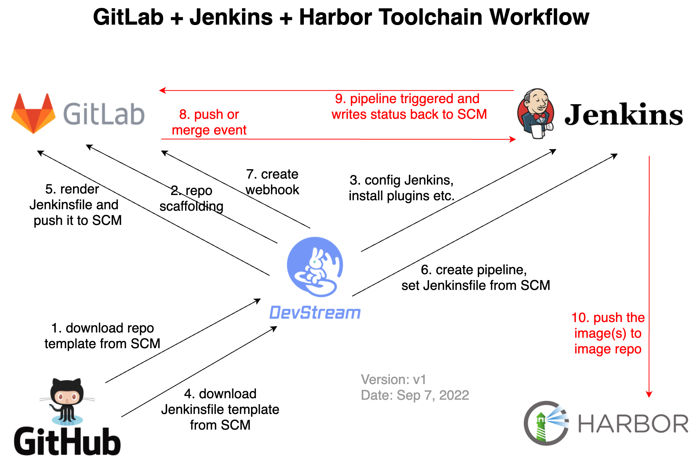
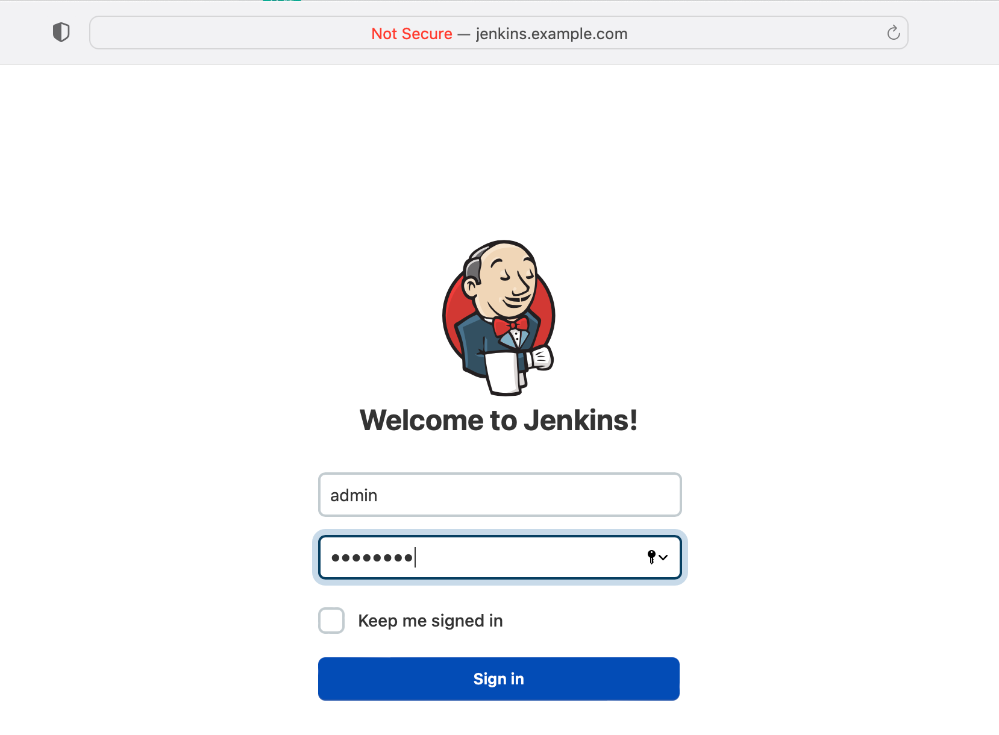
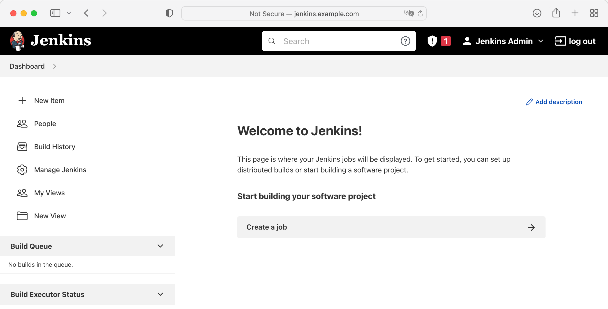
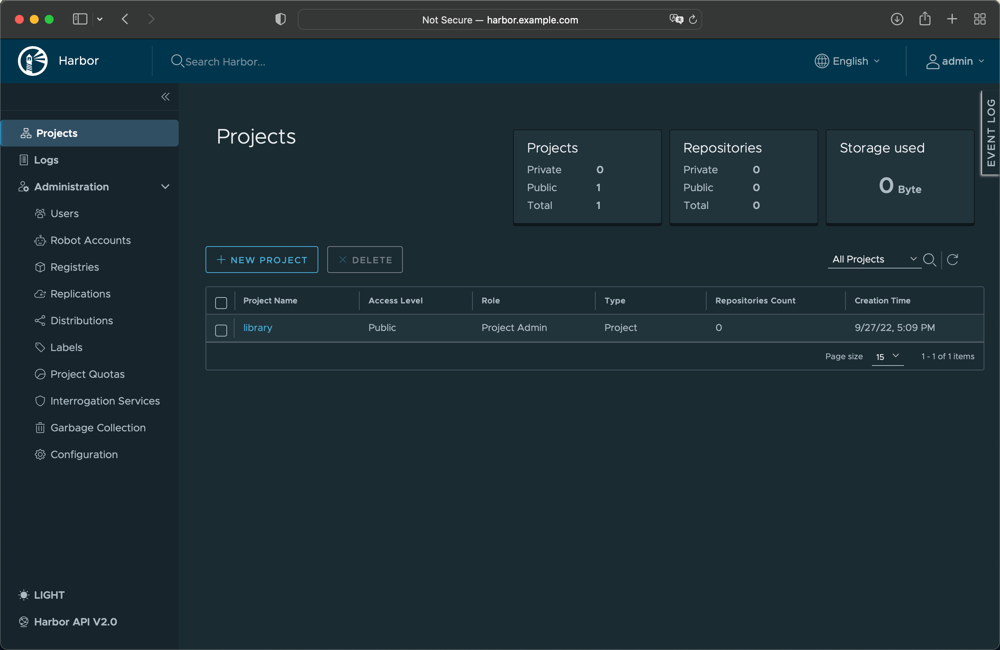
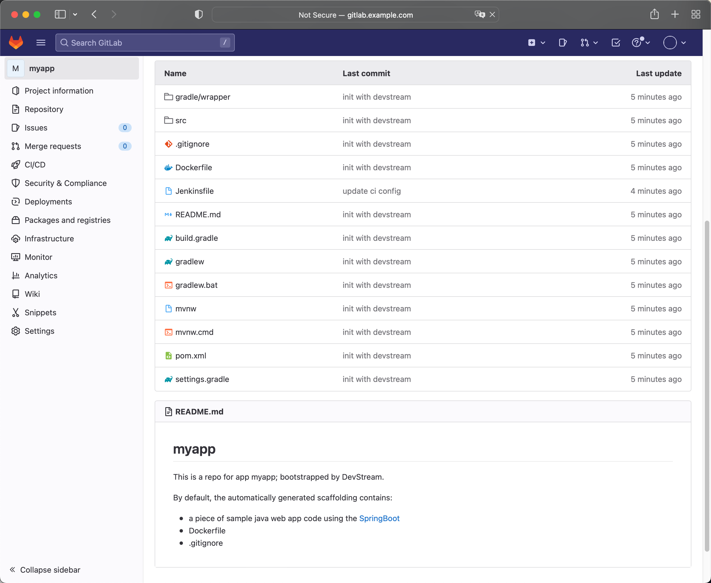
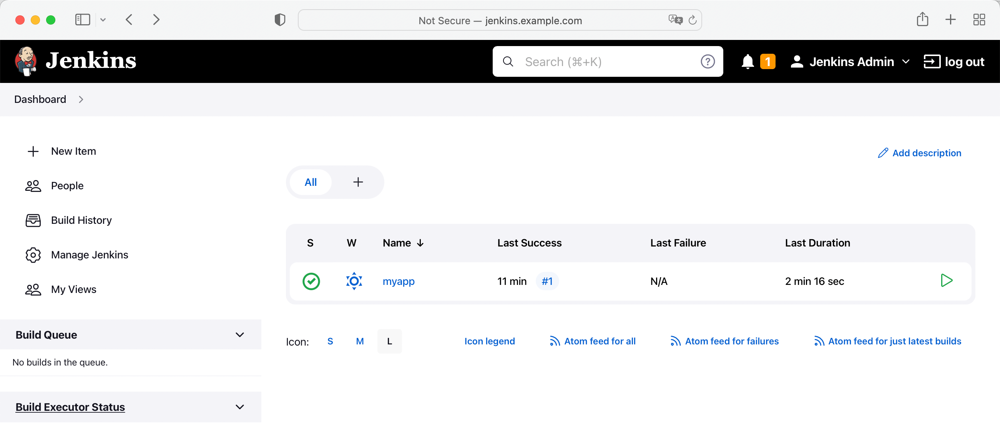

# 本地部署 GitLab + Jenkins + Harbor 工具链

!!! abstract "概述"

    本文将介绍如何通过 DevStream 在本地部署 `GitLab + Jenkins + Harbor` 工具链，并且以 Java Spring Boot 项目为例，
    演示如何通过 DevStream 快速创建 Java Spring Boot 项目脚手架，同时在 Jenkins 上自动创建对应的 Pipeline 实现 Java Spring Boot 项目的 CI 流程。

相关工作流如下图所示：

<figure markdown>
  { width="1000" }
  <figcaption>GitLab + Jenkins + Harbor Toolchain Workflow</figcaption>
</figure>

!!! note "注意"

    这个图中的 GitLab 和 GitHub 可以随意互换，它们只是被当做保存项目脚手架模板库存放地址和脚手架模板渲染后的项目存放地址，DevStream 对 GitHub 和 GitLab 都支持。

## 1、相关插件概览

当前工具链主要涉及如下插件：

- **工具链搭建**
    - [`gitlab-ce-docker`](../plugins/gitlab-ce-docker.zh.md)：本地部署 GitLab 环境；
    - [`jenkins`](../plugins/jenkins.zh.md)：本地部署 Jenkins 环境；
    - [`harbor`](../plugins/harbor.zh.md)：本地部署 Harbor 环境。
- **工具链使用**
    - [`repo-scaffolding`](../plugins/repo-scaffolding.zh.md)：创建 Java Spring Boot 项目脚手架；
    - [`jenkins-pipeline`](../plugins/jenkins-pipeline.zh.md)：在 Jenkins 上创建 Pipeline，并打通 GitLab 与 Jenkins，实现 GitLab 上发生 Push/Merge 等事件时触发 Jenkins Pipeline 运行，并且让 Pipeline 状态能够回写到 GitLab。

!!! hint "提示"

    上述插件不是必选集，你可以根据实际情况灵活调整。比如你本地已经有 GitLab 环境了，那么你可以果断忽略 `gitlab-ce-docker` 插件。

上述插件的依赖关系为：

- jenkins-pipeline -> jenkins, gitlab-ce-docker, repo-scaffolding, harbor
- repo-scaffolding -> gitlab-ce-docker

!!! note "说明"

    A -> B 表示的是 A 依赖 B。

    这里所描述的依赖关系并不是说 jenkins-pipeline -> jenkins 就要求必须 jenkins 部署完成才能部署 jenkins-pipeline 插件，
    而是强调 jenkins-pipeline 需要有一个可用的 Jenkins 环境可以对接。如果你本地已经有 Jenkins 环境了，那么你完全可以忽略这个依赖关系，
    直接在 jenkins-pipeline 插件里配置你的自建 Jenkins 环境连接信息即可。

## 2、部署流程介绍

考虑到插件的依赖顺序，外加 Jenkins、GitLab、Harbor 等工具的部署属于"基础设施"，几乎只需要执行一次，
而 Repo Scaffolding 和 Jenkins Pipeline 的创建属于"配置"过程，可能要执行多次（比如不断新增 Repo 和 Pipeline 等），
所以我们分2步来完成这条工具链的搭建过程。

1. 使用 `gitlab-ce-docker`、`jenkins` 和 `harbor` 三个插件完成 GitLab、Jenkins 和 Harbor 工具的部署；
2. 使用 `repo-scaffolding` 和 `jenkins-pipeline` 两个插件完成 Java Spring Boot 项目脚手架的创建和 Jenkins Pipeline 的配置。

!!! note "注意"

    DevStream 的配置文件分为 core config、plugins config 和 variables config，下文将详细介绍如何编写相应的配置文件，完成上述工具的部署和配置流程。

## 3、准备主配置（core config）

最简单的 core config 是以 **local** 作为 Backend，也就是将状态保存到本地文件；
企业 On premise 环境部署可能需要使用 **k8s** Backend 将状态通过 `kube-apiserver` 存入 etcd，两种方式配置分别如下：

=== "Core Config with 'local' Backend"

    ```yaml title="local Backend"
    varFile: "" # If not empty, use the specified external variables config file
    toolFile: "" # If not empty, use the specified external tools config file
    pluginDir: "" # If empty, use the default value: ~/.devstream/plugins, or use -d flag to specify a directory
    state: # state config, backend can be local, s3 or k8s
      backend: local
      options:
        stateFile: devstream.state
    ```

=== "Core Config with 'k8s' Backend"

    ```yaml title="k8s Backend"
    varFile: "" # If not empty, use the specified external variables config file
    toolFile: "" # If not empty, use the specified external tools config file
    pluginDir: "" # If empty, use the default value: ~/.devstream/plugins, or use -d flag to specify a directory
    state: # state config, backend can be local, s3 or k8s
      backend: k8s
      options:
        namespace: devstream # optional, default is "devstream", will be created if not exists
        configmap: state # optional, default is "state", will be created if not exists
    ```

下文将以 `local` Backend 为例演示。

## 4、准备工具链相关插件的配置（plugin config）

本节继续介绍 gitlab-ce-docker、jenkins 和 harbor 三个插件对应的 plugin configs。你可以点击下方 tag 按钮进行切换：

=== "gitlab-ce-docker 插件"

    gitlab-ce-docker 插件的配置如下（该插件的详细文档参见[ gitlab-ce-docker 插件文档](../plugins/gitlab-ce-docker.zh.md)）：
    
    ```yaml title="Plugin Config with gitlab-ce-docker"
    - name: gitlab-ce-docker
      instanceID: default
      dependsOn: [ ]
      options:
        hostname: gitlab.example.com
        gitlabHome: /srv/gitlab
        sshPort: 30022
        httpPort: 30080
        httpsPort: 30443
        rmDataAfterDelete: false
        imageTag: "rc"
    ```

=== "jenkins 插件"

    jenkins 插件的配置如下（该插件的详细文档参见[ jenkins 插件文档](../plugins/jenkins.zh.md)）：
    
    ```yaml title="Plugin Config with jenkins"
    - name: jenkins
      instanceID: default
      dependsOn: [ ]
      options:
        repo:
          name: jenkins
          url: https://charts.jenkins.io
        chart:
          chartPath: ""
          chartName: jenkins/jenkins
          namespace: jenkins
          wait: true
          timeout: 5m
          upgradeCRDs: true
          valuesYaml: |
            serviceAccount:
              create: true
              name: jenkins
            controller:
              adminUser: "admin"
              adminPassword: "changeme"
              ingress:
                enabled: true
                hostName: jenkins.example.com
              installPlugins:
                - kubernetes:3600.v144b_cd192ca_a_
                - workflow-aggregator:581.v0c46fa_697ffd
                - git:4.11.3
                - configuration-as-code:1512.vb_79d418d5fc8
              additionalPlugins:
                # install "GitHub Pull Request Builder" plugin, see https://plugins.jenkins.io/ghprb/ for more details
                - ghprb
                # install "OWASP Markup Formatter" plugin, see https://plugins.jenkins.io/antisamy-markup-formatter/ for more details
                - antisamy-markup-formatter
            # Enable HTML parsing using OWASP Markup Formatter Plugin (antisamy-markup-formatter), useful with ghprb plugin.
            enableRawHtmlMarkupFormatter: true
            # Jenkins Configuraction as Code, refer to https://plugins.jenkins.io/configuration-as-code/ for more details
            # notice: All configuration files that are discovered MUST be supplementary. They cannot overwrite each other's configuration values. This creates a conflict and raises a ConfiguratorException.
            JCasC:
              defaultConfig: true
    ```

=== "harbor 插件"

    harbor 插件的配置如下（该插件的详细文档参见[ harbor 插件文档](../plugins/harbor.zh.md)）：
    
    ```yaml title="Plugin Config with harbor"
    - name: harbor
      instanceID: default
      dependsOn: [ ]
      options:
        chart:
          valuesYaml: |
            externalURL: http://harbor.example.com
            expose:
              type: ingress
              tls:
                enabled: false
              ingress:
                hosts:
                  core: harbor.example.com
            chartmuseum:
              enabled: false
            notary:
              enabled: false
            trivy:
              enabled: false
            persistence:
              persistentVolumeClaim:
                registry:
                  storageClass: ""
                  accessMode: ReadWriteOnce
                  size: 5Gi
                jobservice:
                  storageClass: ""
                  accessMode: ReadWriteOnce
                  size: 1Gi
                database:
                  storageClass: ""
                  accessMode: ReadWriteOnce
                  size: 1Gi
                redis:
                  storageClass: ""
                  accessMode: ReadWriteOnce
                  size: 1Gi
    ```

## 5、开始部署 GitLab + Jenkins + Harbor 工具链

上文分别介绍了 core config 和 gitlab-ce-docker、jenkins、harbor 三个插件对应的 plugin configs，将其串在一起后完整的配置文件如下：

```yaml title="config.yaml"
---
varFile: "" # If not empty, use the specified external variables config file
toolFile: "" # If not empty, use the specified external tools config file
pluginDir: "" # If empty, use the default value: ~/.devstream/plugins, or use -d flag to specify a directory
state: # state config, backend can be local, s3 or k8s
  backend: local
  options:
    stateFile: devstream-1.state
---
tools:
- name: gitlab-ce-docker
  instanceID: default
  dependsOn: [ ]
  options:
    hostname: gitlab.example.com
    gitlabHome: /srv/gitlab
    sshPort: 30022
    httpPort: 30080
    httpsPort: 30443
    rmDataAfterDelete: false
    imageTag: "rc"
- name: jenkins
  instanceID: default
  dependsOn: [ ]
  options:
    repo:
      name: jenkins
      url: https://charts.jenkins.io
    chart:
      chartPath: ""
      chartName: jenkins/jenkins
      namespace: jenkins
      wait: true
      timeout: 5m
      upgradeCRDs: true
      valuesYaml: |
        serviceAccount:
          create: true
          name: jenkins
        controller:
          adminUser: "admin"
          adminPassword: "changeme"
          ingress:
            enabled: true
            hostName: jenkins.example.com
          installPlugins:
            - kubernetes:3600.v144b_cd192ca_a_
            - workflow-aggregator:581.v0c46fa_697ffd
            - git:4.11.3
            - configuration-as-code:1512.vb_79d418d5fc8
          additionalPlugins:
            # install "GitHub Pull Request Builder" plugin, see https://plugins.jenkins.io/ghprb/ for more details
            - ghprb
            # install "OWASP Markup Formatter" plugin, see https://plugins.jenkins.io/antisamy-markup-formatter/ for more details
            - antisamy-markup-formatter
        # Enable HTML parsing using OWASP Markup Formatter Plugin (antisamy-markup-formatter), useful with ghprb plugin.
        enableRawHtmlMarkupFormatter: true
        # Jenkins Configuraction as Code, refer to https://plugins.jenkins.io/configuration-as-code/ for more details
        # notice: All configuration files that are discovered MUST be supplementary. They cannot overwrite each other's configuration values. This creates a conflict and raises a ConfiguratorException.
        JCasC:
          defaultConfig: true
- name: harbor
  instanceID: default
  dependsOn: [ ]
  options:
    chart:
      valuesYaml: |
        externalURL: http://harbor.example.com
        expose:
          type: ingress
          tls:
            enabled: false
          ingress:
            hosts:
              core: harbor.example.com
        chartmuseum:
          enabled: false
        notary:
          enabled: false
        trivy:
          enabled: false
        persistence:
          persistentVolumeClaim:
            registry:
              storageClass: ""
              accessMode: ReadWriteOnce
              size: 5Gi
            jobservice:
              storageClass: ""
              accessMode: ReadWriteOnce
              size: 1Gi
            database:
              storageClass: ""
              accessMode: ReadWriteOnce
              size: 1Gi
            redis:
              storageClass: ""
              accessMode: ReadWriteOnce
              size: 1Gi
```

!!! tip "提醒"

    注意：这里的 `state.options.stateFile` 改成了 `devstream-1.state`，这是为了避免和下文第二个 state 文件冲突。

你可以将这个配置文件（config.yaml）放到服务器上任意一个合适的目录，比如 `~/devstream-test/`，然后在该目录下执行：

```shell title="初始化命令"
dtm init -f config.yaml
```

这个命令用于下载所需插件。接着你就可以执行 apply 命令了：

```shell title="开始部署"
dtm apply -f config.yaml -y
```

这个命令执行成功的话，你可以看到大致如下日志：

```shell title="部署日志"
2022-09-06 09:43:13 ℹ [INFO]  Apply started.
2022-09-06 09:43:13 ℹ [INFO]  Using dir </root/.devstream/plugins> to store plugins.
2022-09-06 09:43:13 ℹ [INFO]  Using local backend. State file: devstream-1.state.
2022-09-06 09:43:13 ℹ [INFO]  Tool (gitlab-ce-docker/default) found in config but doesn't exist in the state, will be created.
2022-09-06 09:43:13 ℹ [INFO]  Tool (jenkins/default) found in config but doesn't exist in the state, will be created.
2022-09-06 09:43:13 ℹ [INFO]  Tool (harbor/default) found in config but doesn't exist in the state, will be created.
2022-09-06 09:43:13 ℹ [INFO]  Start executing the plan.
2022-09-06 09:43:13 ℹ [INFO]  Changes count: 3.
2022-09-06 09:43:13 ℹ [INFO]  -------------------- [  Processing progress: 1/3.  ] --------------------
2022-09-06 09:43:13 ℹ [INFO]  Processing: (gitlab-ce-docker/default) -> Create ...
2022-09-06 09:43:13 ℹ [INFO]  Cmd: docker image ls gitlab/gitlab-ce:rc -q.
2022-09-06 09:43:13 ℹ [INFO]  Running container as the name <gitlab>
2022-09-06 09:43:13 ℹ [INFO]  Cmd: docker run --detach --hostname gitlab.example.com --publish 30022:22 --publish 30080:80 --publish 30443:443 --name gitlab --restart always --volume /srv/gitlab/config:/etc/gitlab --volume /srv/gitlab/data:/var/opt/gitlab --volume /srv/gitlab/logs:/var/log/gitlab gitlab/gitlab-ce:rc.
Stdout: 53e30ad85faf7e9d6d18764450bb8458db46b388b690b7c8b7a7cc6d0deb283a
2022-09-06 09:43:14 ℹ [INFO]  Cmd: docker inspect --format='{{json .Mounts}}' gitlab.
2022-09-06 09:43:14 ℹ [INFO]  GitLab access URL: http://gitlab.example.com:30080
2022-09-06 09:43:14 ℹ [INFO]  GitLab initial root password: execute the command -> docker exec -it gitlab grep 'Password:' /etc/gitlab/initial_root_password
2022-09-06 09:43:14 ✔ [SUCCESS]  Tool (gitlab-ce-docker/default) Create done.
2022-09-06 09:43:14 ℹ [INFO]  -------------------- [  Processing progress: 2/3.  ] --------------------
2022-09-06 09:43:14 ℹ [INFO]  Processing: (jenkins/default) -> Create ...
2022-09-06 09:43:15 ℹ [INFO]  Creating or updating helm chart ...
2022/09/06 09:43:16 creating 13 resource(s)
2022/09/06 09:43:16 beginning wait for 13 resources with timeout of 5m0s
2022/09/06 09:43:16 StatefulSet is not ready: jenkins/jenkins. 0 out of 1 expected pods are ready
...
2022/09/06 09:44:18 StatefulSet is not ready: jenkins/jenkins. 0 out of 1 expected pods are ready
2022/09/06 09:44:20 release installed successfully: jenkins/jenkins-4.1.17
2022-09-06 09:44:20 ✔ [SUCCESS]  Tool (jenkins/default) Create done.
2022-09-06 09:44:20 ℹ [INFO]  -------------------- [  Processing progress: 3/3.  ] --------------------
2022-09-06 09:44:20 ℹ [INFO]  Processing: (harbor/default) -> Create ...
2022-09-06 09:44:21 ℹ [INFO]  Creating or updating helm chart ...
2022/09/06 09:44:23 creating 28 resource(s)
2022/09/06 09:44:23 beginning wait for 28 resources with timeout of 10m0s
2022/09/06 09:44:24 Deployment is not ready: harbor/harbor-core. 0 out of 1 expected pods are ready
...
2022/09/06 09:46:16 Deployment is not ready: harbor/harbor-jobservice. 0 out of 1 expected pods are ready
2022/09/06 09:46:18 release installed successfully: harbor/harbor-1.10.0
2022-09-06 09:46:19 ✔ [SUCCESS]  Tool (harbor/default) Create done.
2022-09-06 09:46:19 ℹ [INFO]  -------------------- [  Processing done.  ] --------------------
2022-09-06 09:46:19 ✔ [SUCCESS]  All plugins applied successfully.
2022-09-06 09:46:19 ✔ [SUCCESS]  Apply finished.
```

从日志里你可以看到，这时候 GitLab、Jenkins 和 Harbor 就已经部署完成了。

## 6、验证 GitLab + Jenkins + Harbor 三个工具的部署结果

你可以通过如下方式验证 GitLab + Jenkins + Harbor 三个工具的部署结果。

### 6.1、DNS 配置

前面 GitLab + Jenkins + Harbor 三个工具的配置文件里我们都设置了域名，如果是 kubeadm 直接部署的 k8s 集群，你可以直接将这些域名与 IP 的映射关系配置到 DNS 服务器里。

如果没有 DNS 服务器，你也可以直接将域名与 IP 的映射关系配置到 `/etc/hosts` 以及 `CoreDNS` 的 ConfigMap `kube-system/coredns` 里让域名生效。比如：

1. 修改 `/etc/hosts` 文件，添加这条记录：

    ```shell title="dns record"
    44.33.22.11 gitlab.example.com jenkins.example.com harbor.example.com
    ```

2. 修改 `CoreDNS` 的配置，在 ConfigMap `kube-system/coredns` 中添加静态解析记录：

    1. 执行命令：`kubectl edit cm coredns -n kube-system`；
    2. 在 hosts(第20行左右) 部分添加和 /etc/hosts 一样的记录。

??? tip "minikube 环境额外配置内容"

    如果你的环境是 docker-in-docker 的方式部署的 k8s 集群，比如用了 minikube，这时候 DNS 问题就会相对复杂一些。首先你需要获取 minikube ip：

    ```shell
    $ minikube ip
    192.168.49.2
    ```

    如果你执行 `kubectl get ingress -A` 命令，可以看到 Ingress 用的 IP 地址就是这个：
    
    ```shell
    NAMESPACE   NAME             CLASS   HOSTS                 ADDRESS        PORTS   AGE
    harbor      harbor-ingress   nginx   harbor.example.com    192.168.49.2   80      129m
    jenkins     jenkins          nginx   jenkins.example.com   192.168.49.2   80      130m
    ```

    然而主机 IP 并不是192.168.49.2，比如是 44.33.22.11。因此想要访问到 GitLab、Jenkins、Harbor 几个服务并不是太容易。

    你需要在 `/etc/hosts` 里添加如下配置：
    
    ```shell title="dns records"
    44.33.22.11 gitlab.example.com
    192.168.49.2 jenkins.example.com harbor.example.com
    ```

    因为 GitLab 是使用 docker 方式部署的，而 Jenkins 和 Harbor 是通过 k8s 方式部署，然后通过 Ingress 方式暴露服务，所以这里的 IP 并不一样。

    这时候在当前主机上，就可以分别通过如下地址访问到 GitLab、Jenkins 和 Harbor 了：

    - `GitLab`: http://gitlab.example.com:30080
    - `Jenkins`: http://jenkins.example.com
    - `Harbor`: http://harbor.example.com

    接着你还需要修改 `CoreDNS` 的配置，在 ConfigMap `kube-system/coredns` 中添加静态解析记录：

    1. 执行命令：`kubectl edit cm coredns -n kube-system`；
    2. 在 hosts(第20行左右) 部分添加 `44.33.22.11 gitlab.example.com` 和 `192.168.49.2 harbor.example.com` 这两条静态域名解析记录。这样 Jenkins 才能顺利通过域名访问到 GitLab 和 Harbor。

这样 Jenkins 才能通过域名访问到 GitLab。

最后大概率你使用的主机上并没有浏览器，这时候你可以通过 curl 初步验证 GitLab、Jenkins 和 Harbor 是否可访问。假设你的服务器上并没有浏览器，比如你使用的也是一台没有 GUI 的云主机，这时候你可以进一步这样访问三个服务：

### 6.2、访问 GitLab

你可以在自己的 PC 里配置 `44.33.22.11 gitlab.example.com` 静态域名解析记录，然后在浏览器里通过 `http://gitlab.example.com:30080` 访问到 GitLab：

<figure markdown>
  { width="1000" }
  <figcaption>GitLab login page</figcaption>
</figure>

然后通过执行如下命令，你就能获得 GitLab 的初始 root 密码了：

```shell title="get GitLab root Password"
docker exec gitlab cat /etc/gitlab/initial_root_password | grep Password:
```

拿到 root 密码后，你可以尝试用 root/YOUR_PASSWORD 来登录 GitLab。因为后面我们需要用到 GitLab 的 token，所以这时候你可以顺手创建一个 token：

<figure markdown>
  { width="1000" }
  <figcaption>Generate GitLab token</figcaption>
</figure>

### 6.3、访问 Jenkins

前面你可能已经通过 `curl http://jenkins.example.com` 在主机内验证了 Jenkins 的网络连通性，想要远程通过域名访问 Jenkins，你需要在自己的 PC 里配置 `44.33.22.11 jenkins.example.com` 静态域名解析记录。

??? tip "minikube 环境额外配置内容"

    minikube 环境想要远程通过域名访问 Jenkins 并不容易。这时候你可以通过执行如下命令暴露 Jenkins 服务：
    
    ```shell title="Port Forward"
    kubectl port-forward service/jenkins --address 0.0.0.0 -n jenkins 32000:8080
    ```

接着在浏览器里通过 `http://jenkins.example.com:32000` 就可以访问到 Jenkins 了：

<figure markdown>
  { width="1000" }
  <figcaption>Jenkins login page</figcaption>
</figure>

Jenkins 的 admin 用户初始登录密码是 `changeme`，如果你仔细看了前面 dtm 使用的配置文件，可以发现这是在配置文件里指定的。你可以尝试用 `admin/changeme` 登录 Jenkins 检查功能是否正常，不过你不需要在 Jenkins 上进行任何额外的操作。

<figure markdown>
  { width="1000" }
  <figcaption>Jenkins dashboard</figcaption>
</figure>

### 6.4、访问 Harbor

前面你可能已经通过 `curl http://harbor.example.com` 在主机内验证了 Harbor 的网络连通性，同样你可以通过 `docker login harbor.example.com:80` 命令来尝试登录 Harbor。
然后在自己的 PC 里配置 `44.33.22.11 harbor.example.com` 静态域名解析记录。

??? tip "minikube 环境额外配置内容"

    minikube 环境想要远程通过域名访问 Harbor 同样不容易。这时候你可以通过执行如下命令暴露 Harbor 服务：

    ```shell title="Port Forward"
    kubectl port-forward service/harbor-portal --address 0.0.0.0 -n harbor 30180:80
    ```

接着你可以在浏览器里通过 `http://harbor.example.com:30180` 访问到 Harbor：

<figure markdown>
  { width="1000" }
  <figcaption>Harbor login page</figcaption>
</figure>

Harbor 的 admin 用户初始登录密码是 `Harbor12345`，你可以尝试用 `admin/Harbor12345` 登录 Harbor 检查功能是否正常，不过你同样不需要在 Harbor 上进行任何额外的操作。

<figure markdown>
  { width="1000" }
  <figcaption>Harbor dashboard</figcaption>
</figure>

## 7、准备流水线相关插件的配置（plugin config）

本节继续介绍 repo-scaffolding 和 jenkins-pipeline 两个插件对应的 plugin configs。你可以点击下方 tag 按钮进行切换：

=== "repo-scaffolding 插件"

    repo-scaffolding 插件的配置如下（该插件的详细文档参见[ repo-scaffolding 插件文档](../plugins/repo-scaffolding.zh.md)）：
    
    ```yaml
    - name: repo-scaffolding
      instanceID: springboot
      dependsOn: [ ]
      options:
        destinationRepo:
          owner: root
          repo: spring-demo
          branch: master
          repoType: gitlab
          baseURL: http://gitlab.example.com:30080
        sourceRepo:
          owner:  devstream-io
          repo: dtm-repo-scaffolding-java-springboot
          repoType: github
    ```

=== "jenkins-pipeline 插件"

    jenkins-pipeline 插件的配置如下（该插件的详细文档参见[ jenkins-pipeline 插件文档](../plugins/jenkins-pipeline.zh.md)）：

    ```yaml
    - name: jenkins-pipeline
      instanceID: default
      dependsOn: [ ]
      options:
        jenkins:
          url: http://44.33.22.11:32000
          user: admin
          enableRestart: true
        scm:
          cloneURL: http://gitlab.example.com:30080/root/spring-demo
          branch: master
        pipeline:
          jobName: test-job
          jenkinsfilePath: https://raw.githubusercontent.com/devstream-io/dtm-jenkins-pipeline-example/main/springboot/Jenkinsfile
          imageRepo:
            url: http://harbor.example.com:80
            user: admin
    ```

!!! Warning "注意"

    这里需要注意的是 Jenkins 的访问地址需要使用 `http://44.33.22.11:32000`，而不能用域名，因为当前部署架构下 GitLab 并不能解析到 `jenkins.example.com` 这个域名。
    另外 minikube 环境里 GitLab 也无法直接访问到 `http://44.33.22.11:32000` 这个地址，这里还需要通过 kubectl port-forward 的访问转发一次流量。

    在正式的企业环境里，只需要保证 GitLab 能够访问到 Jenkins 即可，如果你的企业里可以通过配置 DNS 等方式让 GitLab 能够完成 jenkins.example.com 域名的解析，
    而且对应的 IP (和端口)可以从 GitLab 访问到，那就可以在这里配置域名。

??? tip "minikube 环境额外配置内容"
    
    你可以执行如下命令保证 Jenkins 可以从 `http://44.33.22.11:32000` 访问到：

    ```shell title="Port Forward"
    kubectl port-forward service/jenkins --address 0.0.0.0 -n jenkins 32000:8080
    ```

## 8、开始应用 repo-scaffolding 和 jenkins-pipeline 插件

上文分别介绍了 repo-scaffolding 和 jenkins-pipeline 两个插件对应的 plugin configs，将其和 core config 串在一起后完整的配置文件如下：

```yaml title="config-pipeline.yaml"
---
varFile: "" # If not empty, use the specified external variables config file
toolFile: "" # If not empty, use the specified external tools config file
pluginDir: "" # If empty, use the default value: ~/.devstream/plugins, or use -d flag to specify a directory
state: # state config, backend can be local, s3 or k8s
  backend: local
  options:
    stateFile: devstream-2.state
---
tools:
- name: repo-scaffolding
  instanceID: springboot
  dependsOn: [ ]
  options:
    destinationRepo:
      owner: root
      repo: spring-demo
      branch: master
      repoType: gitlab
      baseURL: http://gitlab.example.com:30080
    sourceRepo:
      owner:  devstream-io
      repo: dtm-repo-scaffolding-java-springboot
      repoType: github
- name: jenkins-pipeline
  instanceID: default
  dependsOn: [repo-scaffolding.springboot]
  options:
    jenkins:
      url: http://44.33.22.11:32000
      user: admin
      enableRestart: true
    scm:
      cloneURL: http://gitlab.example.com:30080/root/spring-demo
      branch: master
    pipeline:
      jobName: test-job
      jenkinsfilePath: https://raw.githubusercontent.com/devstream-io/dtm-jenkins-pipeline-example/main/springboot/Jenkinsfile
      imageRepo:
        url: http://harbor.example.com:80
        user: admin
```

!!! tip "提醒"

    注意：这里的 `state.options.stateFile` 改成了 `devstream-2.state`，这同样是为了避免和上面第一个 state 文件冲突。

你还记得不，前面我们添加了一个 GitLab 的 token，这个 token 需要被设置到环境变量里：

```shell title="环境变量配置"
export GITLAB_TOKEN=YOUR_GITLAB_TOKEN
```

同时如果你的 Harbor 没有去修改密码，这时候默认密码应该是 Harbor12345，你同样需要将 Harbor 密码配置到环境变量里：

```shell title="环境变量配置"
export IMAGE_REPO_PASSWORD=Harbor12345
```

你可以将这个配置文件放到服务器上同一个目录，比如 `~/devstream-test/`，然后在该目录下执行：

```shell title="初始化 & 开始部署"
dtm init -f config-pipeline.yaml
dtm apply -f config-pipeline.yaml -y
```

如果 apply 命令执行成功的话，你可以看到大致如下日志：

```shell title="执行日志"
2022-09-06 13:19:27 ℹ [INFO]  Apply started.
2022-09-06 13:19:27 ℹ [INFO]  Using dir </root/.devstream/plugins> to store plugins.
2022-09-06 13:19:28 ℹ [INFO]  Using local backend. State file: devstream-2.state.
2022-09-06 13:19:28 ℹ [INFO]  Tool (jenkins-pipeline/default) found in config but doesn't exist in the state, will be created.
2022-09-06 13:19:28 ℹ [INFO]  Start executing the plan.
2022-09-06 13:19:28 ℹ [INFO]  Changes count: 1.
2022-09-06 13:19:28 ℹ [INFO]  -------------------- [  Processing progress: 1/1.  ] --------------------
2022-09-06 13:19:28 ℹ [INFO]  Processing: (jenkins-pipeline/default) -> Create ...
2022-09-06 13:19:28 ℹ [INFO]  Secret jenkins/docker-config has been created.
2022-09-06 13:19:32 ✔ [SUCCESS]  Tool (jenkins-pipeline/default) Create done.
2022-09-06 13:19:32 ℹ [INFO]  -------------------- [  Processing done.  ] --------------------
2022-09-06 13:19:32 ✔ [SUCCESS]  All plugins applied successfully.
2022-09-06 13:19:32 ✔ [SUCCESS]  Apply finished.
```

## 9、验证 repo-scaffolding 和 jenkins-pipeline 两个插件的执行结果

这时候你可以在 GitLab 上看到 dtm 为你准备的 Java Spring Boot 项目脚手架：

<figure markdown>
  { width="1000" }
  <figcaption>Repo scaffolding</figcaption>
</figure>

接着你可以登录 Jenkins，查看 dtm 为你创建的 Pipeline：

<figure markdown>
  { width="1000" }
  <figcaption>Jenkins pipeline</figcaption>
</figure>

Pipeline 成功执行完成后，你可以看到：

<figure markdown>
  { width="1000" }
  <figcaption>Pipeline Success</figcaption>
</figure>

这时候回到 GitLab，你可以看到 Jenkins 回写的 Pipeline 状态：

<figure markdown>
  { width="1000" }
  <figcaption>GitLab Status</figcaption>
</figure>

后面每当 GitLab 上这个 repo 发生 Push 或者 Merge 事件的时候，就会触发 Jenkins 上的 Pipeline 运行。

## 10、环境清理

你可以通过如下命令清理环境：

```shell title="环境清理命令"
dtm delete -f config-pipeline.yaml -y
dtm delete -f config.yaml -y
```

如果这两条命令成功执行，你可以看到大致如下日志：

=== "Pipeline 清理日志"

    ```shell title="清理日志 1"
    2022-09-06 13:46:27 ℹ [INFO]  Delete started.
    2022-09-06 13:46:27 ℹ [INFO]  Using dir </root/.devstream/plugins> to store plugins.
    2022-09-06 13:46:27 ℹ [INFO]  Using local backend. State file: devstream-2.state.
    2022-09-06 13:46:27 ℹ [INFO]  Tool (jenkins-pipeline/default) will be deleted.
    2022-09-06 13:46:27 ℹ [INFO]  Tool (repo-scaffolding/springboot) will be deleted.
    2022-09-06 13:46:27 ℹ [INFO]  Start executing the plan.
    2022-09-06 13:46:27 ℹ [INFO]  Changes count: 2.
    2022-09-06 13:46:27 ℹ [INFO]  -------------------- [  Processing progress: 1/2.  ] --------------------
    2022-09-06 13:46:27 ℹ [INFO]  Processing: (jenkins-pipeline/default) -> Delete ...
    2022-09-06 13:46:29 ℹ [INFO]  Prepare to delete 'jenkins-pipeline_default' from States.
    2022-09-06 13:46:29 ✔ [SUCCESS]  Tool (jenkins-pipeline/default) delete done.
    2022-09-06 13:46:29 ℹ [INFO]  -------------------- [  Processing progress: 2/2.  ] --------------------
    2022-09-06 13:46:29 ℹ [INFO]  Processing: (repo-scaffolding/springboot) -> Delete ...
    2022-09-06 13:46:29 ℹ [INFO]  Prepare to delete 'repo-scaffolding_springboot' from States.
    2022-09-06 13:46:29 ✔ [SUCCESS]  Tool (repo-scaffolding/springboot) delete done.
    2022-09-06 13:46:29 ℹ [INFO]  -------------------- [  Processing done.  ] --------------------
    2022-09-06 13:46:29 ✔ [SUCCESS]  All plugins deleted successfully.
    2022-09-06 13:46:29 ✔ [SUCCESS]  Delete finished.
    ```

=== "工具链清理日志"

    ```shell title="清理日志 2"
    2022-09-06 13:42:38 ℹ [INFO]  Delete started.
    2022-09-06 13:42:38 ℹ [INFO]  Using dir </root/.devstream/plugins> to store plugins.
    2022-09-06 13:42:40 ℹ [INFO]  Using local backend. State file: devstream-2.state.
    2022-09-06 13:42:40 ℹ [INFO]  Tool (jenkins-pipeline/default) will be deleted.
    2022-09-06 13:42:40 ℹ [INFO]  Tool (repo-scaffolding/springboot) will be deleted.
    2022-09-06 13:42:40 ℹ [INFO]  Start executing the plan.
    2022-09-06 13:42:40 ℹ [INFO]  Changes count: 2.
    2022-09-06 13:42:40 ℹ [INFO]  -------------------- [  Processing progress: 1/2.  ] --------------------
    2022-09-06 13:42:40 ℹ [INFO]  Processing: (jenkins-pipeline/default) -> Delete ...
    2022-09-06 13:42:42 ℹ [INFO]  Prepare to delete 'jenkins-pipeline_default' from States.
    2022-09-06 13:42:42 ✔ [SUCCESS]  Tool (jenkins-pipeline/default) delete done.
    2022-09-06 13:42:42 ℹ [INFO]  -------------------- [  Processing progress: 2/2.  ] --------------------
    2022-09-06 13:42:42 ℹ [INFO]  Processing: (repo-scaffolding/springboot) -> Delete ...
    2022-09-06 13:42:42 ℹ [INFO]  Prepare to delete 'repo-scaffolding_springboot' from States.
    2022-09-06 13:42:42 ✔ [SUCCESS]  Tool (repo-scaffolding/springboot) delete done.
    2022-09-06 13:42:42 ℹ [INFO]  -------------------- [  Processing done.  ] --------------------
    2022-09-06 13:42:42 ✔ [SUCCESS]  All plugins deleted successfully.
    2022-09-06 13:42:42 ✔ [SUCCESS]  Delete finished.
    [root@ip-10-3-102-101 test]# dtm apply -f config-pipeline.yaml -y
    2022-09-06 13:43:02 ℹ [INFO]  Apply started.
    2022-09-06 13:43:02 ℹ [INFO]  Using dir </root/.devstream/plugins> to store plugins.
    2022-09-06 13:43:02 ℹ [INFO]  Using local backend. State file: devstream-2.state.
    2022-09-06 13:43:02 ℹ [INFO]  Tool (repo-scaffolding/springboot) found in config but doesn't exist in the state, will be created.
    2022-09-06 13:43:02 ℹ [INFO]  Tool (jenkins-pipeline/default) found in config but doesn't exist in the state, will be created.
    2022-09-06 13:43:02 ℹ [INFO]  Start executing the plan.
    2022-09-06 13:43:02 ℹ [INFO]  Changes count: 2.
    2022-09-06 13:43:02 ℹ [INFO]  -------------------- [  Processing progress: 1/2.  ] --------------------
    2022-09-06 13:43:02 ℹ [INFO]  Processing: (repo-scaffolding/springboot) -> Create ...
    2022-09-06 13:43:03 ✔ [SUCCESS]  Tool (repo-scaffolding/springboot) Create done.
    2022-09-06 13:43:03 ℹ [INFO]  -------------------- [  Processing progress: 2/2.  ] --------------------
    2022-09-06 13:43:03 ℹ [INFO]  Processing: (jenkins-pipeline/default) -> Create ...
    2022-09-06 13:43:03 ℹ [INFO]  Secret jenkins/docker-config has been created.
    2022-09-06 13:43:07 ✔ [SUCCESS]  Tool (jenkins-pipeline/default) Create done.
    2022-09-06 13:43:07 ℹ [INFO]  -------------------- [  Processing done.  ] --------------------
    2022-09-06 13:43:07 ✔ [SUCCESS]  All plugins applied successfully.
    2022-09-06 13:43:07 ✔ [SUCCESS]  Apply finished.
    [root@ip-10-3-102-101 test]#
    [root@ip-10-3-102-101 test]#
    [root@ip-10-3-102-101 test]# dtm delete -f config-pipeline.yaml -y
    2022-09-06 13:46:27 ℹ [INFO]  Delete started.
    2022-09-06 13:46:27 ℹ [INFO]  Using dir </root/.devstream/plugins> to store plugins.
    2022-09-06 13:46:27 ℹ [INFO]  Using local backend. State file: devstream-2.state.
    2022-09-06 13:46:27 ℹ [INFO]  Tool (jenkins-pipeline/default) will be deleted.
    2022-09-06 13:46:27 ℹ [INFO]  Tool (repo-scaffolding/springboot) will be deleted.
    2022-09-06 13:46:27 ℹ [INFO]  Start executing the plan.
    2022-09-06 13:46:27 ℹ [INFO]  Changes count: 2.
    2022-09-06 13:46:27 ℹ [INFO]  -------------------- [  Processing progress: 1/2.  ] --------------------
    2022-09-06 13:46:27 ℹ [INFO]  Processing: (jenkins-pipeline/default) -> Delete ...
    2022-09-06 13:46:29 ℹ [INFO]  Prepare to delete 'jenkins-pipeline_default' from States.
    2022-09-06 13:46:29 ✔ [SUCCESS]  Tool (jenkins-pipeline/default) delete done.
    2022-09-06 13:46:29 ℹ [INFO]  -------------------- [  Processing progress: 2/2.  ] --------------------
    2022-09-06 13:46:29 ℹ [INFO]  Processing: (repo-scaffolding/springboot) -> Delete ...
    2022-09-06 13:46:29 ℹ [INFO]  Prepare to delete 'repo-scaffolding_springboot' from States.
    2022-09-06 13:46:29 ✔ [SUCCESS]  Tool (repo-scaffolding/springboot) delete done.
    2022-09-06 13:46:29 ℹ [INFO]  -------------------- [  Processing done.  ] --------------------
    2022-09-06 13:46:29 ✔ [SUCCESS]  All plugins deleted successfully.
    2022-09-06 13:46:29 ✔ [SUCCESS]  Delete finished.
    [root@ip-10-3-102-101 test]# dtm delete -f config.yaml -y
    2022-09-06 13:46:53 ℹ [INFO]  Delete started.
    2022-09-06 13:46:53 ℹ [INFO]  Using dir </root/.devstream/plugins> to store plugins.
    2022-09-06 13:46:55 ℹ [INFO]  Using local backend. State file: devstream-1.state.
    2022-09-06 13:46:55 ℹ [INFO]  Tool (gitlab-ce-docker/default) will be deleted.
    2022-09-06 13:46:55 ℹ [INFO]  Tool (jenkins/default) will be deleted.
    2022-09-06 13:46:55 ℹ [INFO]  Tool (harbor/default) will be deleted.
    2022-09-06 13:46:55 ℹ [INFO]  Start executing the plan.
    2022-09-06 13:46:55 ℹ [INFO]  Changes count: 3.
    2022-09-06 13:46:55 ℹ [INFO]  -------------------- [  Processing progress: 1/3.  ] --------------------
    2022-09-06 13:46:55 ℹ [INFO]  Processing: (gitlab-ce-docker/default) -> Delete ...
    2022-09-06 13:46:55 ℹ [INFO]  Stopping container gitlab ...
    2022-09-06 13:46:55 ℹ [INFO]  Cmd: docker stop gitlab.
    Stdout: gitlab
    2022-09-06 13:47:06 ℹ [INFO]  Cmd: docker inspect gitlab.
    2022-09-06 13:47:06 ℹ [INFO]  Removing container gitlab ...
    2022-09-06 13:47:06 ℹ [INFO]  Cmd: docker rm gitlab.
    Stdout: gitlab
    2022-09-06 13:47:06 ℹ [INFO]  Cmd: docker inspect gitlab.
    2022-09-06 13:47:06 ℹ [INFO]  Prepare to delete 'gitlab-ce-docker_default' from States.
    2022-09-06 13:47:06 ✔ [SUCCESS]  Tool (gitlab-ce-docker/default) delete done.
    2022-09-06 13:47:06 ℹ [INFO]  -------------------- [  Processing progress: 2/3.  ] --------------------
    2022-09-06 13:47:06 ℹ [INFO]  Processing: (jenkins/default) -> Delete ...
    2022-09-06 13:47:06 ℹ [INFO]  Uninstalling jenkins helm chart.
    2022/09/06 13:47:07 uninstall: Deleting jenkins
    2022/09/06 13:47:07 Starting delete for "jenkins" Ingress
    ...
    2022/09/06 13:47:07 Starting delete for "jenkins" ServiceAccount
    2022/09/06 13:47:07 purge requested for jenkins
    2022/09/06 13:47:07 release uninstalled, response: &{0xc00034a070 }
    2022-09-06 13:47:07 ℹ [INFO]  Prepare to delete 'jenkins_default' from States.
    2022-09-06 13:47:07 ✔ [SUCCESS]  Tool (jenkins/default) delete done.
    2022-09-06 13:47:07 ℹ [INFO]  -------------------- [  Processing progress: 3/3.  ] --------------------
    2022-09-06 13:47:07 ℹ [INFO]  Processing: (harbor/default) -> Delete ...
    2022-09-06 13:47:07 ℹ [INFO]  Uninstalling harbor helm chart.
    2022/09/06 13:47:07 uninstall: Deleting harbor
    2022/09/06 13:47:08 Starting delete for "harbor-ingress" Ingress
    ...
    2022/09/06 13:47:08 Starting delete for "harbor-registry-htpasswd" Secret
    2022/09/06 13:47:08 purge requested for harbor
    2022/09/06 13:47:09 release uninstalled, response: &{0xc000b767e0 These resources were kept due to the resource policy:
    [PersistentVolumeClaim] harbor-jobservice-scandata
    [PersistentVolumeClaim] harbor-jobservice
    [PersistentVolumeClaim] harbor-registry
    }
    2022-09-06 13:47:09 ℹ [INFO]  Prepare to delete 'harbor_default' from States.
    2022-09-06 13:47:09 ✔ [SUCCESS]  Tool (harbor/default) delete done.
    2022-09-06 13:47:09 ℹ [INFO]  -------------------- [  Processing done.  ] --------------------
    2022-09-06 13:47:09 ✔ [SUCCESS]  All plugins deleted successfully.
    2022-09-06 13:47:09 ✔ [SUCCESS]  Delete finished.
    ```
