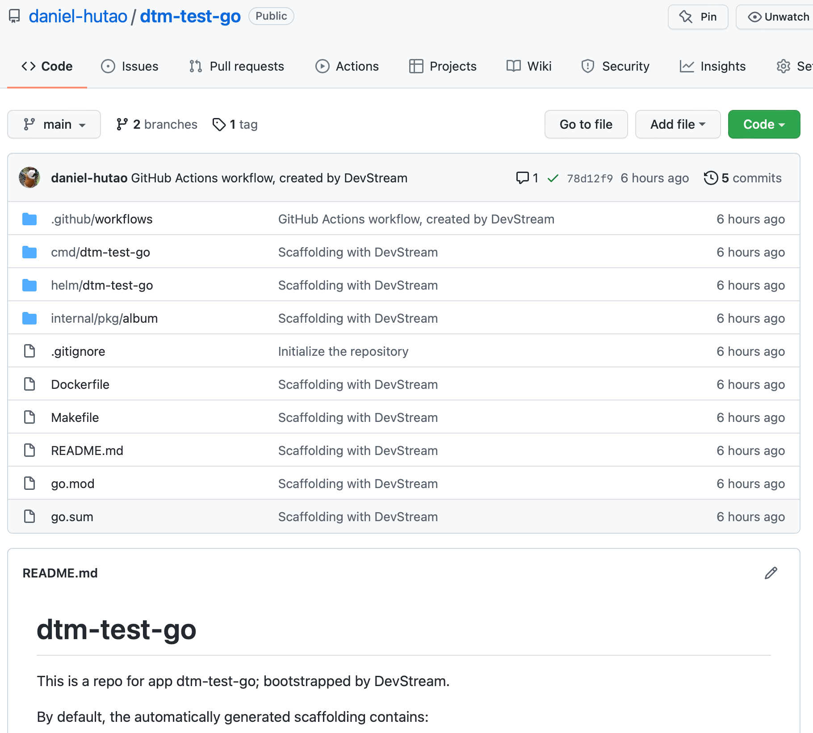
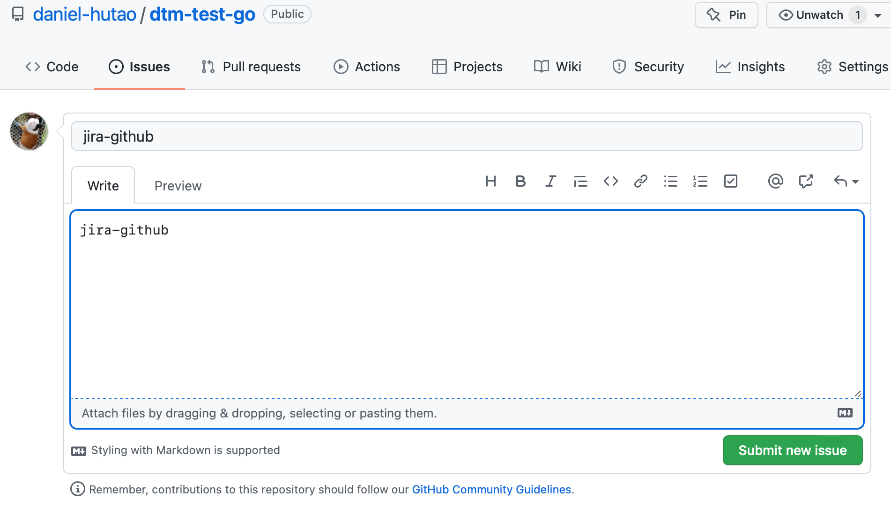

# GitOps

## 0 Goal

In this tutorial, we will try to use DevStream to achieve the following:

1. create a new repository for a Python web application written with [Flask](https://flask.palletsprojects.com/en/2.2.x/);
2. setup basic CI pipelines for the repo we created with GitHub Actions;
3. install [Argo CD](https://argo-cd.readthedocs.io/en/stable/) for GitOps in _an existing Kubernetes cluster_;
4. create an Argo CD application that deploys the web application generated in step 1.

> Note:
> 
> in step 3, Argo CD is installed in an existing Kubernetes cluster. Setting up infrastructure like a Kubernetes cluster is something DevStream chooses not to do.
> 
> If you want to follow this tutorial and give it a try yourself but don't know how to get a Kubernetes cluster up and running locally, maybe the following blogs (also from DevStream) would help:
> 
> - [Creating a Local Kubernetes Cluster from the Ground Up - a Tutorial of "Kind"](https://blog.devstream.io/posts/creating-a-local-k8s-cluster-with-kind/)
> - [Getting Started with minikube](https://blog.devstream.io/posts/getting-started-with-minikube/)

---

## 1 TL;DR: See It in Action

If you prefer to see this GitOps doc in action, check out the video demo below:

<iframe width="100%" height="500" src="https://www.youtube.com/embed/q7TK3vFr1kg" title="YouTube video player" frameborder="0" allow="accelerometer; autoplay; clipboard-write; encrypted-media; gyroscope; picture-in-picture" allowfullscreen></iframe>

It's from an older version of DevStream with slightly different configuration files, but you get the gist. We will update the video with the latest version of DevStream soon; bear with us for a little while.

For Chinese readers, watch this one:

<iframe src="//player.bilibili.com/player.html?aid=426762434&bvid=BV1W3411P7oW&cid=728576152&high_quality=1&danmaku=0" allowfullscreen="allowfullscreen" width="100%" height="500" scrolling="no" frameborder="0" sandbox="allow-top-navigation allow-same-origin allow-forms allow-scripts"></iframe>

However, if you are like us, who prefer to do things hands-on and get their hands dirty, read on, follow the steps, and have a go yourself!

---

## 2 Overview

DevStream will use the following plugins to achieve the goal described in [Section 0](#0-goal):

1. [repo-scaffolding](../plugins/repo-scaffolding.md)
2. [github-actions](../plugins/github-actions.md)
3. [helm-installer](../plugins/helm-installer/helm-installer.md)
4. [argocdapp](../plugins/argocdapp.md)

However, you do not have to worry about these plugins because DevStream will manage them automatically for you.

---

## 3 Getting Started: Download DevStream (`dtm`)

Create a temporary working directory for this tutorial:

```bash
mkdir test
cd test/
```

Then, under the newly created directory, execute the following command:

```shell
sh -c "$(curl -fsSL https://download.devstream.io/download.sh)
```

This script checks your system and downloads the corresponding `dtm` binary. Then the binary will be granted execution permission.

If you do an `ls`, you can see the binary `dtm` has been downloaded:

```bash
tiexin@mbp ~/work/devstream-io/test $ ls
dtm
```

And as a test, try to execute it, and you will get similar output to the following:

```bash
tiexin@mbp ~/work/devstream-io/test $ ./dtm
DevStream is an open-source DevOps toolchain manager

######                 #####
#     # ###### #    # #     # ##### #####  ######   ##   #    #
#     # #      #    # #         #   #    # #       #  #  ##  ##
#     # #####  #    #  #####    #   #    # #####  #    # # ## #
#     # #      #    #       #   #   #####  #      ###### #    #
#     # #       #  #  #     #   #   #   #  #      #    # #    #
######  ######   ##    #####    #   #    # ###### #    # #    #

Usage:
  dtm [command]

Available Commands:
  apply       Create or update DevOps tools according to DevStream configuration file
  completion  Generate the autocompletion script for dtm for the specified shell
  delete      Delete DevOps tools according to DevStream configuration file
  destroy     Destroy DevOps tools deployment according to DevStream configuration file & state file
  develop     Develop is used for develop a new plugin
  help        Help about any command
  init        Download needed plugins according to the config file
  list        This command only supports listing plugins now
  show        Show is used to print plugins' configuration templates or status
  upgrade     Upgrade dtm to the latest release version
  verify      Verify DevOps tools according to DevStream config file and state
  version     Print the version number of DevStream

Flags:
      --debug   debug level log
  -h, --help    help for dtm

Use "dtm [command] --help" for more information about a command.
```

> Optional: you can move `dtm` to a directory which is in your $PATH. For example: `mv dtm /usr/local/bin/`. This will allow you to run `dtm` directly without having to prefix it with the dot and slash (`./dtm`).
> 
> For more methods on how to install DevStream, see [install dtm](../install.md).

---

## 4 Config File

Create a file named `config.yaml` and paste the following content into it:

```yaml
config:
  state:
    backend: local
    options:
      stateFile: devstream.state
vars:
  githubUser: IronCore864
  dockerUser: ironcore864
  app: helloworld

tools:
- name: repo-scaffolding
  instanceID: myapp
  options:
    destinationRepo:
      owner: [[ githubUser ]]
      name: [[ app ]]
      branch: main
      scmType: github
    sourceRepo:
      org: devstream-io
      name: dtm-scaffolding-flask
      scmType: github
- name: github-actions
  instanceID: flask
  dependsOn: [ repo-scaffolding.myapp ]
  options:
    scm:
      owner: [[ githubUser ]]
      name:  [[ app ]]
      scmType: github
    pipeline:
      configLocation: https://raw.githubusercontent.com/devstream-io/ci-template/main/github-actions/workflows/main.yml
      language:
        name: python
        framework: flask
      imageRepo:
        user: [[ dockerUser ]]
- name: helm-installer
  instanceID: argocd
- name: argocdapp
  instanceID: default
  dependsOn: [ "helm-installer.argocd", "github-actions.flask" ]
  options:
    app:
      name: [[ app ]]
      namespace: argocd
    destination:
      server: https://kubernetes.default.svc
      namespace: default
    source:
      valuefile: values.yaml
      path: helm/[[ app ]]
      repoURL: ${{repo-scaffolding.myapp.outputs.repoURL}}
    imageRepo:
      user: [[ dockerUser ]]
```

Then modify the `vars` section in the `config.yaml` file accordingly. Please update the values for `githubUser` and `dockerUser` to your real users.

In the example above, I set these vars like the following:

| Variable   | Example     | Note                                                      |
|------------|-------------|-----------------------------------------------------------|
| githubUser | IronCore864 | case-sensitive, use your GitHub username strictly here    |
| dockerUser | ironcore864 | case-sensitive, use your DockerHub username strictly here |

## 5 Environment Variables

The following environment variables are required for this to work:

```bash
export GITHUB_TOKEN="YOUR_GITHUB_TOKEN_HERE"
export IMAGE_REPO_PASSWORD="YOUR_DOCKERHUB_TOKEN_HERE"
```

> Note:
> 
> if you don't know how to create these two tokens, check out:
> 
> - GITHUB_TOKEN: [Manage API tokens for your Atlassian account](https://docs.github.com/en/authentication/keeping-your-account-and-data-secure/creating-a-personal-access-token)
> - IMAGE_REPO_PASSWORD: [Manage access tokens](https://docs.docker.com/docker-hub/access-tokens/)

---

## 6 Init

Run:

```bash
./dtm init -f config.yaml
```

This downloads the required plugins, according to the config file, automatically.

You'll get some outputs similar to the following:

```bash
2022-12-05 17:46:01 ℹ [INFO]  Using dir </Users/tiexin/.devstream/plugins> to store plugins.
2022-12-05 17:46:01 ℹ [INFO]  -------------------- [  repo-scaffolding-darwin-arm64_0.10.2  ] --------------------
... (omitted)
... (omitted)
2022-12-05 17:46:51 ✔ [SUCCESS]  Initialize finished.
```

---

## 7 Apply

Run:

```bash
./dtm apply -f config.yaml -y
```

You will see similar outputs as the following:

```
2022-12-05 17:49:49 ℹ [INFO]  Apply started.
2022-12-05 17:49:49 ℹ [INFO]  Using local backend. State file: devstream.state.
2022-12-05 17:49:49 ℹ [INFO]  Tool (repo-scaffolding/myapp) found in config but doesn't exist in the state, will be created.
2022-12-05 17:49:49 ℹ [INFO]  Tool (helm-installer/argocd) found in config but doesn't exist in the state, will be created.
2022-12-05 17:49:49 ℹ [INFO]  Tool (github-actions/flask) found in config but doesn't exist in the state, will be created.
2022-12-05 17:49:49 ℹ [INFO]  Tool (argocdapp/default) found in config but doesn't exist in the state, will be created.
2022-12-05 17:49:49 ℹ [INFO]  Start executing the plan.
2022-12-05 17:49:49 ℹ [INFO]  Changes count: 4.
... (omitted)
... (omitted)
2022-12-05 17:51:51 ℹ [INFO]  -------------------- [  Processing progress: 4/4.  ] --------------------
2022-12-05 17:51:51 ℹ [INFO]  Processing: (argocdapp/default) -> Create ...
2022-12-05 17:51:52 ℹ [INFO]  application.argoproj.io/helloworld created
2022-12-05 17:51:52 ✔ [SUCCESS]  Tool (argocdapp/default) Create done.
2022-12-05 17:51:52 ℹ [INFO]  -------------------- [  Processing done.  ] --------------------
2022-12-05 17:51:52 ✔ [SUCCESS]  All plugins applied successfully.
2022-12-05 17:51:52 ✔ [SUCCESS]  Apply finished.
```

---

## 8 Check the Results

Let's continue to look at the results of the `apply` command.

### 8.1 Repository

The repository is created automatically by DevStream with scaffolding code:



### 8.2 CI Pipelines with GitHub Actions

GitHub Actions pipelines are created and executed:



### 8.3 Argo CD Installation

Argo CD is installed in your Kubernetes cluster:

```bash
tiexin@mbp ~/work/devstream-io/test $ kubectl get namespaces
NAME                 STATUS   AGE
argocd               Active   5m42s
default              Active   6m28s
kube-node-lease      Active   6m29s
kube-public          Active   6m29s
kube-system          Active   6m29s
local-path-storage   Active   6m25s
tiexin@mbp ~/work/devstream-io/test $ kubectl get pods -n argocd
NAME                                               READY   STATUS    RESTARTS   AGE
argocd-application-controller-0                    1/1     Running   0          5m43s
argocd-applicationset-controller-66687659f-dsrtd   1/1     Running   0          5m43s
argocd-dex-server-6944757486-clshl                 1/1     Running   0          5m43s
argocd-notifications-controller-7944945879-b9878   1/1     Running   0          5m43s
argocd-redis-7887bbdbbb-xzppj                      1/1     Running   0          5m43s
argocd-repo-server-d4f5cc7cb-8gj24                 1/1     Running   0          5m43s
argocd-server-5bb75c4bd9-g948r                     1/1     Running   0          5m43s
```

### 8.4 Continuous Deployment with Argo CD

The CI pipelines build a Docker image and push it into Dockerhub, and an Argo CD application created by DevStream deploys the app already:

```bash
tiexin@mbp ~/work/devstream-io/test $ kubectl get deployment -n default
NAME         READY   UP-TO-DATE   AVAILABLE   AGE
helloworld   1/1     1            1           5m16s
tiexin@mbp ~/work/devstream-io/test $ kubectl get pods -n default
NAME                          READY   STATUS    RESTARTS   AGE
helloworld-69b5586b94-wjwd9   1/1     Running   0          5m18s
tiexin@mbp ~/work/devstream-io/test $ kubectl get services -n default
NAME         TYPE        CLUSTER-IP    EXTERNAL-IP   PORT(S)   AGE
helloworld   ClusterIP   10.96.73.97   <none>        80/TCP    5m27s
kubernetes   ClusterIP   10.96.0.1     <none>        443/TCP   8m2s
```

If you do a port-forwarding:

```bash
kubectl port-forward -n default svc/helloworld 8080:80
```

And accesses `localhost:8080` in your browser, you can see the deployed app return a "Hello, World!" to you. Hooray!

---

## 9 Clean Up

Run:

```bash
./dtm delete -f config.yaml -y
```

And you will get similar outputs to the following:

```bash
2022-12-05 17:59:25 ℹ [INFO]  Delete started.
2022-12-05 17:59:26 ℹ [INFO]  Using local backend. State file: devstream.state.
2022-12-05 17:59:26 ℹ [INFO]  Tool (argocdapp/default) will be deleted.
2022-12-05 17:59:26 ℹ [INFO]  Tool (github-actions/flask) will be deleted.
2022-12-05 17:59:26 ℹ [INFO]  Tool (repo-scaffolding/myapp) will be deleted.
2022-12-05 17:59:26 ℹ [INFO]  Tool (helm-installer/argocd) will be deleted.
2022-12-05 17:59:26 ℹ [INFO]  Start executing the plan.
2022-12-05 17:59:26 ℹ [INFO]  Changes count: 4.
... (omitted)
... (omitted)
2022-12-05 17:59:35 ℹ [INFO]  -------------------- [  Processing done.  ] --------------------
2022-12-05 17:59:35 ✔ [SUCCESS]  All plugins deleted successfully.
2022-12-05 17:59:35 ✔ [SUCCESS]  Delete finished.
```

Then you can delete what we created:

```bash
cd ../
rm -rf test/
rm -rf ~/.devstream/
```
