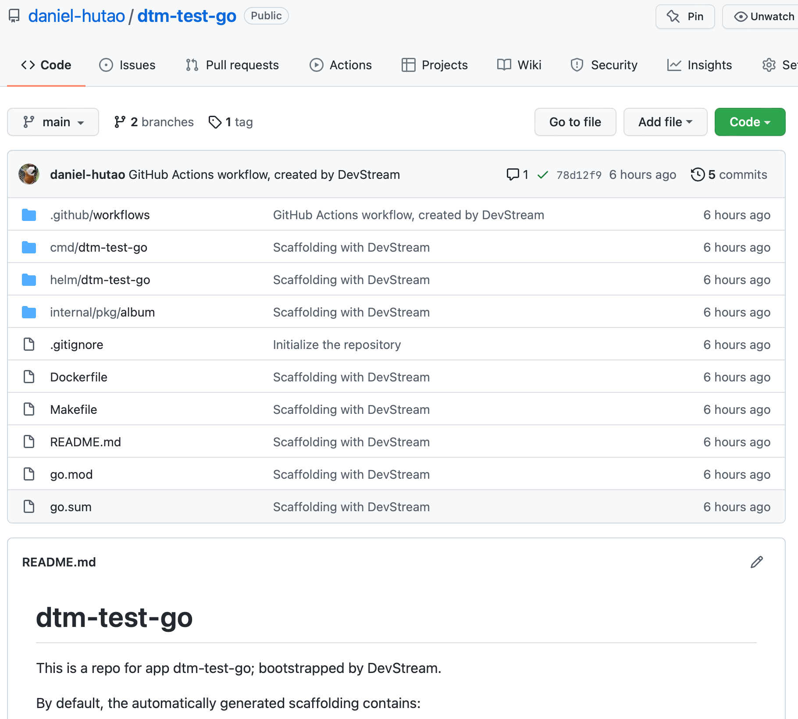
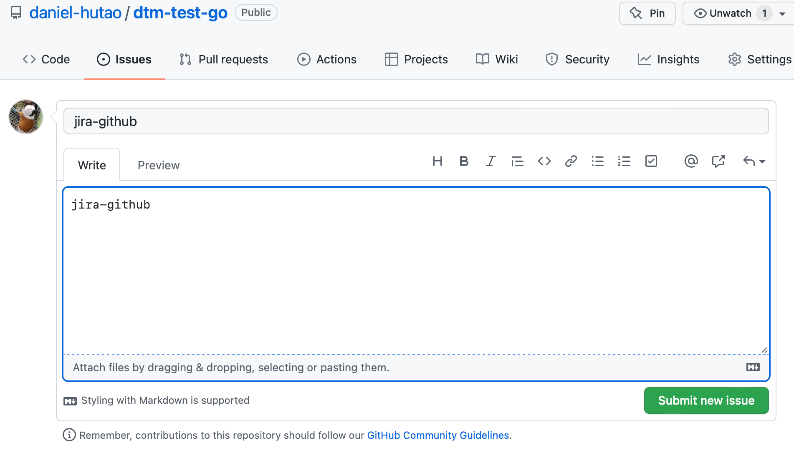
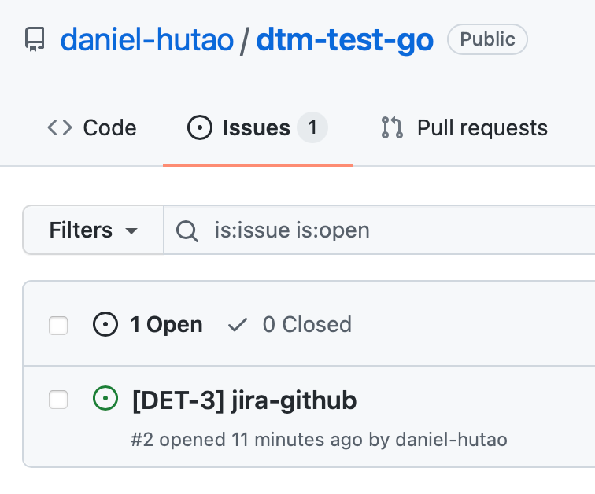
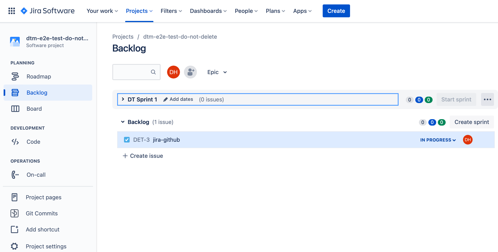
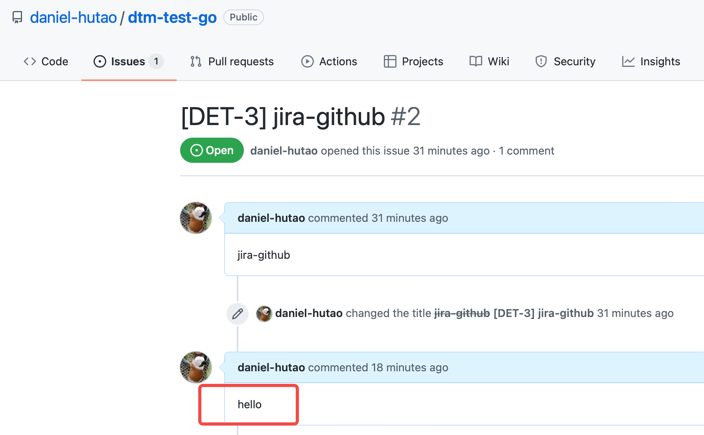
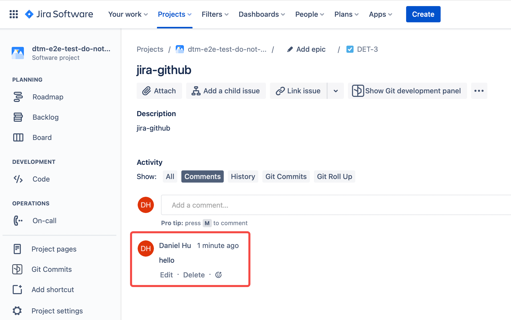
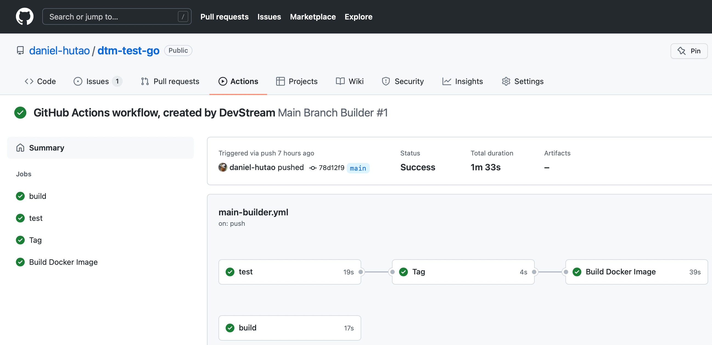
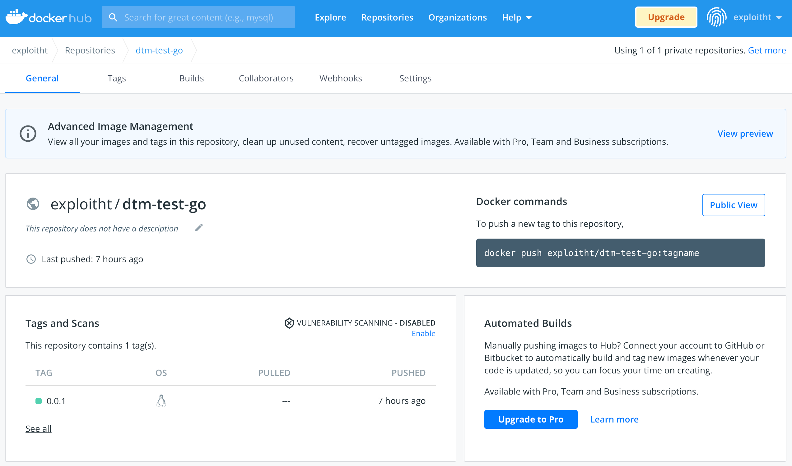
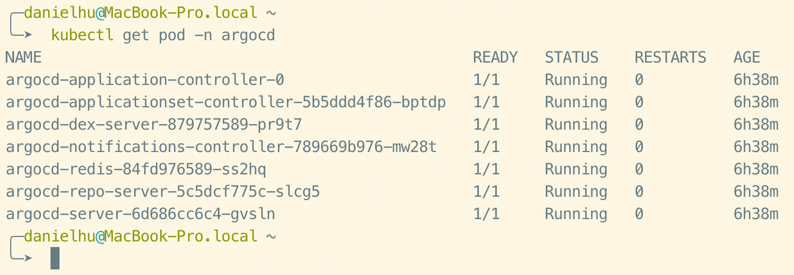
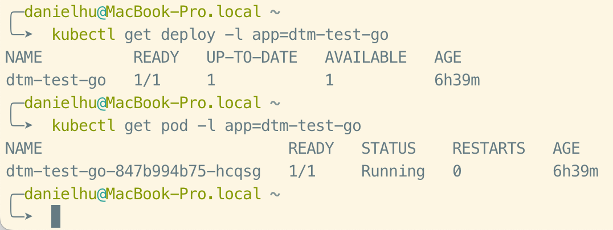

# GitOps Toolchain

If you are interested in watching a video demo, see the youtube video below:

[https://www.youtube.com/watch?v=q7TK3vFr1kg](https://www.youtube.com/watch?v=q7TK3vFr1kg)

For Chinese readers, watch this one instead:

[https://www.bilibili.com/video/BV1W3411P7oW/](https://www.bilibili.com/video/BV1W3411P7oW/)

## Plugins needed

1. [github-repo-scaffolding-golang](../plugins/github-repo-scaffolding-golang)
2. [jira-github](../plugins/jira-github-integ)
3. [githubactions-golang](../plugins/githubactions-golang)
4. [argocd](../plugins/argocd)
5. [argocdapp](../plugins/argocdapp)

The dependencies of these plugins are(`a -> b` means for `a depends on b`):

- `jira-github` -> `github-repo-scaffolding-golang`
- `githubactions-golang` -> `github-repo-scaffolding-golang`
- `argocdapp` -> `argocd` and `github-repo-scaffolding-golang`

Note: These dependencies are not consistent, such as when the repo operated by `jira-github` and `github-repo-scaffolding-golang` are not the same, the dependencies disappear.

We should use the `dependency` according to the actual usage situation.

## Download DevStream (`dtm`)

Download the appropriate `dtm` version for your platform from [DevStream Releases](https://github.com/devstream-io/devstream/releases).

> Remember to rename the binary file to `dtm` so that it's easier to use. For example: `mv dtm-darwin-arm64 dtm`.

> Once downloaded, you can run the binary from anywhere. Ideally, you want to put it in a place that is in your PATH (e.g., `/usr/local/bin`).

## Prepare the Config File

Download the `gitops.yaml`, `tools-gitops.yaml` and `variables-gitops.yaml` to your working directory:

```bash
curl -o config-gitops.yaml https://raw.githubusercontent.com/devstream-io/devstream/main/examples/gitops.yaml
curl -o variables-gitops.yaml https://raw.githubusercontent.com/devstream-io/devstream/main/examples/variables-gitops.yaml
curl -o tools-gitops.yaml https://raw.githubusercontent.com/devstream-io/devstream/main/examples/tools-gitops.yaml
```

Then modify the `variables-gitops.yaml` file accordingly.

For me I can set these variables like:

| Variable                       | Example           | Note                                                         |
| ------------------------------ | ----------------- | ------------------------------------------------------------ |
| defaultBranch                  | main              | The branch name you want to use |
| githubUsername                 | daniel-hutao      | It should be case-sensitive here; strictly use your GitHub username |
| repoName                       | go-webapp         | As long as it doesn't exist in your GitHub account and the name is legal |
| dockerhubUsername              | exploitht         | It should be case-sensitive here; strictly use your DockerHub username |
| jiraID                         | merico            | This is a domain name prefix like merico in https://merico.atlassian.net |
| jiraProjectKey                 | DT                | A descriptive prefix for your project’s issue keys to recognize work from this project |
| jiraUserEmail                  | tao.hu@merico.dev | The email you use to log in to Jira |
| argocdNameSpace                | argocd            | The namespace used by ArgoCD |
| argocdDeployTimeout            | 10m               | How long does ArgoCD deployment timeout |


These plugins require some environment variables to work, so let's set them:

```bash
export GITHUB_TOKEN="YOUR_GITHUB_TOKEN_HERE"
export JIRA_API_TOKEN="YOUR_JIRA_API_TOKEN_HERE"
export DOCKERHUB_TOKEN="YOUR_DOCKERHUB_TOKEN_HERE"
```

If you don't know how to create these three tokens, check out:

- GITHUB_TOKEN: [Manage API tokens for your Atlassian account](https://support.atlassian.com/atlassian-account/docs/manage-api-tokens-for-your-atlassian-account/)
- JIRA_API_TOKEN: [Creating a personal access token](https://docs.github.com/en/authentication/keeping-your-account-and-data-secure/creating-a-personal-access-token)
- DOCKERHUB_TOKEN: [Manage access tokens](https://docs.docker.com/docker-hub/access-tokens/)

## 3. Initialize

Run:

```bash
dtm init -f config-gitops.yaml
```

## 4. Apply

Run:

```bash
dtm apply -f config-gitops.yaml
```

and confirm to continue, then you should see similar output to:

```
...
2022-03-11 13:36:11 ✔ [SUCCESS]  All plugins applied successfully.
2022-03-11 13:36:11 ✔ [SUCCESS]  Apply finished.
```

## 5. Check the Results

Let's continue to look at the results of the `apply` command.

### 5.1 Repository Scaffolding

- The repository scaffolding we got looks like this:



### 5.2 Jira-Github Integration

- How do Jira and Github integrate? Let's create a new issue:



- The issue will be renamed automatically like this:



- We can find this auto-synced `Story` in Jira:



- If we continue to leave a comment on this issue:



- The comment will also be automatically synced to Jira:



### 5.3 GitHub Actions CI for Golang

- What does CI do here?



- The CI processes also build an image, and this image is automatically pushed to DockerHub:



### 5.4 ArgoCD Deployment

- Of course, the ArgoCD must have been installed as expected.



### 5.5 ArgoCD Application Deployment

- Our code has just been built into an image, at this time the image is automatically deployed to our k8s as a Pod:



## 6. Clean Up

Run:

```bash
dtm destroy
```

and you should see similar output:

```
2022-03-11 13:39:11 ✔ [SUCCESS]  All plugins destroyed successfully.
2022-03-11 13:39:11 ✔ [SUCCESS]  Destroy finished.
```
