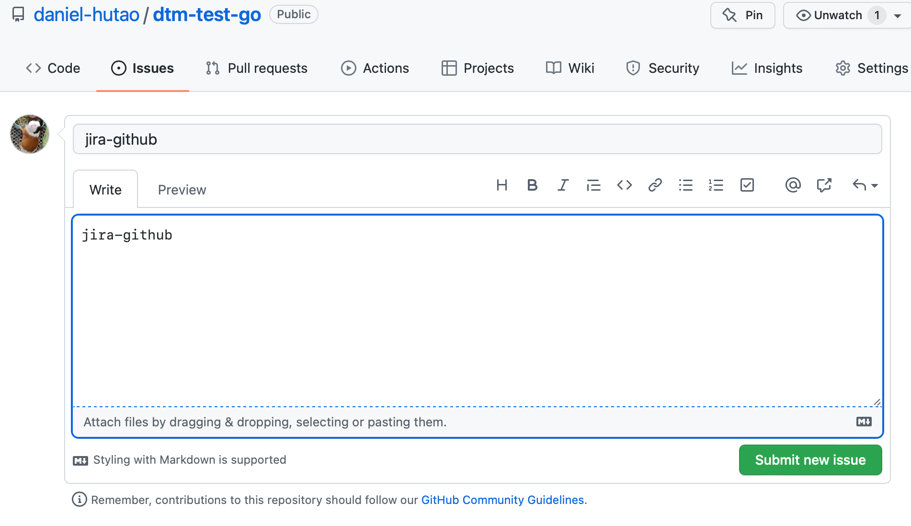
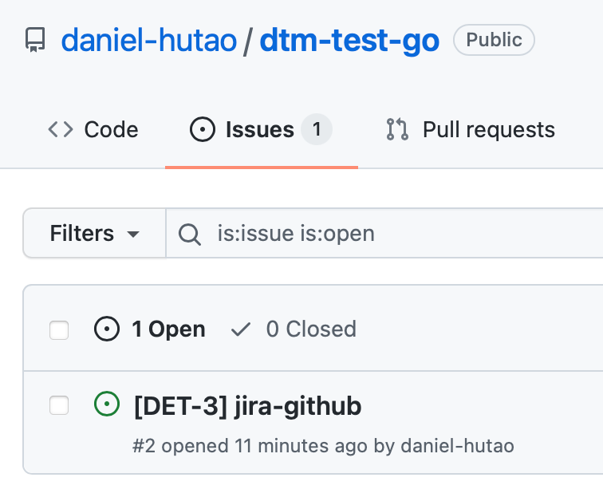
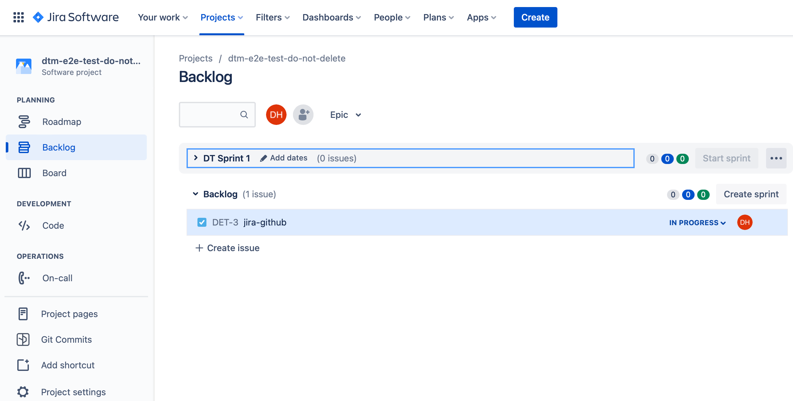
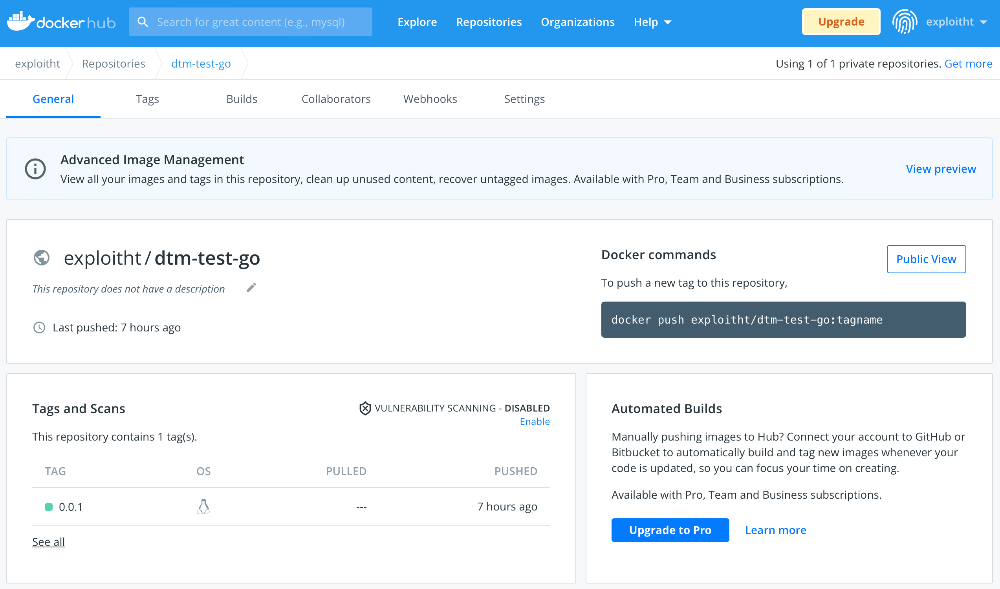

# GitOps 工具链

请参考视频demo来快速熟悉用DevStream来实施GitOps工具链的部署和整合：
- YouTube
<iframe width="100%" height="500" src="https://www.youtube.com/embed/q7TK3vFr1kg" title="YouTube video player" frameborder="0" allow="accelerometer; autoplay; clipboard-write; encrypted-media; gyroscope; picture-in-picture" allowfullscreen></iframe>
- 哔哩哔哩
<iframe src="//player.bilibili.com/player.html?aid=426762434&bvid=BV1W3411P7oW&cid=728576152&high_quality=1&danmaku=0" allowfullscreen="allowfullscreen" width="100%" height="500" scrolling="no" frameborder="0" sandbox="allow-top-navigation allow-same-origin allow-forms allow-scripts"></iframe>

## 所需插件

1. [github-repo-scaffolding-golang](../plugins/github-repo-scaffolding-golang.md)
2. [jira-github](../plugins/jira-github-integ.md)
3. [githubactions-golang](../plugins/githubactions-golang.md)
4. [argocd](../plugins/argocd.md)
5. [argocdapp](../plugins/argocdapp.md)

这些插件的依赖关系如下（`a -> b`意味着`a依赖b`）：

- `jira-github` -> `github-repo-scaffolding-golang`
- `githubactions-golang` -> `github-repo-scaffolding-golang`
- `argocdapp` -> `argocd` 和 `github-repo-scaffolding-golang`

**注意**：依赖并不是必须指定的，我们可以用依赖确保某个工具可以先于另外一个工具安装。我们应该根据实际的使用场景来使用`dependsOn`。

## 1 下载DevStream（`dtm`）

在[DevStream Releases](https://github.com/devstream-io/devstream/releases)页面下载适合你操作系统和CPU架构的`dtm`。

> 将二进制文件改名为`dtm`，以便易于使用。例如，执行：`mv dtm-drawin-arm64 dtm`。

> 下载之后，你可以在任意地方执行这个二进制文件。你可以将它加入到你的PATH中（例如`/usr/local/bin`）。

## 2 准备配置文件

将`gitops.yaml`下载到你的工作目录下：

```shell
curl -o gitops.yaml https://raw.githubusercontent.com/devstream-io/devstream/main/examples/gitops.yaml
```

然后对`gitops.yaml`文件做相应的修改。

配置文件中用到的变量的解释和示例值如下：

| Variable                       | Example           | Note                                            |
| ------------------------------ | ----------------- |-------------------------------------------------|
| defaultBranch                  | main              | 你想使用的分支名称                                       |
| githubUsername                 | daniel-hutao      | 你的GitHub用户名（区分大小写）                              |
| repoName                       | go-webapp         | 只要它不在你的GitHub账户下，这个名称就是合法的                      |
| dockerhubUsername              | exploitht         | 你的DockerHub用户名（区分大小写）                           |
| jiraID                         | merico            | 这是一个域名前缀就像https://merico.atlassian.net 中的merico |
| jiraProjectKey                 | DT                | 项目issue key的描述性前缀，用于识别来自该项目的工作                  |
| jiraUserEmail                  | tao.hu@merico.dev | 登录Jira的邮箱                                       |
| argocdNameSpace                | argocd            | ArgoCD用的namespace                               |
| argocdDeployTimeout            | 10m               | ArgoCD部署的timeout时长                              |

这些插件需要设定一下环境变量：

```bash
export GITHUB_TOKEN="YOUR_GITHUB_TOKEN_HERE"
export JIRA_API_TOKEN="YOUR_JIRA_API_TOKEN_HERE"
export DOCKERHUB_TOKEN="YOUR_DOCKERHUB_TOKEN_HERE"
```

如果你不知道如何获取以上环境变量的值，请参考以下链接（英文）：

- GITHUB_TOKEN: [Manage API tokens for your Atlassian account](https://docs.github.com/en/authentication/keeping-your-account-and-data-secure/creating-a-personal-access-token)
- JIRA_API_TOKEN: [Creating a personal access token](https://support.atlassian.com/atlassian-account/docs/manage-api-tokens-for-your-atlassian-account/)
- DOCKERHUB_TOKEN: [Manage access tokens](https://docs.docker.com/docker-hub/access-tokens/)


## 3 初始化

执行：

```bash
dtm init -f gitops.yaml
```

## 4 Apply

执行：

```bash
dtm apply -f gitops.yaml
```

并且确认继续，然后你就能看到类似如下的输出：

```
...
2022-03-11 13:36:11 ✔ [SUCCESS]  All plugins applied successfully.
2022-03-11 13:36:11 ✔ [SUCCESS]  Apply finished.
```

## 5 检查结果

我们接着来看`apply`命令的结果。

### 5.1 仓库结构

- 我们得到的仓库结构看起来如下：


### 5.2 Jira-Github 集成

- 测试Jira和Github之间的整合，让我们新创建一个issue：



- 上述issue将会自动地被重命名：



- 我们可以在Jira中找到这个自动同步的`Story`：



- 如果我们在这个issue留下评论：


- 这个评论也会被自动同步到Jira中：


### 5.3 为Golang设置Github Actions CI

- CI在这里可以做以下事情：


- CI流程同时也会构建Docker镜像，之后该镜像会被自动推送到DockerHub中：



### 5.4 ArgoCD部署

- ArgoCD已经被装好了：


### 5.5 ArgoCD应用部署

- 我们的代码刚刚被构建到镜像中，此时这个镜像会作为一个Pod自动部署到我们的k8s中：


## 6 清理

执行：

```bash
dtm destroy -f gitops.yaml
```

然后你应该能看到类似的输出结果：

```
2022-03-11 13:39:11 ✔ [SUCCESS]  All plugins destroyed successfully.
2022-03-11 13:39:11 ✔ [SUCCESS]  Destroy finished.
```
