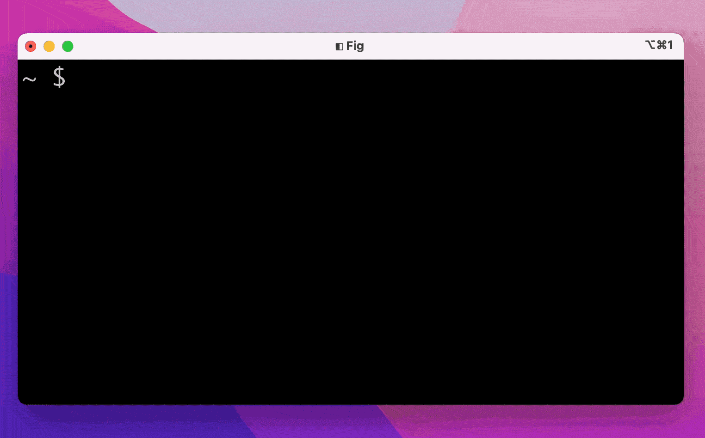
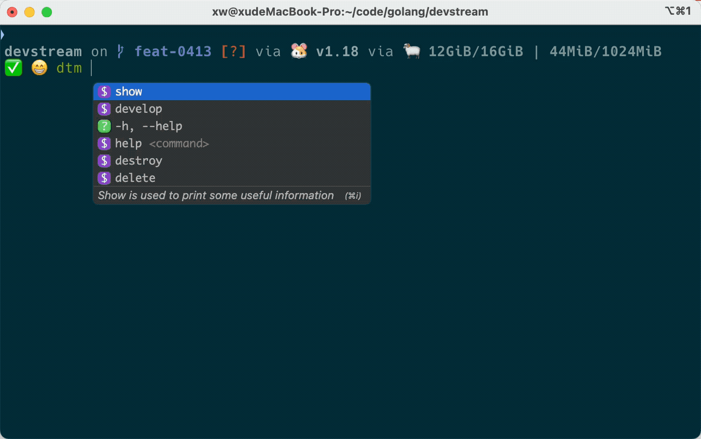
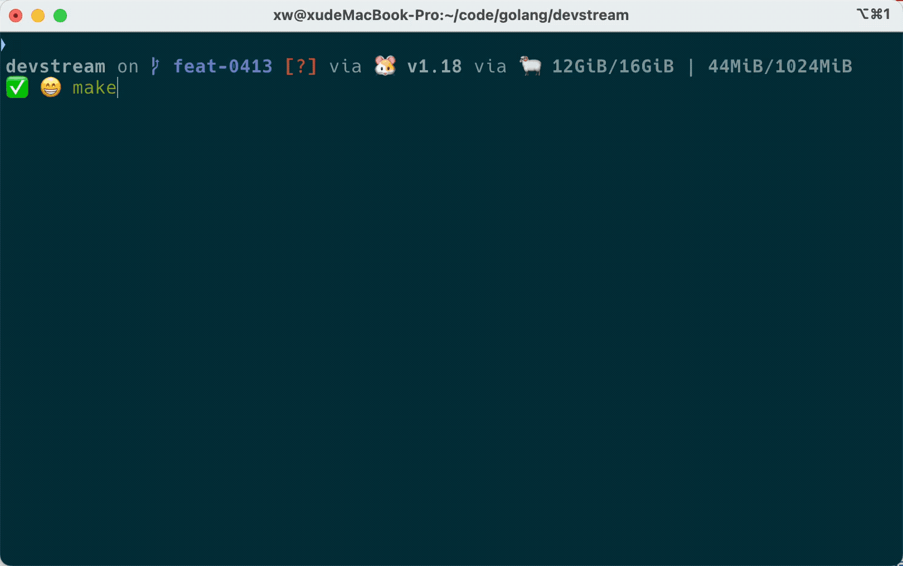

# Autocomplete

## Fig Autocomplete

In order to give a better experience for terminal users, we [support the Fig Auto-complete](https://github.com/withfig/autocomplete/blob/master/src/dtm.ts).

Unlike other auto-complete tools, [Fig](https://fig.io) is more intuitive. It brings an IDE-style experience to the terminal users. Detailed introduction see the [official website](https://fig.io/)



**Notice: Temporary only supports MacOS now!**

### Setup

See [https://fig.io](https://fig.io)


Once the installation is complete, you need to integrate the terminal you are using.

### Examples

#### Get Specified Plugin Information



#### Get Subcommand Help Information


#### Build a Specified Plugin



## Shell Autocomplete

### Bash Autocompletion

#### On Linux

**Note: Main reference [bash auto-completion on Linux](https://kubernetes.io/docs/tasks/tools/included/optional-kubectl-configs-bash-linux/)**

The completion script depends on `bash-completion`, So you have to install it first.

```bash
apt-get install bash-completion # For Ubuntu

yum install bash-completion # For CentOS and RedHat
```

The above commands create `/usr/share/bash-completion/bash_completion`, which is the main script of `bash-completion`. Depending on your package manager, you have to manually source this file in your `~/.bashrc` file.

To find out, reload your shell and run `type _init_completion`. If the command succeeds, you're already set, otherwise add the following to your `~/.bashrc` file:

```bash
source /usr/share/bash-completion/bash_completion
```

Reload your shell and verify that bash-completion is correctly installed by typing `type _init_completion`.

Then You can generate completion script for Bash with the command `dtm completion bash` and add the following line to your `~/.bashrc` file:

```bash
echo 'source <(dtm completion bash)' >>~/.bashrc
```

After reloading your shell, dtm autocompletion should be working!
#### On MacOS

```{admonition} Note
:class: note
Main reference [bash auto-completion on macOS](https://kubernetes.io/docs/tasks/tools/included/optional-kubectl-configs-bash-macos/)
```

The completion script depends on `bash-completion`, So you have to install it first.

```bash
brew install bash-completion@2
```

As stated in the output of this command, add the following to your `~/.bash_profile` file:

```bash
export BASH_COMPLETION_COMPAT_DIR="/usr/local/etc/bash_completion.d"
[[ -r "/usr/local/etc/profile.d/bash_completion.sh" ]] && . "/usr/local/etc/profile.d/bash_completion.sh"
```

Reload your shell and verify that bash-completion v2 is correctly installed with `type _init_completion`.

Then You can generate completion script for Bash with the command `dtm completion bash` and add the following line to your `~/.bashrc` file:

```bash
echo 'source <(dtm completion bash)' >>~/.bash_profile
```

After reloading your shell, dtm autocompletion should be working!

### Zsh Autocompletion

You can generate completion script for Zsh with the command `dtm completion zsh`. Then add the following line to your `~/.zshrc` file:

```zsh
source <(dtm completion zsh)
```

After reloading your shell, dtm autocompletion should be working!

### Fish Autocompletion

You can generate completion script for Fish with the command `dtm completion fish`.Then add the following line to your `~/.config/fish/config.fish` file:

```fish
dtm completion fish | source
```

After reloading your shell, dtm autocompletion should be working!

### PowerShell Autocompletion

You can generate completion script for PowerShell with the command `dtm completion powershell`. Then add the following line to your `$PROFILE` file:

```powershell
dtm completion powershell | Out-String | Invoke-Expression
```

This command will regenerate the auto-completion script on every PowerShell start up. You can also add the generated script directly to your `$PROFILE` file.

To add the generated script to your `$PROFILE` file, run the following line in your powershell prompt:

```powershell
dtm completion powershell >> $PROFILE
```

After reloading your shell, dtm autocompletion should be working.
