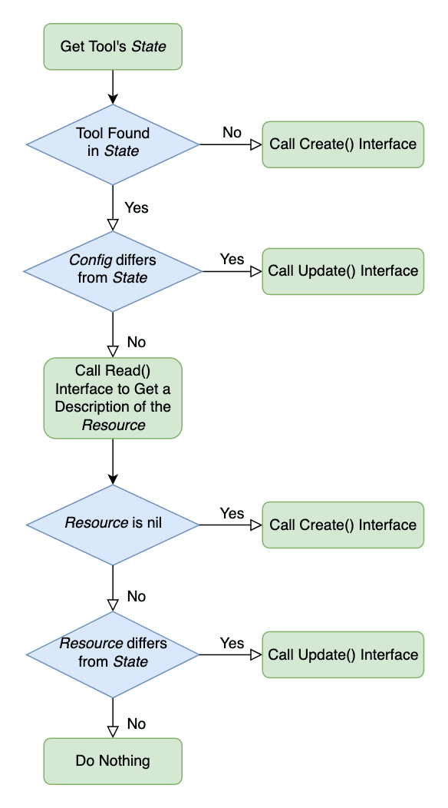

# 概览

## 1 构架

上面的图展示了数据如何在 dtm 的各个模块中流动。

本质上：

- DevStream 的核心(插件引擎)就像一个状态机，它根据配置和状态计算出需要执行的操作。
- 接着 DevStream 核心调用“插件”来完成特定 DevOps 工具或它们之间的集成的 CRUD 操作。

---

## 2 插件(Plugin)

插件 是 DevStream 的核心，由 dtm 负责下载、管理和调用。

每个插件拥有一定的功能，涵盖了 DevOps 工具的安装、配置和集成，用户通过自由组合插件来构建自己的 DevOps 工具链。

开发者可以通过编写插件来扩展 DevStream，详见 [创建插件](../development/dev/creating-a-plugin.zh.md)。

---

## 3 配置(Config)

DevStream 在配置文件中定义了 DevOps 平台的期望状态（如插件列表、DevStream 自身的配置等）。

配置文件可以是单个 YAML 文件，也可以是同个目录下的多个 YAML 文件，拥有以下几个部分：

- `config`: DevStream 的基本配置，目前主要是与 状态 相关的设置。更多信息请参考 [这里](./state.zh.md)。
- `vars`: 变量的定义。键值对的形式，可以在 tools/apps/pipelineTemplates 部分中引用。
- `tools`: DevStream 工具 的列表，每个工具包含插件名称、实例 ID(唯一标识符)和 Options。更多信息请参考 [这里](./tools.zh.md)。
- `apps`: DevStream 应用 的列表，每个应用对应一个微服务。更多信息请参考 [这里](./apps.zh.md)。
- `pipelineTemplates`: 一个流水线模板的列表，可以被 DevStream 应用 引用。更多信息请参考 [这里](./apps.zh.md)。

---

## 4 状态(State)

状态 记录了 DevStream 定义和创建的 DevOps 工具链和平台的当前状态。

状态 包含了所有组件的配置和它们对应的状态，这样 DevStream 核心模块就可以依靠它计算出，达到配置中定义的状态所需要的操作。

---

## 5 工作流

