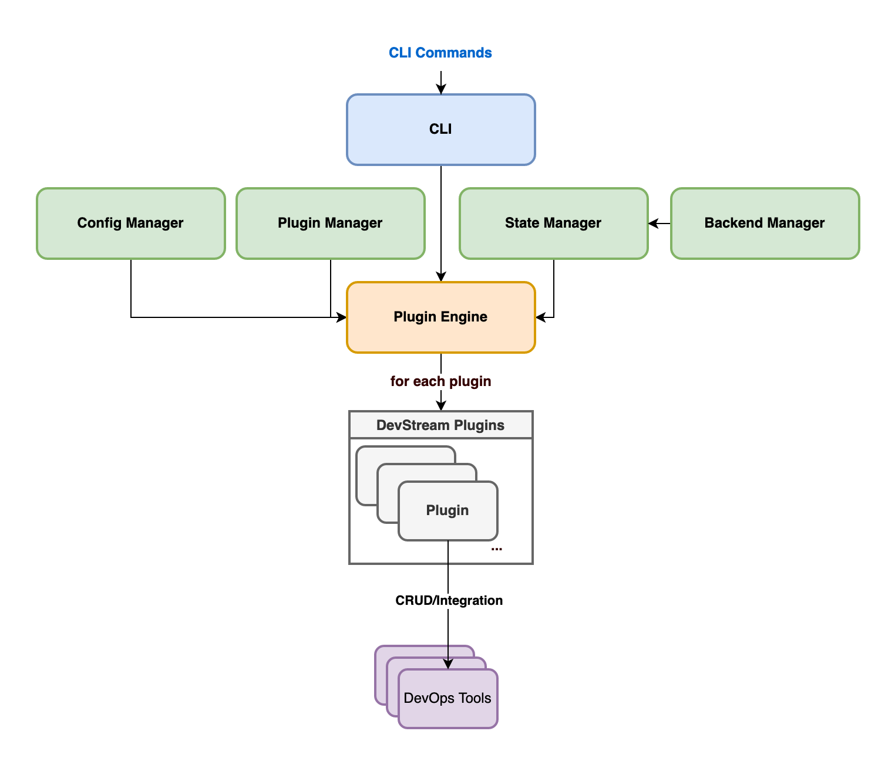

# Architecture

This document summarizes the main components of DevStream and how data flows between these components.

## 0 Data Flow

The following diagram shows an approximation of how DevStream executes a user command:

There are three major parts:

- CLI: handles user input, commands and parameters
- `pluginengine`: the plugin engine, which achieves the core functionalities by calling other modules (`configloader`, `pluginmanager`, `statemanager`, etc.)
- plugins: implements the actual CRUD interfaces for a certain DevOps tool

## 1 CLI (The `devstream` Package)

Note: for simplicity, the CLI is named `dtm`(DevOps Tool Manager) instead of the full name DevStream.

Every time a user runs the `dtm` program, the execution transfers immediately into one of the "command" implementations in the [`devstream`](https://github.com/devstream-io/devstream/tree/main/cmd/devstream) package, in which folder all commands' definitions reside.

Then, each command calls the `pluginengine` package under [`internal/pkg`](https://github.com/devstream-io/devstream/tree/main/internal/pkg/pluginengine).

The `pluginengine` calls the `configloader` first to read the local YAML config file into a struct.

Then it calls the `pluginmanager` to download the required plugins.

After that, the `pluginengine` calls the state manager to calculate "changes" between the congfig, the state, and the actual DevOps tool's status. At last, the `pluginengine` executes actions according to the changes, and updates the state. During the execution, the `pluginengine` loads each plugin (`*.so` file) and calls the predefined interface according to each change.

## 2 Plugin Engine

The `pluginengine` has various responsibilities:

- make sure the required plugins (according to the config file) are present 
- generate changes according to the config, the state and tools' actual status
- execute the changes by loading each plugin and calling the desired action

It achieves the goal by calling the following modules:

### 2.1 Configuration Loader

Model types in package [`configloader`](https://github.com/devstream-io/devstream/blob/main/internal/pkg/configloader/config.go#L19) represent the top-level configuration structure.

### 2.2 Plugin Manager

The [`pluginmanager`](https://github.com/devstream-io/devstream/blob/main/internal/pkg/pluginmanager/manager.go) is in charge of downloading necessary plugins according to the configuration.

If a plugin with the desired version already exists locally, it will not download it again.

### 2.3 State Manager

The [`statemanager`](https://github.com/devstream-io/devstream/blob/main/internal/pkg/statemanager/manager.go) manages the "state", i.e., what has been done successfully and what not.

The `statemanager` stores the state in a [`backend`](https://github.com/devstream-io/devstream/blob/main/internal/pkg/backend/backend.go).

## 3 Plugin

A _plugin_ implements the aforementioned, predefined interfaces.

It executes operations like `Create`, `Read`, `Update`, and `Delete`.

To develop a new plugin, see [creating a plugin](creating-a-plugin).
