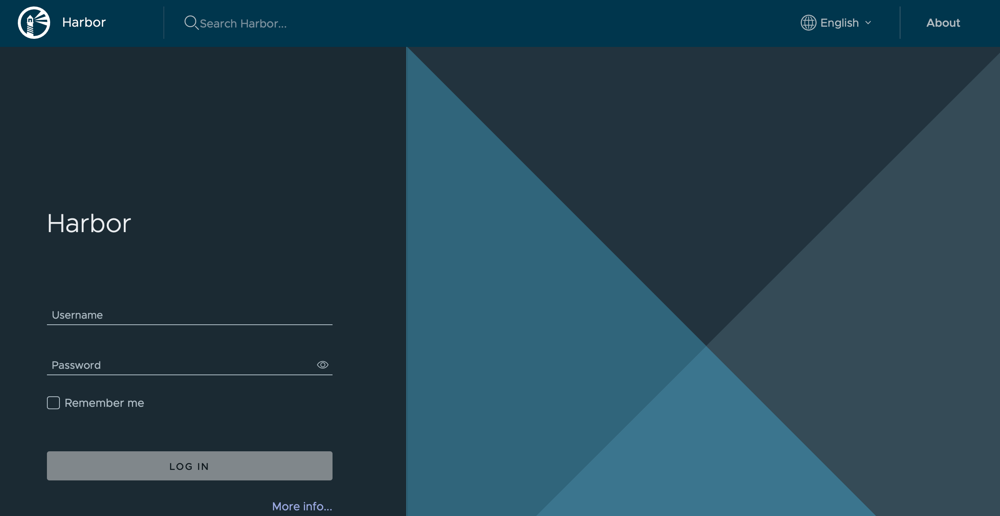

# 使用 DevStream 部署 Harbor

## 1、前置要求

**必须满足**

- 有一个可用的 Kubernetes 集群，版本 1.10+
- 配置好 StorageClass

**可选满足**

- 配置好 Ingress 控制器（如果需要使用 Ingress 暴露服务）

## 2、部署架构

Harbor 本身并不关注如何实现存储高可用，所以 Harbor 通过 PVCs 的方式持久化数据。
另外 Harbor 也不关注 PostgreSQL、Redis 的高可用方式部署，而是提供了对接外部 PostgreSQL 和 Redis 的能力。

Harbor 部署架构整体如下图所示(图片来自 Harbor 官网)：


## 3、开始部署

下文将介绍如何配置 `harbor` 插件，完成 Harbor 应用的部署。

> 说明：本文所使用的演示环境为一台 Linux 云主机，上面装有以 minikube 方式部署的单节点 k8s 集群。

minikube 方式部署的 k8s 集群自带一个默认的 StorageClass，另外部署 Ingress 控制器只需要执行 `minikube addons enable ingress` 命令即可。
其他方式部署的 k8s 集群中如何配置 StorageClass 和 Ingress Controller，请查阅[ k8s 官方文档](https://kubernetes.io)。

你可以选择顺序阅读本文档，从而全面了解 `harbor` 插件的使用方法；也可以选择直接跳到下文"典型场景"小节，直接寻找你感兴趣的使用场景开始阅读。

### 3.1、快速开始

如果仅是用于开发、测试等目的，希望快速完成 Harbor 的部署，可以使用如下配置快速开始：

```yaml title="config.yaml"
tools:
- name: helm-installer
  instanceID: harbor-001
  dependsOn: [ ]
  options:
    valuesYaml: |
      externalURL: http://127.0.0.1
      expose:
        type: nodePort
        tls:
          enabled: false
      chartmuseum:
        enabled: false
      notary:
        enabled: false
      trivy:
        enabled: false
```

在成功执行 `dtm apply` 命令后，我们可以在 harbor 命名空间下看到下述主要资源：

- **Deployment** (`kubectl get deployment -n harbor`)

几乎所有 Harbor 相关服务都是以 Deployment 方式在运行：

```shell
NAME                READY   UP-TO-DATE   AVAILABLE   AGE
harbor-core         1/1     1            1           2m56s
harbor-jobservice   1/1     1            1           2m56s
harbor-nginx        1/1     1            1           2m56s
harbor-portal       1/1     1            1           2m56s
harbor-registry     1/1     1            1           2m56s
```

- **StatefulSet** (`kubectl get statefulset -n harbor`)

StatefulSet 资源对应的是 Harbor 所依赖的 PostgreSQL 和 Redis。
换言之，当前部署方式会自动完成 PostgreSQL 和 Redis 的部署，但是同时需要注意 PostgreSQL 和 Redis 并不是高可用的：

```shell
NAME              READY   AGE
harbor-database   1/1     3m40s
harbor-redis      1/1     3m40s
```

- **Service** (`kubectl get service -n harbor`)

默认情况下 Harbor 通过 NodePort 方式暴露服务时，端口是 30002：

```shell
NAME                TYPE        CLUSTER-IP       EXTERNAL-IP   PORT(S)             AGE
harbor              NodePort    10.99.177.6      <none>        80:30002/TCP        4m17s
harbor-core         ClusterIP   10.106.220.239   <none>        80/TCP              4m17s
harbor-database     ClusterIP   10.102.102.95    <none>        5432/TCP            4m17s
harbor-jobservice   ClusterIP   10.98.5.49       <none>        80/TCP              4m17s
harbor-portal       ClusterIP   10.105.115.5     <none>        80/TCP              4m17s
harbor-redis        ClusterIP   10.104.100.167   <none>        6379/TCP            4m17s
harbor-registry     ClusterIP   10.106.124.148   <none>        5000/TCP,8080/TCP   4m17s
```

- **PersistentVolumeClaim** (`kubectl get pvc -n harbor`)

Harbor 所需要的存储卷有4个，其中也包括了 PostgreSQL 和 Redis 的存储：

```shell
NAME                              STATUS   VOLUME                                     CAPACITY   ACCESS MODES   STORAGECLASS   AGE
data-harbor-redis-0               Bound    pvc-5b6b5eb4-c40d-4f46-8f19-ff3a8869e56f   1Gi        RWO            standard       5m12s
database-data-harbor-database-0   Bound    pvc-d7ccaf1f-c450-4a16-937a-f55ad0c7c18d   1Gi        RWO            standard       5m12s
harbor-jobservice                 Bound    pvc-9407ef73-eb65-4a56-8720-a9ddbcb76fef   1Gi        RWO            standard       5m13s
harbor-registry                   Bound    pvc-34a2b88d-9ff2-4af4-9faf-2b33e97b971f   5Gi        RWO            standard       5m13s
```

- **PersistentVolume** (`kubectl get pv`)

我们并没有配置 StorageClass，所以这里用的是集群内的 default StorageClass 完成的 pv 创建：

```shell
pvc-34a2b88d-9ff2-4af4-9faf-2b33e97b971f   5Gi        RWO            Delete           Bound         harbor/harbor-registry                    standard                5m22s
pvc-5b6b5eb4-c40d-4f46-8f19-ff3a8869e56f   1Gi        RWO            Delete           Bound         harbor/data-harbor-redis-0                standard                5m22s
pvc-9407ef73-eb65-4a56-8720-a9ddbcb76fef   1Gi        RWO            Delete           Bound         harbor/harbor-jobservice                  standard                5m22s
pvc-d7ccaf1f-c450-4a16-937a-f55ad0c7c18d   1Gi        RWO            Delete           Bound         harbor/database-data-harbor-database-0    standard                5m22s
```

在当前演示环境里，default StorageClass 如下(`kubectl get storageclass`)：

```shell
NAME                 PROVISIONER                RECLAIMPOLICY   VOLUMEBINDINGMODE   ALLOWVOLUMEEXPANSION   AGE
standard (default)   k8s.io/minikube-hostpath   Delete          Immediate           false                  20h
```

这个 StorageClass 对应的 Provisioner 会以 hostPath 的方式提供 pv。

到这里，我们就可以通过 http://127.0.0.1:3002 访问到 Harbor 登录页面了，如下：



默认登录账号/密码是 `admin/Harbor12345`。登录后，可以看到默认首页如下：


如果是在云主机上部署的 Harbor，可以通过 `kubectl port-forward` 命令来暴露服务：

```shell
ip=YOUR_HOST_IP
kubectl port-forward -n harbor service/harbor --address=${ip} 80
```

*注意：这里得使用主机真实网卡 ip，而我们在浏览器上输入的 ip 是云主机的公网 ip，两者并不一样。*

### 3.2、默认配置

| 配置项              | 默认值                    | 描述                                 |
| ----               | ----                     | ----                                |
| chart.chartPath    | ""                       | 本地 chart 包路径                      |
| chart.chartName    | harbor/harbor            | helm chart 包名称                    |
| chart.timeout      | 10m                      | helm install 的超时时间               |
| chart.upgradeCRDs  | true                     | 是否更新 CRDs（如果有）                |
| chart.releaseName  | harbor                   | helm 发布名称                         |
| chart.wait         | true                     | 是否等待部署完成                       |
| chart.namespace    | harbor                   | 部署的命名空间                         |
| repo.url           | https://helm.goharbor.io | helm 仓库地址                         |
| repo.name          | harbor                   | helm 仓库名                           |

因此完整的配置文件应该是这样：

### 3.3、持久化存储数据

前面我们已经看到了如果不指定 StorageClass，Harbor 会使用集群内的 default StorageClass。
在当前演示环境中，default StorageClass 是通过 hostPath 方式提供 pv 的，因此我们可以看到 harbor-registry 所使用的 pv 配置大致如下：

```yaml
apiVersion: v1
kind: PersistentVolume
metadata:
  name: pvc-34a2b88d-9ff2-4af4-9faf-2b33e97b971f
spec:
  accessModes:
  - ReadWriteOnce
  capacity:
    storage: 5Gi
  claimRef:
    apiVersion: v1
    kind: PersistentVolumeClaim
    name: harbor-registry
    namespace: harbor
  hostPath:
    path: /tmp/hostpath-provisioner/harbor/harbor-registry
  persistentVolumeReclaimPolicy: Delete
  storageClassName: standard
  volumeMode: Filesystem
status:
  phase: Bound
```

可见数据其实挂在到了主机的 `/tmp/hostpath-provisioner/harbor/harbor-registry` 目录下了。

Harbor 支持3种持久化存储数据配置方式：

1. 配置 StorageClass（默认使用 default StorageClass）；
2. 使用已经存在的 pvc（手动创建）；
3. 对接 azure、gcs、s3、swift、oss 等实现镜像和 Charts 云端存储。

我们暂时只介绍第一种方式，也就是指定 StorageClass 实现存储数据持久化。
registry、jobservice、chartmuseum、database、redis、trivy 等组件都可以单独指定 StorageClass。
假设我们现在有一个新的 StorageClass 叫做 nfs，这时候要实现前面部署的 Harbor 所有数据持久化到外部 pv，我们可以这样配置：

```yaml
tools:
- name: helm-installer
  instanceID: harbor-001
  dependsOn: [ ]
  options:
    valuesYaml: |
      persistence:
        persistentVolumeClaim:
          registry:
            storageClass: "nfs"
            accessMode: ReadWriteOnce
            size: 5Gi
          jobservice:
            storageClass: "nfs"
            accessMode: ReadWriteOnce
            size: 1Gi
          database:
            storageClass: "nfs"
            accessMode: ReadWriteOnce
            size: 1Gi
          redis:
            storageClass: "nfs"
            accessMode: ReadWriteOnce
            size: 1Gi
```

### 3.4、服务暴露

Harbor 可以以 ClusterIP、LoadBalancer、NodePort 和 Ingress 等方式对外暴露服务。我们前面使用的就是 NodePort 方式：

```yaml
tools:
- name: helm-installer
  instanceID: harbor-001
  dependsOn: [ ]
  options:
    valuesYaml: |
      externalURL: http://127.0.0.1
      expose:
        type: nodePort
```

接下来我们再介绍一下如何使用 Ingress 方式暴露服务：

```yaml
tools:
- name: helm-installer
  instanceID: harbor-001
  dependsOn: [ ]
  options:
    valuesYaml: |
      externalURL: http://core.harbor.domain
      expose:
        type: ingress
        tls:
          enabled: false
        ingress:
          hosts:
            core: core.harbor.domain
```

注意：如果没有开启 TLS，这种方式暴露 Harbor 服务后 docker push/pull 命令必须带上端口。

### 3.5、PostgreSQL 和 Redis 高可用

Harbor 依赖 PostgreSQL 和 Redis 服务，默认情况下自动部署的 PostgreSQL 和 Redis 服务都是非高可用模式。
换言之如果我们单独部署高可用的 PostgreSQL 和 Redis 服务，Harbor 是支持去对接外部 PostgreSQL 和 Redis 服务的。

TODO(daniel-hutao): 本节待细化

### 3.6、https 配置

TODO(daniel-hutao): 本节待细化

- 使用自签名证书
  1. 将 `tls.enabled` 设置为 `true`，并编辑对应的域名 `externalURL`；
  2. 将 Pod `harbor-core` 中目录 `/etc/core/ca` 存储的自签名证书复制到自己的本机；
  3. 在自己的主机上信任该证书。
- 使用公共证书
  1. 将公共证书添加为密钥 (`Secret`)；
  2. 将 `tls.enabled` 设置为 `true`，并编辑对应的域名 `externalURL`；
  3. 配置 `tls.secretName` 使用该公共证书。

## 4、典型场景

// TODO(daniel-hutao): 本节待补充

### 4.1、HTTP

#### 4.1.1 HTTP + Registry + Internal Database + Internal Redis

如果我们选择以如下方式部署 Harbor：

- 协议：http
- 服务暴露：Ingress
- PostgreSQL 和 Redis：自动部署

域名和 StorageClass 可以灵活修改，这里以 core.harbor.domain 和 nfs 为例：

```yaml
tools:
- name: helm-installer
  instanceID: harbor-001
  dependsOn: [ ]
  options:
    valuesYaml: |
      externalURL: http://core.harbor.domain
      expose:
        type: ingress
        tls:
          enabled: false
        ingress:
          hosts:
            core: core.harbor.domain
      chartmuseum:
        enabled: false
      notary:
        enabled: false
      trivy:
        enabled: false
      persistence:
        persistentVolumeClaim:
          registry:
            storageClass: "nfs"
            accessMode: ReadWriteOnce
            size: 5Gi
          jobservice:
            storageClass: "nfs"
            accessMode: ReadWriteOnce
            size: 1Gi
          database:
            storageClass: "nfs"
            accessMode: ReadWriteOnce
            size: 1Gi
          redis:
            storageClass: "nfs"
            accessMode: ReadWriteOnce
            size: 1Gi
```

部署完成后，可以看到 Ingress 配置如下(`kubectl get ingress -n harbor)：

```shell
NAME             CLASS   HOSTS                ADDRESS        PORTS   AGE
harbor-ingress   nginx   core.harbor.domain   192.168.49.2   80      2m8s
```

如果你的 DNS 服务器可以解析到这个域名，那么这时候就可以在浏览器里通过 http://core.harbor.domain 访问到 Harbor 了。
如果是测试环境，我们也可以通过修改 hosts 配置来完成这个域名解析，比如：

- 修改 hosts (`cat /etc/hosts | grep harbor`)

```shell
192.168.49.2 core.harbor.domain
```

对于 minikube 部署的 k8s 集群，这里的 ip 可以通过 `minikube ip` 命令获取。
如果是正式的 k8s 集群，这里的 ip 是 k8s 集群对外暴露的 vip，可能是一个节点 ip，也可能是一个 F5 上的 vip，或者 haproxy 等方式提供的 vip。

#### 4.1.2 HTTP + Registry + Chartmuseum + Internal Database + Internal Redis

#### 4.1.3 HTTP + Registry + Chartmuseum + External Database + External Redis

### 4.2、HTTPS

#### 4.1.1 HTTPS + Registry + Internal Database + Internal Redis

#### 4.1.2 HTTPS + Registry + Chartmuseum + Internal Database + Internal Redis

#### 4.1.3 HTTPS + Registry + Chartmuseum + External Database + External Redis

## 5、离线环境部署

// TODO(daniel-hutao): 本节内容近期将持续补充完善

### 5.1、Helm Chart 包

如果需要在离线环境部署 Harbor，你需要下载对应的 helm chart 包：

```shell
helm repo add harbor https://helm.goharbor.io
helm repo update
helm search repo harbor -l
helm pull harbor/harbor	--version=1.10.0
```

这时你会得到一个 `harbor-1.10.0.tgz` 文件，你可以将其存放到一个合适的目录，比如 `~/devstream-test/harbor-1.10.0.tgz`，然后在配置文件就可以这样引用这个 chart 包了：

```yaml
tools:
- name: helm-installer
  instanceID: harbor-001
  dependsOn: [ ]
  options:
    chart:
      chartPath: "~/devstream-test/harbor-1.10.0.tgz"
```

### 5.2、容器镜像

`harbor` 插件支持使用自定义容器镜像，你需要先在 valuesYaml 部分加上如下配置：

```yaml
valuesYaml: |
  nginx:
    image:
      repository: [[ imageRepo ]]/goharbor/nginx-photon
      tag: v2.5.3
  portal:
    image:
      repository: [[ imageRepo ]]/goharbor/harbor-portal
      tag: v2.5.3
  core:
    image:
      repository: [[ imageRepo ]]/goharbor/harbor-core
      tag: v2.5.3
  jobservice:
    image:
      repository: [[ imageRepo ]]/goharbor/harbor-jobservice
      tag: v2.5.3
  registry:
    registry:
      image:
        repository: [[ imageRepo ]]/goharbor/registry-photon
        tag: v2.5.3
    controller:
      image:
        repository: [[ imageRepo ]]/goharbor/harbor-registryctl
        tag: v2.5.3
  chartmuseum:
    image:
      repository: [[ imageRepo ]]/goharbor/chartmuseum-photon
      tag: v2.5.3
  trivy:
    image:
      repository: [[ imageRepo ]]/goharbor/trivy-adapter-photon
      tag: v2.5.3
  notary:
    server:
      image:
        repository: [[ imageRepo ]]/goharbor/notary-server-photon
        tag: v2.5.3
    signer:
      image:
        repository: [[ imageRepo ]]/goharbor/notary-signer-photon
        tag: v2.5.3
  database:
    internal:
      image:
        repository: [[ imageRepo ]]/goharbor/harbor-db
        tag: v2.5.3
  redis:
    internal:
      image:
        repository: [[ imageRepo ]]/goharbor/redis-photon
        tag: v2.5.3
  exporter:
    image:
      repository: [[ imageRepo ]]/goharbor/harbor-exporter
      tag: v2.5.3
```

这段配置中留了一个变量 `[[ imageRepo ]]`，你可以在[变量配置](../../core-concepts/config.zh.md)中定义这个变量，变量值设置成你的镜像仓库地址，例如：

```yaml
imageRepo: harbor.example.com:9000
```

当然，你需要保证需要的镜像都在你的镜像仓库中存在。

你可以下载[镜像列表文件](./harbor/harbor-images.txt)，
然后借助["Image Pull Push"](https://raw.githubusercontent.com/devstream-io/devstream/main/hack/image-pull-push.sh)工具脚本来准备镜像。

```shell
curl -o harbor-images.txt https://raw.githubusercontent.com/devstream-io/devstream/main/docs/plugins/helm-installer/harbor/harbor-images.txt
curl -o image-pull-push.sh https://raw.githubusercontent.com/devstream-io/devstream/main/hack/image-pull-push.sh
chmod +x image-pull-push.sh
# 查看工具脚本的使用方法和注意事项等
./image-pull-push.sh -h
# 设置镜像仓库地址，按需修改
export IMAGE_REPO_ADDR=harbor.devstream.io
# 下载 harbor-images.txt 中所有镜像并保存到本地压缩包中
./image-pull-push.sh -f harbor-images.txt -r ${IMAGE_REPO_ADDR} -s
# 从压缩包中 load 镜像并 push 到私有镜像仓库（如果镜像仓库需要登录，则需要先手动执行 docker login）
./image-pull-push.sh -f harbor-images.txt -r ${IMAGE_REPO_ADDR} -l -u
```

如果你还没有一个私有镜像仓库，可以参考[这篇文章](../../best-practices/image-registry.zh.md)快速部署一个 Docker Registry。

### 5.3、参考配置

这时候我们需要指定本地 helm chart 包以及私有镜像仓库的镜像，所以整体的参考配置大致如下：

```yaml
---
# variable config
imageRepo: harbor.example.com:9000

---
# plugin config
tools:
- name: helm-installer
  instanceID: harbor-001
  dependsOn: [ ]
  options:
    chart:
      chartPath: "~/devstream-test/harbor-1.10.0.tgz"
    valuesYaml: |
      externalURL: http://core.harbor.domain
      expose:
        type: ingress
        tls:
          enabled: false
        ingress:
          hosts:
            core: core.harbor.domain
      nginx:
        image:
          repository: [[ imageRepo ]]/goharbor/nginx-photon
          tag: v2.5.3
      portal:
        image:
          repository: [[ imageRepo ]]/goharbor/harbor-portal
          tag: v2.5.3
      core:
        image:
          repository: [[ imageRepo ]]/goharbor/harbor-core
          tag: v2.5.3
      jobservice:
        image:
          repository: [[ imageRepo ]]/goharbor/harbor-jobservice
          tag: v2.5.3
      registry:
        registry:
          image:
            repository: [[ imageRepo ]]/goharbor/registry-photon
            tag: v2.5.3
        controller:
          image:
            repository: [[ imageRepo ]]/goharbor/harbor-registryctl
            tag: v2.5.3
      chartmuseum:
        enabled: false
        image:
          repository: [[ imageRepo ]]/goharbor/chartmuseum-photon
          tag: v2.5.3
      trivy:
        enabled: false
        image:
          repository: [[ imageRepo ]]/goharbor/trivy-adapter-photon
          tag: v2.5.3
      notary:
        enabled: false
        server:
          image:
            repository: [[ imageRepo ]]/goharbor/notary-server-photon
            tag: v2.5.3
        signer:
          image:
            repository: [[ imageRepo ]]/goharbor/notary-signer-photon
            tag: v2.5.3
      database:
        internal:
          image:
            repository: [[ imageRepo ]]/goharbor/harbor-db
            tag: v2.5.3
      redis:
        internal:
          image:
            repository: [[ imageRepo ]]/goharbor/redis-photon
            tag: v2.5.3
      exporter:
        image:
          repository: [[ imageRepo ]]/goharbor/harbor-exporter
          tag: v2.5.3
      persistence:
        persistentVolumeClaim:
          registry:
            storageClass: "nfs"
            accessMode: ReadWriteOnce
            size: 5Gi
          jobservice:
            storageClass: "nfs"
            accessMode: ReadWriteOnce
            size: 1Gi
          database:
            storageClass: "nfs"
            accessMode: ReadWriteOnce
            size: 1Gi
          redis:
            storageClass: "nfs"
            accessMode: ReadWriteOnce
            size: 1Gi
```

在这个参考配置里包含了全部可能用到的镜像，在部分组件不启用的情况下你完全可以移除相关的镜像配置项。不过保留在这里也不会有什么影响。
