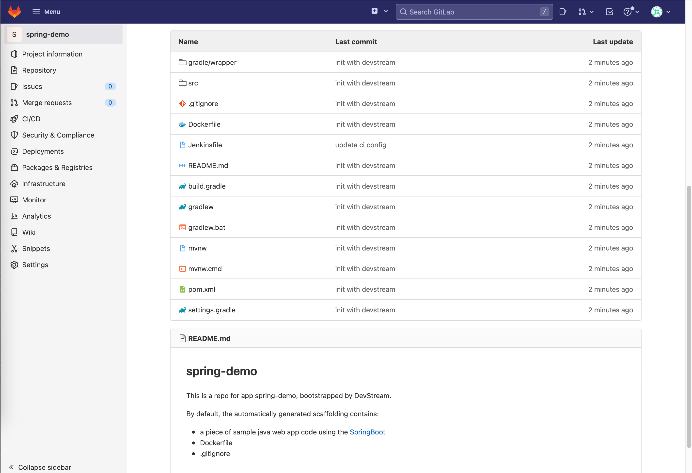
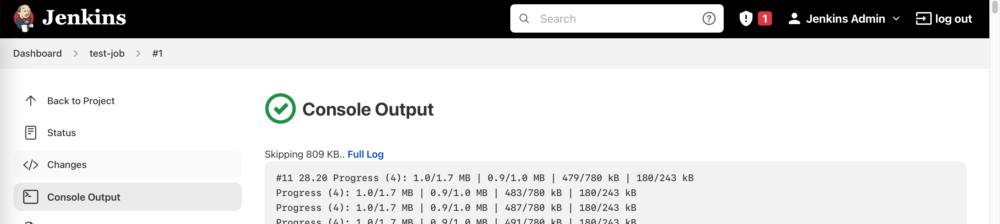
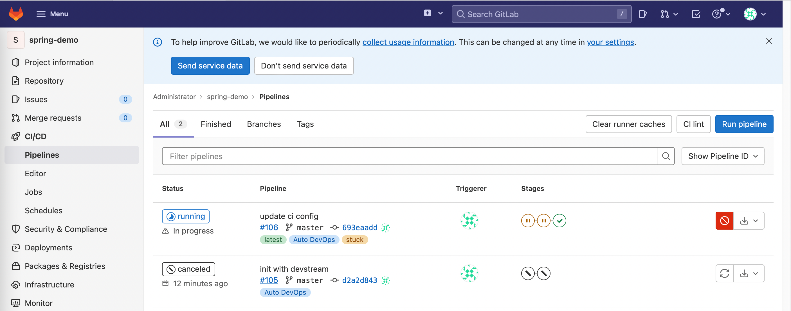
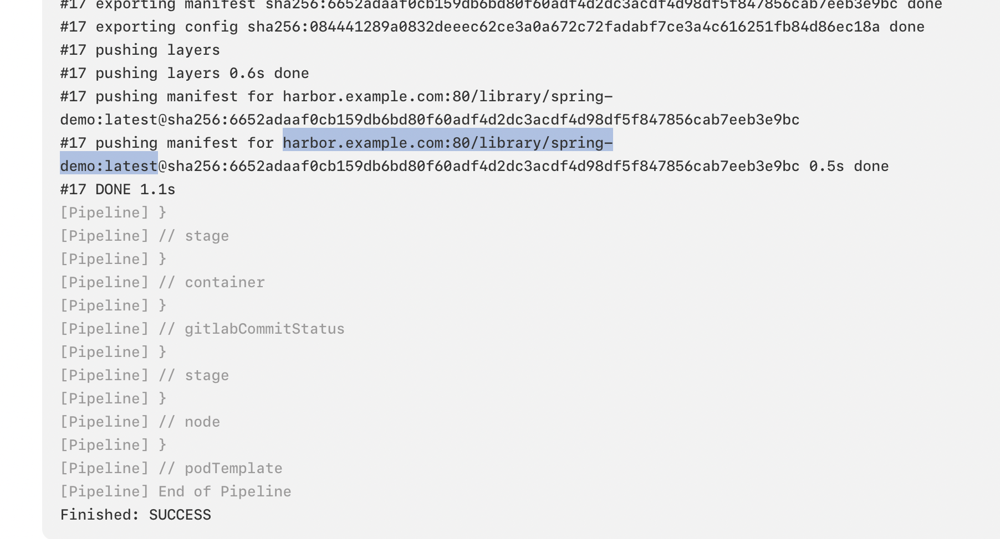
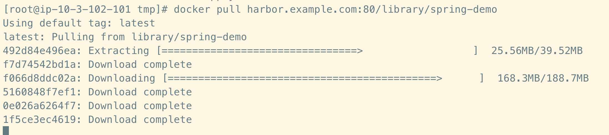

# jenkins-pipeline 插件

`jenkins-pipeline` 插件用于打通 GitHub/GitLab 和 Jenkins，实现自动化创建 Jenkins Pipeline 的功能。

本文将演示：

1. 通过 [`repo-scaffolding`](./repo-scaffolding.zh.md) 插件在 GitLab 上创建一个 Java Spring Boot 项目脚手架；
2. 通过 `jenkins-pipeline` 插件在 Jenkins 上创建一条 Java Spring Boot 的 CI 流水线；
3. 通过 `jenkins-pipeline` 插件实现在 GitLab 和 Jenkins 上分别配置相应参数，实现当 GitLab 上的代码库有 push 或者 merge 事件时，自动触发 Jenkins 上的流水线运行，同时流水线的执行结果自动回写到 GitLab 上。

!!! tip "提示"

    GitHub 与 GitLab 的主要区别在于 DevStream tool config 的 options.scm.url 以及所需要的 token 等不同。

## 1、前置要求

**必须满足**

- 一套可用的 Jenkins 环境
- 一套可用的 GitLab 环境
- 一套可用的 Harbor 环境
- Jenkins 与 GitLab、Harbor 网络互通
- 执行 dtm 的主机与 Jenkins、GitLab 网络互通

!!! warning "注意"

    当前插件暂时只支持对接使用 dtm 部署的 Jenkins。

本文基于如下环境编写：

- **系统**：一台装有 CentOS 7 的云主机；
- **k8s**：minikube 方式部署的单节点集群；
- **Jenkins、Harbor 和 GitLab**：使用 dtm 方式部署。

## 2、配置

你需要预先准备好 GitLab 的 token 和镜像仓库（Harbor 等）的密码，然后配置到环境变量里，例如（记得替换占位字符）：

```shell
export IMAGE_REPO_PASSWORD=YOUR_IMAGE_REPO_PASSWORD
export GITLAB_TOKEN=YOUR_GITLAB_TOKEN
export GITLAB_SSHKEY=YOUR_REPO_PRIVATE_KEY
```

!!! tip "提示"

    如果是 GitHub，则这里的环境变量改成：
    
    ```shell
    export IMAGE_REPO_PASSWORD=YOUR_IMAGE_REPO_PASSWORD
    export GITHUB_TOKEN=YOUR_GITHUB_TOKEN
    export GITHUB_SSHKEY=YOUR_REPO_PRIVATE_KEY
    ```

然后准备 DevStream 插件配置：

下面的配置文件展示的是"tool file"的内容。

关于更多关于DevStream的主配置、tool file、var file的信息，请阅读[核心概念概览](../core-concepts/overview.zh.md)和[DevStream配置](../core-concepts/config.zh.md).

```yaml
tools:
- name: repo-scaffolding
  instanceID: springboot
  dependsOn: []
  options:
    destinationRepo:
      owner: root
      name: spring-demo
      branch: master
      scmType: gitlab
      baseURL: YOUR_GITLAB_ADDR
    sourceRepo:
      owner:  devstream-io
      name: dtm-repo-scaffolding-java-springboot
      scmType: github
- name: jenkins-pipeline
  instanceID: default
  dependsOn: [repo-scaffolding.springboot]
  options:
    jenkins:
      url: YOUR_JENKINS_ADDR
      user: admin
      enableRestart: true
    scm:
      url: git@YOUR_REPO_CLONE_ADDRESS/root/spring-demo
      branch: master
      apiURL: YOUR_JENKINS_ADDR
    pipeline:
      jobName: test-job
      configLocation: https://raw.githubusercontent.com/devstream-io/dtm-jenkins-pipeline-example/main/springboot/Jenkinsfile
      imageRepo:
        url: YOUR_HARBOR_ADDR
        user: admin
```

上述配置文件中使用的 GitLab、Jenkins 和 Harbor 访问地址需要替换成你的环境中实际地址。例如：

- **YOUR_GITLAB_ADDR**: http://44.33.22.11:30080
- **YOUR_REPO_CLONE_ADDRESS**: http://44.33.22.11:30022
- **YOUR_JENKINS_ADDR**: http://44.33.22.11:32000
- **YOUR_HARBOR_ADDR**: http://harbor.example.com:80

除了这几个必须修改的配置项外，其他配置项你可以在确保理解含义的前提下灵活决定是否调整。

*注意：这个配置示例仅是 tool config，完整的 DevStream 配置文件还需要补充 core config 等内容，具体参考[这个文档](../core-concepts/config.zh.md)。*

## 3、开始执行

你可以使用 `dtm apply` 命令开始应用当前配置：

- `dtm apply -f config-jenkins-pipeline.yaml -y`

这个过程的日志大致如下：

```shell
2022-09-05 09:01:08 ℹ [INFO]  Apply started.
2022-09-05 09:01:08 ℹ [INFO]  Using dir </root/.devstream/plugins> to store plugins.
2022-09-05 09:01:09 ℹ [INFO]  Using local backend. State file: devstream.state.
2022-09-05 09:01:09 ℹ [INFO]  Tool (repo-scaffolding/springboot) found in config but doesn't exist in the state, will be created.
2022-09-05 09:01:09 ℹ [INFO]  Tool (jenkins-pipeline/default) found in config but doesn't exist in the state, will be created.
2022-09-05 09:01:09 ℹ [INFO]  Start executing the plan.
2022-09-05 09:01:09 ℹ [INFO]  Changes count: 2.
2022-09-05 09:01:09 ℹ [INFO]  -------------------- [  Processing progress: 1/2.  ] --------------------
2022-09-05 09:01:09 ℹ [INFO]  Processing: (repo-scaffolding/springboot) -> Create ...
2022-09-05 09:01:10 ✔ [SUCCESS]  Tool (repo-scaffolding/springboot) Create done.
2022-09-05 09:01:10 ℹ [INFO]  -------------------- [  Processing progress: 2/2.  ] --------------------
2022-09-05 09:01:10 ℹ [INFO]  Processing: (jenkins-pipeline/default) -> Create ...
2022-09-05 09:01:10 ℹ [INFO]  Secret jenkins/docker-config has been created.
2022-09-05 09:01:14 ✔ [SUCCESS]  Tool (jenkins-pipeline/default) Create done.
2022-09-05 09:01:14 ℹ [INFO]  -------------------- [  Processing done.  ] --------------------
2022-09-05 09:01:14 ✔ [SUCCESS]  All plugins applied successfully.
2022-09-05 09:01:14 ✔ [SUCCESS]  Apply finished.
```

## 4、执行结果

你可以在 GitLab、Jenkins 上查看本次执行结果：

- **Repo Scaffolding**

首先你可以在 GitLab 上可以看 repo scaffolding 的效果，dtm 为你创建了一个 Java Spring Boot 项目脚手架：

<figure markdown>
  { width="1000" }
  <figcaption>Repo scaffolding</figcaption>
</figure>

- **Pipeline**

接着你可以在 Jenkins 上看到刚才 dtm 为你创建的 Pipeline：

<figure markdown>
  { width="1000" }
  <figcaption>Pipeline</figcaption>
</figure>

如果你点开这个 test-job，就能看到它已经被触发了一次，执行结果如下：

<figure markdown>
  { width="1000" }
  <figcaption>Pipeline console</figcaption>
</figure>

- **状态回写**

然后你可以回到 GitLab，看一下 Jenkins Pipeline 的执行结果有没有被成功回写：

<figure markdown>
  { width="1000" }
  <figcaption>GitLab status</figcaption>
</figure>

- **检查镜像**

通过 Jenkins 的日志你可以找到刚才 push 的镜像地址为 `harbor.example.com:80/library/spring-demo:latest`：

<figure markdown>
  { width="1000" }
  <figcaption>Jenkins' logs</figcaption>
</figure>

// TODO(daniel-hutao): 补充 Harbor 截图

最后你可以通过 `docker pull` 下载该镜像：

<figure markdown>
  { width="1000" }
  <figcaption>Docker pulling</figcaption>
</figure>

## 配置详解

当前插件完整配置如下：

``` yaml
--8<-- "jenkins-pipeline.yaml"
```


## 离线配置 （下文待进一步整理）

目前的 `jenkins-pipeline` 插件配置过程中会连接外部网络来安装插件和配置 `pipeline` 的共享库，为了支持在离线环境中使用 `jenkins-pipeline` 来创建和管理 `jenkins` 流水线，我们在 `jenkins-pipeline` 插件中提供了一个选项 `offline` 用于表示需要在离线环境下配置 `jenkins-pipeline`。

### Jenkins 插件

流水线正常运行需要依赖 `jenkins` 的几个插件。在离线环境中因为无法下载外部环境的插件，需要在 `jenkins` 预先安装好插件或者使用已经有插件的 `jenkins` 镜像，devstream 官方也提供了已预先安装好所有依赖的镜像 `devstreamdev/jenkins:2.361.1-jdk11-dtm-0.2`。

依赖的插件如下：
| 插件名       | 作用           | 备注                       |
|--------------|----------------|----------------------------|
| dingding-notifications    | 用于发送钉钉通知          | 如果需要使用钉钉通知，则需要安装此插件                 |
| github-branch-source      | jenkins github 插件       | 如果代码仓库使用的是 github，则必须安装此插件          |
| gitlab-plugin             | jenkins gitlab 插件       | 如果代码仓库使用的是 gitlab，则必须安装此插件          |
| sonar                     | sonar sanner 代码扫描插件 | 如果需要使用 sonarqube，则需要安装此插件               |
| kubernetes                | jenkins kubernetes 插件   | 用于 jenkins runner， 必须安装此插件                   |
| git                       | jenkins git 插件          | 用于代码的克隆和权限认证， 必须安装此插件              |
| configuration-as-code     | jenkins 配置即代码插件    | 用于 devstream 配置 jenkins 的全局配置， 必须安装此插件|

### 共享库

在 `jenkins` 中 devstream 默认使用共享库来管理 jenkins 流水线的共用代码，在离线环境中因为无法连接共享库，所以 devstream 提供了单独的 `Jenkinfile` 配置。

### app 示例配置

```yaml
apps:
- name: test
  spec:
    language: java
    framework: springboot
  repo:
    url: gitlab.com/root/test.git
    branch: main
  repoTemplate:
    url: https://github.com/devstream-io/dtm-repo-scaffolding-java-springboot.git
  ci:
  - type: template
    templateName: ci-pipeline

pipelineTemplates:
- name: ci-pipeline
  type: jenkins-pipeline
  options:
    branch: main
    jenkins:
      url: jenkins.com
      user: admin
      offline: true # 在此处设置 offline 为 true， 即开启该 jenkins-pipeline 的离线模式
    imageRepo:
      user: repoUser
```

使用该配置可得到以下输出：

```text
2022-12-02 19:51:52 ℹ [INFO]  Apply started.
2022-12-02 19:51:52 ℹ [INFO]  Using local backend. State file: devstream-app.state.
2022-12-02 19:51:52 ℹ [INFO]  Tool (repo-scaffolding/test) found in config but doesn't exist in the state, will be created.
2022-12-02 19:51:52 ℹ [INFO]  Tool (jenkins-pipeline/test) found in config but doesn't exist in the state, will be created.
2022-12-02 19:51:52 ℹ [INFO]  Start executing the plan.
2022-12-02 19:51:52 ℹ [INFO]  Changes count: 2.
2022-12-02 19:51:52 ℹ [INFO]  -------------------- [  Processing progress: 1/2.  ] --------------------
2022-12-02 19:51:52 ℹ [INFO]  Processing: (repo-scaffolding/test) -> Create ...
2022-12-02 19:51:52 ℹ [INFO]  github start to download repoTemplate...
2022-12-02 19:51:57 ✔ [SUCCESS]  Tool (repo-scaffolding/test) Create done.
2022-12-02 19:51:57 ℹ [INFO]  -------------------- [  Processing progress: 2/2.  ] --------------------
2022-12-02 19:51:57 ℹ [INFO]  Processing: (jenkins-pipeline/test) -> Create ...
2022-12-02 19:51:58 ℹ [INFO]  jenkins plugin imageRepo start config...
2022-12-02 19:51:58 ⚠ [WARN]  jenkins gitlab ssh key not config, private repo can't be clone
2022-12-02 19:52:00 ℹ [INFO]  jenkins start config casc...
2022-12-02 19:52:07 ✔ [SUCCESS]  Tool (jenkins-pipeline/test) Create done.
2022-12-02 19:52:07 ℹ [INFO]  -------------------- [  Processing done.  ] --------------------
2022-12-02 19:52:07 ✔ [SUCCESS]  All plugins applied successfully.
2022-12-02 19:52:07 ✔ [SUCCESS]  Apply finished.
```
