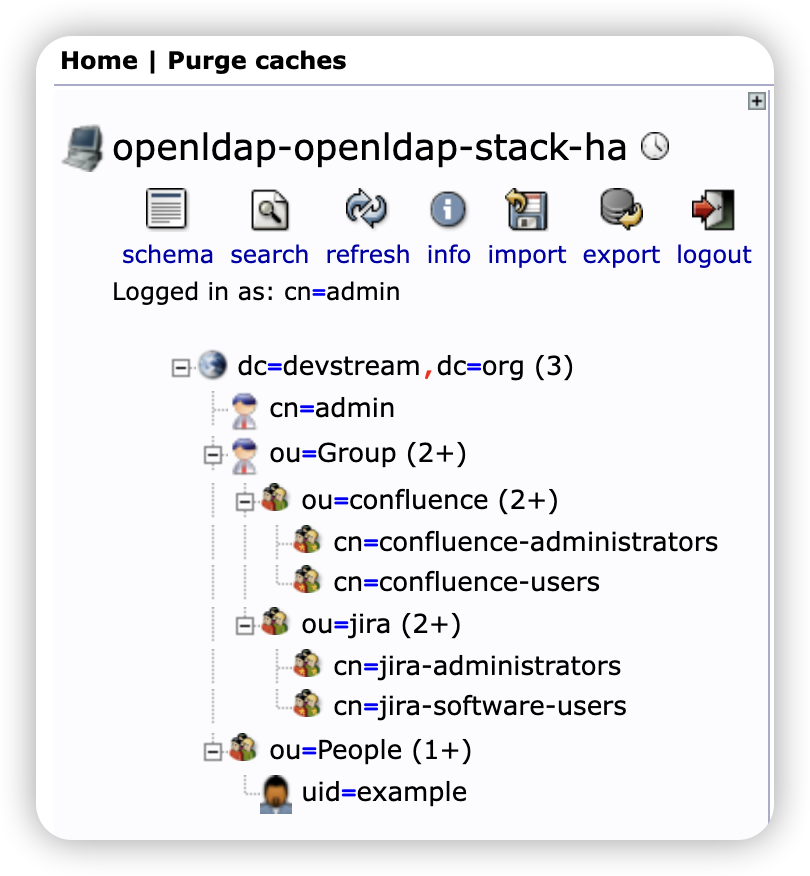

# openldap Plugin

This plugin installs [OpenLDAP](https://www.openldap.org/) in an existing Kubernetes cluster using the Helm chart. Please at least make sure your Kubernetes's version is greater than 1.18.

## Usage

```yaml
tools:
# name of the tool
- name: openldap
  # id of the tool instance
  instanceID: default
  # format: name.instanceID; If specified, dtm will make sure the dependency is applied first before handling this tool.
  dependsOn: []
  # options for the plugin  
  options:
    # need to create the namespace or not, default: false
    create_namespace: true
    repo:
      # name of the Helm repo
      name: helm-openldap
      # url of the Helm repo
      url: https://jp-gouin.github.io/helm-openldap/
    # Helm chart information
    chart:
      # name of the chart
      chart_name: helm-openldap/openldap-stack-ha
      # release name of the chart
      release_name: openldap
      # k8s namespace where OpenLDAP will be installed
      namespace: openldap
      # whether to wait for the release to be deployed or not
      wait: true
      # the time to wait for any individual Kubernetes operation (like Jobs for hooks). This defaults to 5m0s
      timeout: 5m
      # custom configuration (Optional). You can refer to https://github.com/jp-gouin/helm-openldap/blob/master/values.yaml
      values_yaml: |
        replicaCount: 1
        service: 
          type: NodePort  
        env:
          LDAP_ORGANISATION: "DevStream Inc."
          LDAP_DOMAIN: "devstream.io"
        persistence:
          enabled: false
        adminPassword: Not@SecurePassw0rd
        configPassword: Not@SecurePassw0rd

        ltb-passwd:
          enabled : false

        phpldapadmin:
          enabled: true
          ingress:
            enabled: false
```

## Description of Key Fields in `values_yaml`
- `replicaCount`: The default value is 3, for the convenience of local testing, the above example is set to 1
- `service.type`: The default value is `ClusterIP`, if you have services outside the Kubernetes cluster that require ldap integration, the value preferably be set to `NodePort`, so that services outside the Kubernetes cluster can access the ldap service via `ldap://ip:389` instead of `ldap://openldap.openldap-openldap-stack-ha:389`
- `adminPassword`: Use your own custom password
- `configPassword`: Use your own custom password
- `ltb-passwd`: Ingress of the Ltb-Passwd service by which you can modify your password. If you need this service, you can set `ltb-passwd.enabled` to `true`.
- `phpldapadmin.ingress`: Ingress of Phpldapadmin service by which you can manage your ldap service. If you wish to expose the service to the Internet, you can change the `phpldapadmin.ingress.enabled` to `true` and configure your own domain name

## Post-installation Operations

Once the installation is complete, you can manage ldap service through **phpldapadmin**. For local testing, you can access the service through port forwarding. The commands are as follows.

```bash
kubectl port-forward svc/openldap-phpldapadmin 8080:80 -n openldap
```

Now you can now access the phpldapadmin service on your browser via http://127.0.0.1:8080

If you have not changed the default values in the above example, its account will be **cn=admin,dc=devstream,dc=org** and password will be **Not@SecurePassw0rd**.

**Note**: If you're familiar with OpenLDAP, then you don't need to continue reading the tutorial below, you can just go ahead and integrate ldap for your service.

### Importing Your Data

The following is a sample file, if you have changed the above configuration, remember to replace `dc=devstream,dc=org` with your own.

```
dn: cn=admin,dc=devstream,dc=org
cn: admin
objectclass: organizationalRole

dn: ou=Group,dc=devstream,dc=org
cn: Group
objectclass: organizationalRole
ou: Group

# confluence organizationalUnit
dn: ou=confluence,ou=Group,dc=devstream,dc=org
objectclass: organizationalUnit
objectclass: top
ou: confluence

# confluence administrators group
dn: cn=confluence-administrators,ou=confluence,ou=Group,dc=devstream,dc=org
cn: confluence-administrators
description:: d2lraeeuoeeQhue7hA==
objectclass: groupOfUniqueNames
uniquemember: uid=example,ou=People,dc=devstream,dc=org

# confluence users group
dn: cn=confluence-users,ou=confluence,ou=Group,dc=devstream,dc=org
cn: confluence-users
description:: d2lraeaZrumAmueUqOaItw==
objectclass: groupOfUniqueNames
uniquemember: uid=example,ou=People,dc=devstream,dc=org

# jira organizationalUnit
dn: ou=jira,ou=Group,dc=devstream,dc=org
objectclass: organizationalUnit
objectclass: top
ou: jira

# jira administrators Group
dn: cn=jira-administrators,ou=jira,ou=Group,dc=devstream,dc=org
cn: jira-administrators
description:: amlyYeeuoeeQhue7hA==
objectclass: groupOfUniqueNames
uniquemember: uid=example,ou=People,dc=devstream,dc=org

# jira users group
dn: cn=jira-software-users,ou=jira,ou=Group,dc=devstream,dc=org
cn: jira-software-users
description:: amlyYeeuoeeQhue7hA==
objectclass: groupOfUniqueNames
uniquemember: uid=example,ou=People,dc=devstream,dc=org

dn: ou=People,dc=devstream,dc=org
objectclass: organizationalUnit
ou: People

# People for example
dn: uid=example,ou=People,dc=devstream,dc=org
cn: example
gidnumber: 500
givenname: example
homedirectory: /home/example
loginshell: /bin/sh
mail: example@devstream.org
objectclass: inetOrgPerson
objectclass: posixAccount
objectclass: top
sn: example
uid: example
uidnumber: 1007
userpassword: example@123456
```

Login your `phpldapadmin` service and import the sample configuration above.After importing the data successfully, the result is as follows.

<!--  -->

### Verify the LDAP Service

Log in to the container where the ldap service is located, and then use the `ldapsearch` command to query the user(`uid=example,ou=people,dc=devstream,dc=org`) created above

```bash
root@openldap-openldap-stack-ha-0:/# ldapsearch -x -H ldap://127.0.0.1:389 -b uid=example,ou=people,dc=devstream,dc=org -D "cn=admin,dc=devstream,dc=org" -w Not@SecurePassw0rd

# extended LDIF
#
# LDAPv3
# base <uid=example,ou=people,dc=devstream,dc=org> with scope subtree
# filter: (objectclass=*)
# requesting: ALL
#

# example, People, devstream.org
dn: uid=example,ou=People,dc=devstream,dc=org
cn: example
gidNumber: 500
givenName: example
homeDirectory: /home/example
loginShell: /bin/sh
mail: example@devstream.org
objectClass: inetOrgPerson
objectClass: posixAccount
objectClass: top
sn: example
uid: example
uidNumber: 1007
userPassword:: ZXhhbXBsZUAxMjM0NTY=

# search result
search: 2
result: 0 Success

# numResponses: 2
# numEntries: 1
```

If your command output is as above, your ldap service is fine. The above `values_yaml` is only to facilitate your local testing, if you want production available, you also have to configure `replicaCount`, data persistence, etc., refer to [OpenLDAP values.yaml](https://github.com/jp-gouin/helm-openldap/blob/master/values.yaml)
