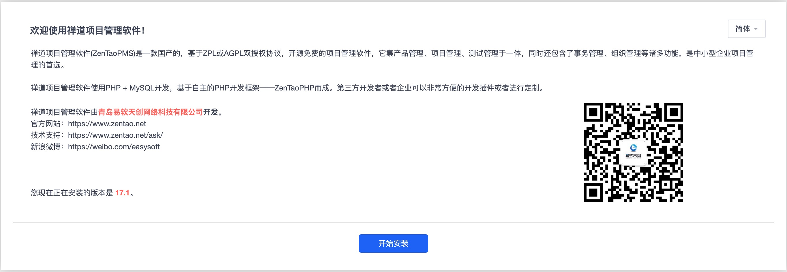
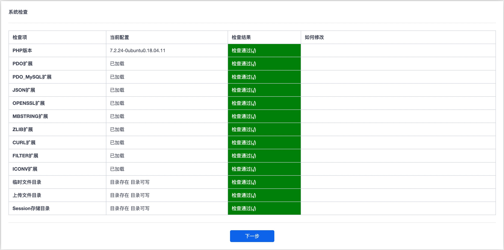
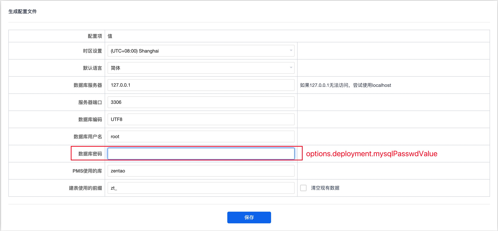
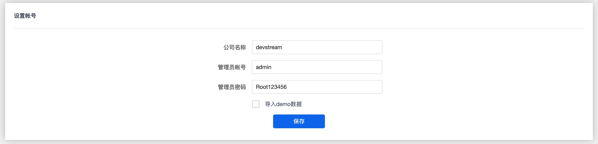
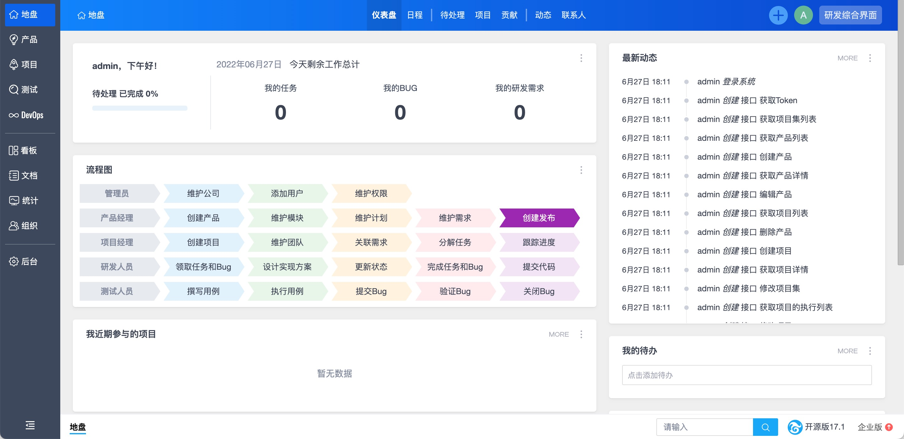

# zentao Plugin

This plugin installs [ZenTao](https://zentao.net/) in an existing Kubernetes cluster by go client.

**Notes:**

- ZenTao will be installed in K8s cluster, please prepare a K8s cluster before using ZenTao plugin.
  For local build, you can use `hack/e2e/e2e-up.sh` to create a K8s cluster via `Kind`.
- Currently, all fields list in the example config file below are required. You can modify them according to your needs.
- This plugin is not supported to run on `arm64` architecture now.

## Usage

The following content is an example of the "tool file".

For more information on the main config, the tool file and the var file of DevStream, see [Core Concepts Overview](../core-concepts/core-concepts.md#1-config) and [DevStream Configuration](../core-concepts/config.md).

```yaml
---
# core config
varFile: ''
toolFile: ''
pluginDir: ''
state: # state config, backend can be local or s3
  backend: local
  options:
    stateFile: devstream.state

---
# plugins config
tools:
  # name of the tool
  - name: zentao
    # id of the tool instance
    instanceID: default
    # format: name.instanceID; If specified, dtm will make sure the dependency is applied first before handling this tool
    dependsOn: []
    # options for the plugin
    options:
      # namespace for ZenTao application
      namespace: 'zentao'
      # storageClassName used to match pv and pvc
      storageClassName: 'zentao-storage'
      # two PersistentVolumes for ZenTao and mysql should be specified
      persistentVolumes:
          # name of ZenTao pv
        - pvName: "zentao-pv"
          # capacity of ZenTao pv
          pvCapacity: "1G"
          # name of mysql pv
        - pvName: "mysql-pv"
          # capacity of mysql pv
          pvCapacity: "1G"
      # two PersistentVolumeClaims for ZenTao and mysql should be specified
      persistentVolumeClaims:
          # name of ZenTao pvc
        - pvcName: "zentao-pvc"
          # capacity of ZenTao pvc
          pvcCapacity: "1G"
          # name of mysql pvc
        - pvcName: "mysql-pvc"
          # capacity of mysql pvc
          pvcCapacity: "1G"
      # ZenTao application is deployed by K8s Deployment
      deployment:
        # name of ZenTao deployment
        name: 'zentao-dp'
        # number of application replica
        replicas: 1
        # ZenTao image
        image: 'easysoft/zentao:latest'
        envs:
          - key: 'MYSQL_ROOT_PASSWORD'
            # initial password value for mysql database, you can specify any value you like
            value: '123456'
      # ZenTao application is exposed via K8s Service
      service:
        # name of ZenTao service
        name: 'zentao-svc'
        # nodePort of ZenTao service, currently ZenTao plugin only support `nodePort` type
        nodePort: 30081
```

## Deployment

### Step1: Prepare a Kubernetes Cluster

- If you already have a Kubernetes cluster, ignore this step. 
- If not, you can use `hack/e2e/e2e-up.sh` to create a K8s cluster via `Kind` as test environment.

```shell
bash hack/e2e/e2e-up.sh
```

### Step2: Create ZenTao Application via Config File

- Create a ZenTao config file following the usage example above.

```shell
./dtm apply -f ZenTao.yaml --debug
```

### Step3: Initialize ZenTao Application

1. Visit `http://NodeIP:NodePort`("NodeIP" and "NodePort" are Kubernets node IP and node port) to start the initialization process. Press `Start Installation` button to the next step.


2. You don't need to do anything about the system check and it's done automatically. If there are system check items that do not pass, please make sure that the previous operation is correct. If it still doesn't work, create an issue to track your problem.


3. Fill in database password filed with `options.deployment.mysqlPasswdValue` which was set previously in `ZenTao.yaml`.


4. If everything proceeds successfully, you will see the Zendo introduction.


5. Fill in your company name and create an administrator account.


6. Now, the Zendo application has been successfully deployed.

