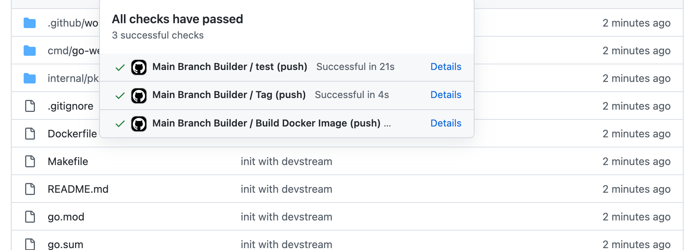

# Quick Start

In this quickstart, we will do the following automatically with DevStream:

- create a GitHub repository with automatically generated code for a web application written in Golang with the [gin](https://github.com/gin-gonic/gin) framework;
- set up GitHub Actions workflow for the app created in the previous step.

---

## 1 Download

In your working directory, run:

```shell
sh -c "$(curl -fsSL https://download.devstream.io/download.sh)"
```

<script id="asciicast-TqB17iqGyksHVKOMNVDqSqgQn" src="https://asciinema.org/a/TqB17iqGyksHVKOMNVDqSqgQn.js" async></script>

!!! note "Note"
    The command above does the following:
 
    - find out your OS and chip architecture
    - find the latest version of the `dtm` binary
    - download the correct `dtm` according to OS/architecture
    - grant the binary execution permission.

!!! quote "Optional"
    You can then move `dtm` to a place which is in your PATH. For example: `mv dtm /usr/local/bin/`.
    
    For more ways to install `dtm`, see [install dtm](./install.md).

---

## 2 Configuration

Run the following command to generate the template configuration file `config.yaml` for quickstart.

```shell
./dtm show config -t quickstart > config.yaml
```

Then set the following environment variables by running (replace values within the double quotes):

```shell
export GITHUB_TOKEN="<YOUR_GITHUB_PERSONAL_ACCESS_TOKEN_HERE>"
export IMAGE_REPO_PASSWORD="<YOUR_DOCKER_HUB_USER_NAME_HERE>"
```

!!! tip "Tip"
    Go to [Personal Access Token](https://github.com/settings/tokens/new) to generate a new `GITHUB_TOKEN` for `dtm`.
    
    For "Quick Start", we only need `repo`,`workflow`,`delete_repo` permissions.

Then we run the following commands to update our config file with those env vars:

===  "**macOS** or **FreeBSD** based systems"

    ```shell
    sed -i.bak "s@YOUR_GITHUB_USERNAME_CASE_SENSITIVE@${GITHUB_USER}@g" config.yaml
    sed -i.bak "s@YOUR_DOCKER_USERNAME@${DOCKERHUB_USERNAME}@g" config.yaml
    ```

=== "**GNU** Linux users"
 
    ```shell
    sed -i "s@YOUR_GITHUB_USERNAME_CASE_SENSITIVE@${GITHUB_USER}@g" config.yaml
    sed -i "s@YOUR_DOCKER_USERNAME@${DOCKERHUB_USERNAME}@g" config.yaml
    ```

<script id="asciicast-4yp3VlJZ3WsPbuVwlh6GsXTJI" src="https://asciinema.org/a/4yp3VlJZ3WsPbuVwlh6GsXTJI.js" async></script>

---

## 3 Init

Run:

```shell
./dtm init -f config.yaml
```

<script id="asciicast-p3Uq9NuC5R53gRrUYmd6aMMRx" src="https://asciinema.org/a/p3Uq9NuC5R53gRrUYmd6aMMRx.js" async></script>

---

## 4 Apply

Run:

```shell
./dtm apply -f config.yaml -y
```

<script id="asciicast-eoWGI8l6wiNZ3misK8xZjp1fv" src="https://asciinema.org/a/eoWGI8l6wiNZ3misK8xZjp1fv.js" async></script>

---

## 5 Check the Results

Go to your GitHub repositories list and you can see the new repo `go-webapp-devstream-demo` has been created.

There is scaffolding code for a Golang web app in it, with GitHub Actions CI workflow set up properly.

The commits (made by DevStream when scaffolding the repo and creating workflows) have triggered the CI, and the workflow has finished successfully, as shown in the screenshot below:



---

## 6 Clean Up

Run:

```shell
./dtm delete -f config.yaml
```

Input `y` then press enter to continue, and you should see similar output:

!!! success "Output"

    ```text title=""
    2022-12-12 12:29:00 ℹ [INFO]  Delete started.
    2022-12-12 12:29:00 ℹ [INFO]  Using local backend. State file: devstream.state.
    2022-12-12 12:29:00 ℹ [INFO]  Tool (github-actions/default) will be deleted.
    2022-12-12 12:29:00 ℹ [INFO]  Tool (repo-scaffolding/golang-github) will be deleted.
    Continue? [y/n]
    Enter a value (Default is n): y
    2022-12-12 12:29:00 ℹ [INFO]  Start executing the plan.
    2022-12-12 12:29:00 ℹ [INFO]  Changes count: 2.
    2022-12-12 12:29:00 ℹ [INFO]  -------------------- [  Processing progress: 1/2.  ] --------------------
    2022-12-12 12:29:00 ℹ [INFO]  Processing: (github-actions/default) -> Delete ...
    2022-12-12 12:29:02 ℹ [INFO]  Prepare to delete 'github-actions_default' from States.
    2022-12-12 12:29:02 ✔ [SUCCESS]  Tool (github-actions/default) delete done.
    2022-12-12 12:29:02 ℹ [INFO]  -------------------- [  Processing progress: 2/2.  ] --------------------
    2022-12-12 12:29:02 ℹ [INFO]  Processing: (repo-scaffolding/golang-github) -> Delete ...
    2022-12-12 12:29:03 ✔ [SUCCESS]  GitHub repo go-webapp-devstream-demo removed.
    2022-12-12 12:29:03 ℹ [INFO]  Prepare to delete 'repo-scaffolding_golang-github' from States.
    2022-12-12 12:29:03 ✔ [SUCCESS]  Tool (repo-scaffolding/golang-github) delete done.
    2022-12-12 12:29:03 ℹ [INFO]  -------------------- [  Processing done.  ] --------------------
    2022-12-12 12:29:03 ✔ [SUCCESS]  All plugins deleted successfully.
    2022-12-12 12:29:03 ✔ [SUCCESS]  Delete finished.
    ```

Now if you check your GitHub repo list again, everything has been nuked by DevStream. Hooray!

You can also remove the DevStream state file (which should be empty now) by running: `rm devstream.state`.
