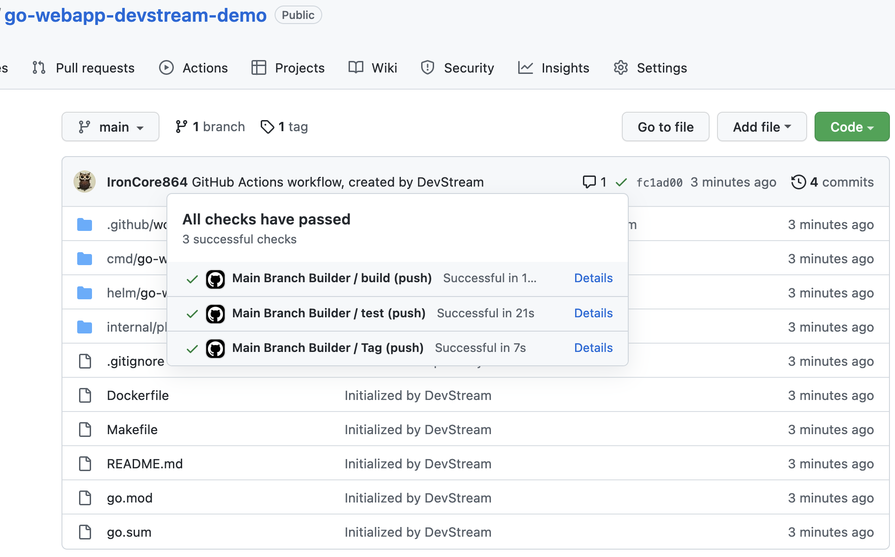

# 快速开始

如果你更喜欢看 DevStream 的实际操作，请先观看[演示视频](./index.md)。

> 注意：DevStream 目前只有 Linux 和 macOS 版本，Windows 将在以后支持。 

在这个快速开始的示例中，我们将使用 DevStream 做以下自动化工作：

1. 使用 Golang 的 web 应用程序脚手架在 GitHub 创建仓库。
2. 为我们创建的 Golang 应用程序设置 GitHub Actions，包含 Go web 应用程序的构建和测试阶段。

## 1 下载

进入你的工作目录，运行：
```shell
sh -c "$(curl -fsSL https://raw.githubusercontent.com/devstream-io/devstream/main/hack/quick-start/quickstart.sh)"
```

这个命令会下载 `dtm` 二进制文件和 `quickstart.yaml` 的配置文件到你的工作目录中，并赋予二进制文件执行权限。

> 可选：建议你将 dtm 移动到包含于 PATH 的目录下，比如 `mv dtm /usr/local/bin/`。

## 2 配置

正如前文所述，我们将在 GitHub Actions 中操作 GitHub 仓库的脚手架和 CI 工作流。所以，我们需要设置以下环境变量：

- GITHUB_USER
- GITHUB_TOKEN
- DOCKERHUB_USERNAME

运行以下命令以设置这些环境变量（记得替换双引号内的值）：

```shell
export GITHUB_USER="<YOUR_GITHUB_USER_NAME_HERE>"
export GITHUB_TOKEN="<YOUR_GITHUB_PERSONAL_ACCESS_TOKEN_HERE>"
export DOCKERHUB_USERNAME="<YOUR_DOCKER_HUB_USER_NAME_HERE>"
```

> 小贴士：如果你不知道怎么获取 GitHub token，可以前往 [GitHub 官方文档](https://docs.github.com/en/authentication/keeping-your-account-and-data-secure/creating-a-personal-access-token) 。

接着，让我们运行以下命令，以使用环境变量来修改配置文件：

对于 **macOS** 或 基于 **FreeBSD** 的操作系统：


```shell
sed -i.bak "s@YOUR_GITHUB_USERNAME_CASE_SENSITIVE@${GITHUB_USER}@g" quickstart.yaml
sed -i.bak "s@YOUR_DOCKER_USERNAME@${DOCKERHUB_USERNAME}@g" quickstart.yaml
```

对于 **GNU** Linux 用户:

```shell
sed -i "s@YOUR_GITHUB_USERNAME_CASE_SENSITIVE@${GITHUB_USER}@g" quickstart.yaml
sed -i "s@YOUR_DOCKER_USERNAME@${DOCKERHUB_USERNAME}@g" quickstart.yaml
```


## 3 初始化

运行：

```shell
./dtm init -f quickstart.yaml
```

你会看到类似这样的日志输出：

```
2022-06-30 11:21:48 ℹ [INFO]  Got Backend from config: local
2022-06-30 11:21:48 ℹ [INFO]  Using dir <.devstream> to store plugins.
2022-06-30 11:21:48 ℹ [INFO]  Downloading: [github-repo-scaffolding-golang-darwin-arm64_0.7.0.so] ...
 15.05 MiB / 15.05 MiB [================================] 100.00% 21.17 MiB/s 0s
2022-06-30 11:21:49 ✔ [SUCCESS]  [github-repo-scaffolding-golang-darwin-arm64_0.7.0.so] download succeeded.
2022-06-30 11:21:49 ℹ [INFO]  Downloading: [github-repo-scaffolding-golang-darwin-arm64_0.7.0.md5] ...
 33 B / 33 B [==========================================] 100.00% 35.29 KiB/s 0s
2022-06-30 11:21:49 ✔ [SUCCESS]  [github-repo-scaffolding-golang-darwin-arm64_0.7.0.md5] download succeeded.
2022-06-30 11:21:49 ℹ [INFO]  Plugin: github-repo-scaffolding-golang-darwin-arm64_0.7.0.so doesn't match with .md5 and will be downloaded.
2022-06-30 11:21:49 ℹ [INFO]  Downloading: [github-repo-scaffolding-golang-darwin-arm64_0.7.0.so] ...
 15.05 MiB / 15.05 MiB [================================] 100.00% 31.25 MiB/s 0s
2022-06-30 11:21:50 ✔ [SUCCESS]  [github-repo-scaffolding-golang-darwin-arm64_0.7.0.so] download succeeded.
2022-06-30 11:21:50 ℹ [INFO]  Downloading: [github-repo-scaffolding-golang-darwin-arm64_0.7.0.md5] ...
 33 B / 33 B [==========================================] 100.00% 43.43 KiB/s 0s
2022-06-30 11:21:50 ✔ [SUCCESS]  [github-repo-scaffolding-golang-darwin-arm64_0.7.0.md5] download succeeded.
2022-06-30 11:21:50 ℹ [INFO]  Downloading: [githubactions-golang-darwin-arm64_0.7.0.so] ...
 17.49 MiB / 17.49 MiB [================================] 100.00% 31.18 MiB/s 0s
2022-06-30 11:21:51 ✔ [SUCCESS]  [githubactions-golang-darwin-arm64_0.7.0.so] download succeeded.
2022-06-30 11:21:51 ℹ [INFO]  Downloading: [githubactions-golang-darwin-arm64_0.7.0.md5] ...
 33 B / 33 B [=========================================] 100.00% 160.70 KiB/s 0s
2022-06-30 11:21:51 ✔ [SUCCESS]  [githubactions-golang-darwin-arm64_0.7.0.md5] download succeeded.
2022-06-30 11:21:51 ℹ [INFO]  Plugin: githubactions-golang-darwin-arm64_0.7.0.so doesn't match with .md5 and will be downloaded.
2022-06-30 11:21:51 ℹ [INFO]  Downloading: [githubactions-golang-darwin-arm64_0.7.0.so] ...
 17.49 MiB / 17.49 MiB [================================] 100.00% 31.78 MiB/s 0s
2022-06-30 11:21:52 ✔ [SUCCESS]  [githubactions-golang-darwin-arm64_0.7.0.so] download succeeded.
2022-06-30 11:21:52 ℹ [INFO]  Downloading: [githubactions-golang-darwin-arm64_0.7.0.md5] ...
 33 B / 33 B [==========================================] 100.00% 87.12 KiB/s 0s
2022-06-30 11:21:52 ✔ [SUCCESS]  [githubactions-golang-darwin-arm64_0.7.0.md5] download succeeded.
2022-06-30 11:21:52 ✔ [SUCCESS]  Initialize finished.
```

## 4 应用（Apply）

运行：

```shell
./dtm apply -f quickstart.yaml
```

当它提示：

```shell
...(以上省略)
Continue? [y/n]
Enter a value (Default is n):
```

请输入 `y` 并按回车键。

你会看到类似下面的输出：

```
2022-06-30 11:25:47 ℹ [INFO]  Apply started.
2022-06-30 11:25:47 ℹ [INFO]  Got Backend from config: local
2022-06-30 11:25:47 ℹ [INFO]  Using dir <.devstream> to store plugins.
2022-06-30 11:25:47 ℹ [INFO]  Using local backend. State file: devstream.state.
2022-06-30 11:25:47 ℹ [INFO]  Tool (github-repo-scaffolding-golang/default) found in config but doesn't exist in the state, will be created.
2022-06-30 11:25:47 ℹ [INFO]  Tool (githubactions-golang/default) found in config but doesn't exist in the state, will be created.
Continue? [y/n]
Enter a value (Default is n): y

2022-06-30 11:26:20 ℹ [INFO]  Start executing the plan.
2022-06-30 11:26:20 ℹ [INFO]  Changes count: 2.
2022-06-30 11:26:20 ℹ [INFO]  -------------------- [  Processing progress: 1/2.  ] --------------------
2022-06-30 11:26:20 ℹ [INFO]  Processing: (github-repo-scaffolding-golang/default) -> Create ...
2022-06-30 11:26:24 ℹ [INFO]  The repo go-webapp-devstream-demo has been created.
2022-06-30 11:26:37 ✔ [SUCCESS]  Tool (github-repo-scaffolding-golang/default) Create done.
2022-06-30 11:26:37 ℹ [INFO]  -------------------- [  Processing progress: 2/2.  ] --------------------
2022-06-30 11:26:37 ℹ [INFO]  Processing: (githubactions-golang/default) -> Create ...
2022-06-30 11:26:38 ℹ [INFO]  Creating GitHub Actions workflow pr-builder.yml ...
2022-06-30 11:26:38 ✔ [SUCCESS]  Github Actions workflow pr-builder.yml created.
2022-06-30 11:26:38 ℹ [INFO]  Creating GitHub Actions workflow main-builder.yml ...
2022-06-30 11:26:39 ✔ [SUCCESS]  Github Actions workflow main-builder.yml created.
2022-06-30 11:26:39 ✔ [SUCCESS]  Tool (githubactions-golang/default) Create done.
2022-06-30 11:26:39 ℹ [INFO]  -------------------- [  Processing done.  ] --------------------
2022-06-30 11:26:39 ✔ [SUCCESS]  All plugins applied successfully.
2022-06-30 11:26:39 ✔ [SUCCESS]  Apply finished.
```


## 5 检查结果

前往你的 GitHub 仓库列表，你可以看到一个新的仓库 `go-webapp-devstream-demo` 已经被创建了。

包含了 Golang web 应用程序的脚手架代码，并正确设置了 GitHub Actions CI 工作流。

DevStream 在生成仓库脚手架和创建工作流时的代码提交，已经触发了 CI，且工作流已经成功地运行完毕，如下图所示：



## 6 清理

运行：

```shell
./dtm delete -f quickstart.yaml
```

像之前那样，在收到提示时输入 `y`，你将会看到类似输出：

```
2022-06-30 11:31:01 ℹ [INFO]  Delete started.
2022-06-30 11:31:01 ℹ [INFO]  Got Backend from config: local
2022-06-30 11:31:01 ℹ [INFO]  Using dir <.devstream> to store plugins.
2022-06-30 11:31:01 ℹ [INFO]  Using local backend. State file: devstream.state.
2022-06-30 11:31:01 ℹ [INFO]  Tool (githubactions-golang/default) will be deleted.
2022-06-30 11:31:01 ℹ [INFO]  Tool (github-repo-scaffolding-golang/default) will be deleted.
Continue? [y/n]
Enter a value (Default is n): y

2022-06-30 11:31:03 ℹ [INFO]  Start executing the plan.
2022-06-30 11:31:03 ℹ [INFO]  Changes count: 2.
2022-06-30 11:31:03 ℹ [INFO]  -------------------- [  Processing progress: 1/2.  ] --------------------
2022-06-30 11:31:03 ℹ [INFO]  Processing: (githubactions-golang/default) -> Delete ...
2022-06-30 11:31:04 ℹ [INFO]  Deleting GitHub Actions workflow pr-builder.yml ...
2022-06-30 11:31:05 ✔ [SUCCESS]  GitHub Actions workflow pr-builder.yml removed.
2022-06-30 11:31:05 ℹ [INFO]  Deleting GitHub Actions workflow main-builder.yml ...
2022-06-30 11:31:06 ✔ [SUCCESS]  GitHub Actions workflow main-builder.yml removed.
2022-06-30 11:31:06 ℹ [INFO]  Prepare to delete 'githubactions-golang_default' from States.
2022-06-30 11:31:06 ✔ [SUCCESS]  Tool (githubactions-golang/default) delete done.
2022-06-30 11:31:06 ℹ [INFO]  -------------------- [  Processing progress: 2/2.  ] --------------------
2022-06-30 11:31:06 ℹ [INFO]  Processing: (github-repo-scaffolding-golang/default) -> Delete ...
2022-06-30 11:31:06 ✔ [SUCCESS]  GitHub repo go-webapp-devstream-demo removed.
2022-06-30 11:31:06 ℹ [INFO]  Prepare to delete 'github-repo-scaffolding-golang_default' from States.
2022-06-30 11:31:06 ✔ [SUCCESS]  Tool (github-repo-scaffolding-golang/default) delete done.
2022-06-30 11:31:06 ℹ [INFO]  -------------------- [  Processing done.  ] --------------------
2022-06-30 11:31:06 ✔ [SUCCESS]  All plugins deleted successfully.
2022-06-30 11:31:06 ✔ [SUCCESS]  Delete finished.
```

现在，如果你看看 GitHub 仓库列表，所有东西都被 DevStream 消灭了。妙哉！

> 可选：你也可以通过运行：`rm devstream.state` 来删除 DevStream 状态文件（现在应该是个空文件）。
