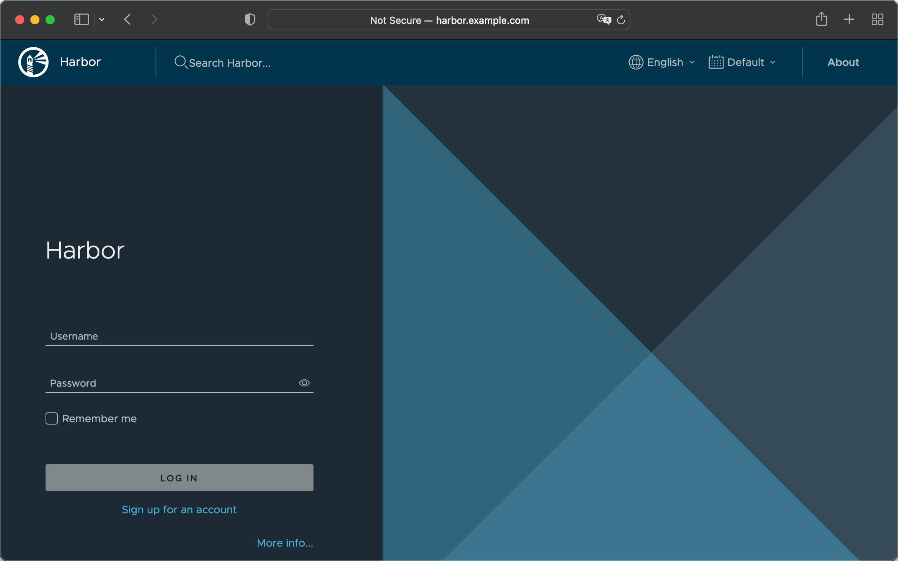

# 快速部署 GitLab + Jenkins + Harbor 工具链

## 1、概述

本文将介绍如何通过 DevStream 在本地快速部署 `GitLab + Jenkins + Harbor` 工具链。

!!! hint "提示"

    本文基于 kubeadm 部署的单节点 k8s 环境，不适用于 minikube 和 kind 等 docker-in-docker 类型的 k8s 集群。

## 2、安装 dtm

你可以参考[这个文档](../../install.zh.md)完成 dtm 的下载与安装。

## 3、准备配置文件

DevStream 可以简单地以 **local** 作为[状态](../../core-concepts/state.zh.md) Backend，也就是将状态保存到本地文件。如果你在本地测试，可以选择使用这种方式；
而企业 On premise 环境部署可能需要使用 **k8s** Backend 将状态通过 `kube-apiserver` 存入 etcd，两种方式配置分别如下：

=== "DevStream with 'local' Backend"

    ```yaml title="local Backend"
    config:
      state:
        backend: local
        options:
          stateFile: devstream.state
    ```

=== "DevStream with 'k8s' Backend"

    ```yaml title="k8s Backend"
    config:
      state:
        backend: k8s
        options:
          namespace: devstream
          configmap: state
    ```

下文将以 `local` Backend 为例演示。

在编写 `gitlab-ce-docker` 和 `helm-installer`（用于安装 Jenkins 和 Harbor）这两个插件的配置文件之前，你需要先定义一些变量，这会让后续的配置和维护工作变得更加简单：

```yaml title="config-tools.yaml"
config:
  state:
    backend: local
    options:
      stateFile: devstream.state
vars:
  gitlabHostname: gitlab.example.com
  jenkinsHostname: jenkins.example.com
  harborHostname: harbor.example.com
  harborURL: http://harbor.example.com
  jenkinsAdminUser: admin
  jenkinsAdminPassword: changeme
  gitlabSSHPort: 30022
  gitlabHttpPort: 30080
  gitlabHttpsPort: 30443
```

你可以根据自己的需要，选择性自定义上述 vars 配置的值，这些变量内容主要是域名、端口号等可修改配置项。

继续往里面追加工具链相关插件的配置，你的配置文件会扩充成这样：

```yaml title="config-tools.yaml"
config:
  state:
    backend: local
    options:
      stateFile: devstream.state
vars:
  gitlabHostname: gitlab.example.com
  jenkinsHostname: jenkins.example.com
  harborHostname: harbor.example.com
  harborURL: http://harbor.example.com
  jenkinsAdminUser: admin
  jenkinsAdminPassword: changeme
  gitlabSSHPort: 30022
  gitlabHttpPort: 30080
  gitlabHttpsPort: 30443
tools:
- name: gitlab-ce-docker
  instanceID: default
  dependsOn: []
  options:
    hostname: [[ gitlabHostname ]]
    gitlabHome: /srv/gitlab
    sshPort: [[ gitlabSSHPort ]]
    httpPort: [[ gitlabHttpPort ]]
    httpsPort: [[ gitlabHttpsPort ]]
    rmDataAfterDelete: false
    imageTag: "rc"
- name: helm-installer
  instanceID: jenkins-001
  dependsOn: []
  options:
    valuesYaml: |
      serviceAccount:
        create: true
        name: jenkins
      controller:
        adminUser: [[ jenkinsAdminUser ]]
        adminPassword: [[ jenkinsAdminPassword ]]
        ingress:
          enabled: true
          hostName: [[ jenkinsHostname ]]
      enableRawHtmlMarkupFormatter: true
      JCasC:
        defaultConfig: true
- name: helm-installer
  instanceID: harbor-001
  dependsOn: []
  options:
    valuesYaml: |
      externalURL: [[ harborURL ]]
      expose:
        type: ingress
        tls:
          enabled: false
        ingress:
          hosts:
            core: [[ harborHostname ]]
      chartmuseum:
        enabled: false
      notary:
        enabled: false
      trivy:
        enabled: false
      persistence:
        persistentVolumeClaim:
          registry:
            storageClass: ""
            accessMode: ReadWriteOnce
            size: 5Gi
          jobservice:
            storageClass: ""
            accessMode: ReadWriteOnce
            size: 1Gi
          database:
            storageClass: ""
            accessMode: ReadWriteOnce
            size: 1Gi
          redis:
            storageClass: ""
            accessMode: ReadWriteOnce
            size: 1Gi
```

## 4、初始化

你可以将上面这个配置文件（config-tools.yaml）放到服务器上任意一个合适的目录，比如 `~/devstream-test/`，然后在该目录下执行：

```shell title="初始化命令"
dtm init -f config-tools.yaml
```

这个命令会帮助你下载所有需要的 DevStream 插件。

## 5、开始部署

接着你就可以执行 apply 命令了：

```shell title="开始部署"
dtm apply -f config-tools.yaml -y
```

这个命令执行成功的话，你可以大致看到如下日志：

```shell title="部署日志"
2022-11-30 08:14:05 ℹ [INFO]  Apply started.
2022-11-30 08:14:06 ℹ [INFO]  Using local backend. State file: devstream.state.
2022-11-30 08:14:06 ℹ [INFO]  Tool (gitlab-ce-docker/default) found in config but doesn't exist in the state, will be created.
2022-11-30 08:14:06 ℹ [INFO]  Tool (helm-installer/jenkins-001) found in config but doesn't exist in the state, will be created.
2022-11-30 08:14:06 ℹ [INFO]  Tool (helm-installer/harbor-001) found in config but doesn't exist in the state, will be created.
2022-11-30 08:14:06 ℹ [INFO]  Start executing the plan.
2022-11-30 08:14:06 ℹ [INFO]  Changes count: 3.
2022-11-30 08:14:06 ℹ [INFO]  -------------------- [  Processing progress: 1/3.  ] --------------------
2022-11-30 08:14:06 ℹ [INFO]  Processing: (gitlab-ce-docker/default) -> Create ...
2022-11-30 08:14:06 ℹ [INFO]  Cmd: docker image ls gitlab/gitlab-ce:rc -q.
2022-11-30 08:14:06 ℹ [INFO]  Running container as the name <gitlab>
2022-11-30 08:14:06 ℹ [INFO]  Cmd: docker run --detach --hostname gitlab.example.com --publish 30022:22 --publish 30080:80 --publish 30443:443 --name gitlab --restart always --volume /srv/gitlab/config:/etc/gitlab --volume /srv/gitlab/data:/var/opt/gitlab --volume /srv/gitlab/logs:/var/log/gitlab gitlab/gitlab-ce:rc.
Stdout: 34cdd2a834a1c21be192064eacf1e29536ff45c52562956b97d6d376a5dae11b
2022-11-30 08:14:07 ℹ [INFO]  Cmd: docker inspect --format='{{json .Mounts}}' gitlab.
2022-11-30 08:14:07 ℹ [INFO]  GitLab access URL: http://gitlab.example.com:30080
2022-11-30 08:14:07 ℹ [INFO]  GitLab initial root password: execute the command -> docker exec -it gitlab grep 'Password:' /etc/gitlab/initial_root_password
2022-11-30 08:14:07 ✔ [SUCCESS]  Tool (gitlab-ce-docker/default) Create done.
2022-11-30 08:14:07 ℹ [INFO]  -------------------- [  Processing progress: 2/3.  ] --------------------
2022-11-30 08:14:07 ℹ [INFO]  Processing: (helm-installer/jenkins-001) -> Create ...
2022-11-30 08:14:07 ℹ [INFO]  Filling default config with instance: jenkins-001.
2022-11-30 08:14:07 ℹ [INFO]  Creating or updating helm chart ...
2022/11/30 08:14:09 creating 13 resource(s)
2022/11/30 08:14:09 beginning wait for 13 resources with timeout of 10m0s
2022/11/30 08:14:09 StatefulSet is not ready: jenkins/jenkins. 0 out of 1 expected pods are ready
...
2022/11/30 08:14:49 StatefulSet is not ready: jenkins/jenkins. 0 out of 1 expected pods are ready
2022/11/30 08:14:51 release installed successfully: jenkins/jenkins-4.2.15
2022-11-30 08:14:51 ✔ [SUCCESS]  Tool (helm-installer/jenkins-001) Create done.
2022-11-30 08:14:51 ℹ [INFO]  -------------------- [  Processing progress: 3/3.  ] --------------------
2022-11-30 08:14:51 ℹ [INFO]  Processing: (helm-installer/harbor-001) -> Create ...
2022-11-30 08:14:51 ℹ [INFO]  Filling default config with instance: harbor-001.
2022-11-30 08:14:51 ℹ [INFO]  Creating or updating helm chart ...
2022/11/30 08:14:52 checking 28 resources for changes
2022/11/30 08:14:52 Created a new Secret called "harbor-core" in harbor
...
2022/11/30 08:14:52 Created a new Ingress called "harbor-ingress" in harbor
2022/11/30 08:14:52 beginning wait for 28 resources with timeout of 10m0s
2022/11/30 08:14:52 Deployment is not ready: harbor/harbor-core. 0 out of 1 expected pods are ready
...
2022/11/30 08:15:50 Deployment is not ready: harbor/harbor-jobservice. 0 out of 1 expected pods are ready
2022/11/30 08:15:52 release installed successfully: harbor/harbor-1.10.2
2022-11-30 08:15:52 ✔ [SUCCESS]  Tool (helm-installer/harbor-001) Create done.
2022-11-30 08:15:52 ℹ [INFO]  -------------------- [  Processing done.  ] --------------------
2022-11-30 08:15:52 ✔ [SUCCESS]  All plugins applied successfully.
2022-11-30 08:15:52 ✔ [SUCCESS]  Apply finished.
```

从日志里你可以看到，这时候 GitLab、Jenkins 和 Harbor 就已经部署完成了。

## 6、验证部署结果

你可以通过如下方式验证 GitLab + Jenkins + Harbor 三个工具的部署结果。

### 6.1、DNS 配置

前面你给 GitLab + Jenkins + Harbor 三个工具的配置文件里都设置了域名，然后你可以直接将这些域名与 IP 的映射关系配置到 DNS 服务器里。

如果没有 DNS 服务器，你也可以直接将域名与 IP 的映射关系配置到 `/etc/hosts` 以及 `CoreDNS` 的 ConfigMap `kube-system/coredns` 里让域名生效。比如我的主机 IP 是 44.33.22.11，这时候可以这样配置：

1. 修改 `/etc/hosts` 文件，添加这条记录：

    ```shell title="dns record"
    44.33.22.11 gitlab.example.com jenkins.example.com harbor.example.com
    ```

2. 修改 `CoreDNS` 的配置，在 ConfigMap `kube-system/coredns` 中添加静态解析记录，执行命令：`kubectl edit cm coredns -n kube-system`，在 hosts(第20行左右) 部分添加：

    ```shell title="dns record"
    44.33.22.11 gitlab.example.com jenkins.example.com harbor.example.com
    ```

    这时候在当前主机上，就可以分别通过如下地址访问到 GitLab、Jenkins 和 Harbor 了，同时 Jenkins 也能顺利地通过域名访问到 GitLab 和 Harbor：
    
    - `GitLab`: http://gitlab.example.com:30080
    - `Jenkins`: http://jenkins.example.com
    - `Harbor`: http://harbor.example.com

最后由于当前刚才 DevStream 使用了 Docker 的方式直接运行的 GitLab，所以不管是主机的 /etc/hosts 还是 CoreDNS 的配置都无法让 GitLab 解析到 Jenkins 的域名，因此你还需要在 GitLab 容器内加一行配置：

```sh
docker exec -it gitlab bash
echo "44.33.22.11 jenkins.example.com" >> /etc/hosts
exit
```

### 6.2、访问 GitLab

你可以在自己的 PC 里配置 `44.33.22.11 gitlab.example.com` 静态域名解析记录，然后在浏览器里通过 `http://gitlab.example.com:30080` 访问到 GitLab：

<figure markdown>
  { width="1000" }
  <figcaption>GitLab login page</figcaption>
</figure>

通过执行如下命令，你可以设置 GitLab 的 root 密码：

```shell title="get GitLab root Password"
docker exec -it gitlab bash # 进入容器
gitlab-rake "gitlab:password:reset" # 执行后按照提示输入用户名 root，回车后输入密码
```

拿到 root 密码后，你可以尝试用 root/YOUR_PASSWORD 来登录 GitLab。

### 6.3、访问 Jenkins

前面你可能已经通过 `curl http://jenkins.example.com` 在主机内验证了 Jenkins 的网络连通性，想要远程通过域名访问 Jenkins，你还需要在自己的 PC 里配置 `44.33.22.11 jenkins.example.com` 静态域名解析记录。

接着在浏览器里通过 `http://jenkins.example.com` 就可以访问到 Jenkins 了：

<figure markdown>
  { width="1000" }
  <figcaption>Jenkins login page</figcaption>
</figure>

Jenkins 的 admin 用户初始登录密码是 `changeme`，如果你仔细看了前面 dtm 使用的配置文件，可以发现这是在配置文件里指定的。你可以尝试用 `admin/changeme` 登录 Jenkins 检查功能是否正常，不过当前你不需要在 Jenkins 上进行任何额外的操作。

<figure markdown>
  { width="1000" }
  <figcaption>Jenkins dashboard</figcaption>
</figure>

### 6.4、访问 Harbor

前面你可能也已经通过 `curl http://harbor.example.com` 在主机内验证了 Harbor 的网络连通性，同样你可以通过 `docker login harbor.example.com:80` 命令来尝试登录 Harbor。

现在你需要在自己的 PC 里配置 `44.33.22.11 harbor.example.com` 静态域名解析记录。

接着你可以在浏览器里通过 `http://harbor.example.com` 访问到 Harbor：

<figure markdown>
  { width="1000" }
  <figcaption>Harbor login page</figcaption>
</figure>

Harbor 的 admin 用户初始登录密码是 `Harbor12345`，你可以尝试用 `admin/Harbor12345` 登录 Harbor 检查功能是否正常，不过当前你同样也不需要在 Harbor 上进行任何额外的操作。

<figure markdown>
  { width="1000" }
  <figcaption>Harbor dashboard</figcaption>
</figure>

## 7、环境清理

你可以通过如下命令清理环境：

```shell title="环境清理命令"
dtm delete -f config-tools.yaml -y
```
