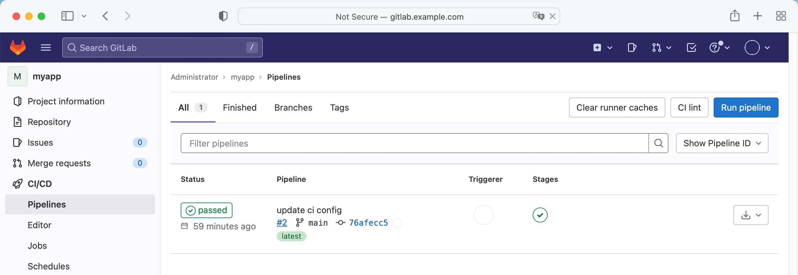
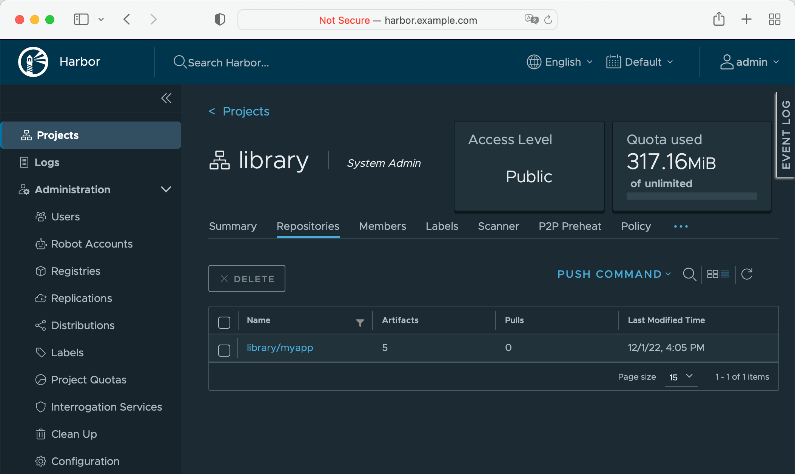

# Java Spring Boot 项目脚手架的快速创建与 Jenkins CI 流水线的自动化配置

在[快速部署 GitLab + Jenkins + Harbor 工具链](./2-gitlab-jenkins-harbor.zh.md)中你已经学会了如何使用 DevStream 快速部署 GitLab + Jenkins + Harbor 工具链。

本文将基于部署好 GitLab + Jenkins + Harbor 工具链，继续以 Java Spring Boot 项目为例，演示如何通过 DevStream 快速创建 Java Spring Boot 项目脚手架，同时在 Jenkins 上自动创建对应的 Pipeline 实现 Java Spring Boot 项目的 CI 流程。

## 1、工作流介绍

本文最终将实现的工具链相关工作流如下图所示：

<figure markdown>
  { width="1000" }
  <figcaption>GitLab + Jenkins + Harbor Toolchain Workflow</figcaption>
</figure>

这里的工作流主要是：

1. DevStream 根据你给定配置，选择默认项目模板或者用户自定义模板创建项目脚手架；
2. DevStream 根据你给定配置，使用 CI 模板创建 CI 流程，过程中会涉及到 CI 工具的配置（比如调用 Jenkins API 完成一些 Jenkins 插件的安装等）；
3. 最终 DevStream 完成全部配置后，如果你提交代码到 DevStream 为你创建的代码库中，GitLab 便会出发 Jenkins 执行相应的 CI 流程，Jenkins 上的流水线运行结果也会实时回显到 GitLab 上，并且这个过程中构建出来的容器镜像会被自动推送到 Harbor 上。

## 2、准备配置文件

DevStream 可以简单地以 **local** 作为[状态](../../core-concepts/state.zh.md) Backend，也就是将状态保存到本地文件。如果你在本地测试，可以选择使用这种方式；
而企业 On premise 环境部署可能需要使用 **k8s** Backend 将状态通过 `kube-apiserver` 存入 etcd，两种方式配置分别如下：

=== "DevStream with 'local' Backend"

    ```yaml title="local Backend"
    config:
      state:
        backend: local
        options:
          stateFile: devstream.state
    ```

=== "DevStream with 'k8s' Backend"

    ```yaml title="k8s Backend"
    config:
      state:
        backend: k8s
        options:
          namespace: devstream
          configmap: state
    ```

下文将以 `local` Backend 为例演示。

在编写应用相关配置项之前，你需要先定义一些变量，这会让后续的配置和维护工作变得更加简单：

```yaml title="config-apps.yaml"
config:
  state:
    backend: local
    options:
      stateFile: devstream.state
vars:
  appName: myapp
  gitlabURL: http://gitlab.example.com:30080
  jenkinsURL: http://jenkins.example.com
  harborURL: http://harbor.example.com
```

你可以根据自己的需要，选择性自定义上述 vars 配置的值，这些变量内容主要是域名等可修改配置项。

继续往里面追加应用相关配置，你的配置文件会扩充成这样：

```yaml title="config-apps.yaml"
config:
  state:
    backend: local
    options:
      stateFile: devstream-app.state
vars:
  appName: myapp
  gitlabURL: http://gitlab.example.com:30080
  jenkinsURL: http://jenkins.example.com
  harborURL: http://harbor.example.com
apps:
- name: [[ appName ]]
  spec:
    language: java
    framework: springboot
  repo:
    url: [[ gitlabURL ]]/root/[[ appName ]].git
    branch: main
    token: [[ env GITLAB_TOKEN ]]
  repoTemplate:
    url: https://github.com/devstream-io/dtm-repo-scaffolding-java-springboot.git
  ci:
  - type: template
    templateName: ci-pipeline
pipelineTemplates:
- name: ci-pipeline
  type: jenkins-pipeline
  options:
    branch: main
    jenkins:
      url: [[ jenkinsURL ]]
      user: admin
      enableRestart: true
      password: [[ env JENKINS_PASSWORD ]]
    imageRepo:
      user: admin
      url: [[ harborURL ]]/library
      password: [[ env IMAGE_REPO_PASSWORD ]]
```

你可以将这个配置文件放到服务器上的某一个路径内，比如 `~/devstream-test/config-apps.yaml`。

## 3、让配置生效

你还需要几个简单的步骤来让上述配置生效。

### 3.1、准备 GitLab Token

你可以参考下图方式在 GitLab 上创建一个 token，这个 token 将给 DevStream 必要的权限用来在 GitLab 上创建项目脚手架等：

<figure markdown>
  { width="1000" }
  <figcaption>Generate GitLab token</figcaption>
</figure>

然后这个 token 需要被设置到环境变量里：

```shell title="环境变量配置"
export GITLAB_TOKEN=YOUR_GITLAB_TOKEN
```

同时需要将 Harbor 密码配置到环境变量里：

```shell title="环境变量配置"
export IMAGE_REPO_PASSWORD=Harbor12345
```

此外由于 DevStream 需要调用 Jenkins 的 API 来帮你创建流水线，所以你还需要告诉 DevStream Jenkins 的密码：

```shell title="环境变量配置"
export JENKINS_PASSWORD=changeme
```

你可以将这个配置文件放到服务器上同一个目录，比如 `~/devstream-test/`，然后在该目录下执行：

### 3.2、开始执行

首先你需要执行初始化命令：

```shell title="初始化"
dtm init -f config-apps.yaml
```

这时候 DevStream 会帮你下载 `jenkins-pipeline` 和 `repo-scaffolding` 两个插件，最终将有这两个插件来帮你完成代码库脚手架的创建和 Jenkins 流水线的配置。

接着你可以继续执行如下命令

```shell
dtm apply -f config-apps.yaml -y
```

如果 apply 命令执行成功的话，你可以看到大致如下日志：

```shell title="执行日志"
2022-12-02 01:04:44 ℹ [INFO]  Delete started.
2022-12-02 01:04:44 ℹ [INFO]  Using local backend. State file: devstream-app.state.
2022-12-02 01:04:44 ℹ [INFO]  Tool (jenkins-pipeline/myapp) will be deleted.
2022-12-02 01:04:44 ℹ [INFO]  Tool (repo-scaffolding/myapp) will be deleted.
2022-12-02 01:04:44 ℹ [INFO]  Start executing the plan.
2022-12-02 01:04:44 ℹ [INFO]  Changes count: 2.
2022-12-02 01:04:44 ℹ [INFO]  -------------------- [  Processing progress: 1/2.  ] ----------
----------
2022-12-02 01:04:44 ℹ [INFO]  Processing: (jenkins-pipeline/myapp) -> Delete ...
2022-12-02 01:04:46 ℹ [INFO]  Prepare to delete 'jenkins-pipeline_myapp' from States.
2022-12-02 01:04:46 ✔ [SUCCESS]  Tool (jenkins-pipeline/myapp) delete done.
2022-12-02 01:04:46 ℹ [INFO]  -------------------- [  Processing progress: 2/2.  ] --------------------
2022-12-02 01:04:46 ℹ [INFO]  Processing: (repo-scaffolding/myapp) -> Delete ...
2022-12-02 01:04:46 ℹ [INFO]  Prepare to delete 'repo-scaffolding_myapp' from States.
2022-12-02 01:04:46 ✔ [SUCCESS]  Tool (repo-scaffolding/myapp) delete done.
2022-12-02 01:04:46 ℹ [INFO]  -------------------- [  Processing done.  ] --------------------
2022-12-02 01:04:46 ✔ [SUCCESS]  All plugins deleted successfully.
2022-12-02 01:04:46 ✔ [SUCCESS]  Delete finished.
root@dtm-realk8sdev:~# ./dtm apply -y -f config-apps.yaml
2022-12-02 01:04:55 ℹ [INFO]  Apply started.
2022-12-02 01:04:55 ℹ [INFO]  Using local backend. State file: devstream-app.state.
2022-12-02 01:04:55 ℹ [INFO]  Tool (repo-scaffolding/myapp) found in config but doesn't exist in the state, will be created.
2022-12-02 01:04:55 ℹ [INFO]  Tool (jenkins-pipeline/myapp) found in config but doesn't exist in the state, will be created.
2022-12-02 01:04:55 ℹ [INFO]  Start executing the plan.
2022-12-02 01:04:55 ℹ [INFO]  Changes count: 2.
2022-12-02 01:04:55 ℹ [INFO]  -------------------- [  Processing progress: 1/2.  ] --------------------
2022-12-02 01:04:55 ℹ [INFO]  Processing: (repo-scaffolding/myapp) -> Create ...
2022-12-02 01:04:55 ℹ [INFO]  github start to download repoTemplate...
2022-12-02 01:04:56 ✔ [SUCCESS]  Tool (repo-scaffolding/myapp) Create done.
2022-12-02 01:04:56 ℹ [INFO]  -------------------- [  Processing progress: 2/2.  ] --------------------
2022-12-02 01:04:56 ℹ [INFO]  Processing: (jenkins-pipeline/myapp) -> Create ...
2022-12-02 01:04:57 ℹ [INFO]  jenkins plugin imageRepo start config...
2022-12-02 01:04:57 ⚠ [WARN]  jenkins gitlab ssh key not config, private repo can't be clone
2022-12-02 01:04:57 ℹ [INFO]  jenkins start config casc...
2022-12-02 01:04:59 ✔ [SUCCESS]  Tool (jenkins-pipeline/myapp) Create done.
2022-12-02 01:04:59 ℹ [INFO]  -------------------- [  Processing done.  ] --------------------
2022-12-02 01:04:59 ✔ [SUCCESS]  All plugins applied successfully.
2022-12-02 01:04:59 ✔ [SUCCESS]  Apply finished.
```

## 4、查看执行结果

这时候你可以在 GitLab 上看到 dtm 为你准备的 Java Spring Boot 项目脚手架：

<figure markdown>
  { width="1000" }
  <figcaption>Repo scaffolding</figcaption>
</figure>

接着你可以登录 Jenkins，查看 dtm 为你创建的 Pipeline：

<figure markdown>
  { width="1000" }
  <figcaption>Jenkins pipeline</figcaption>
</figure>

这个 Pipeline 会自动执行一次，执行完成后回到 GitLab，你可以看到 Jenkins 回写的 Pipeline 状态：

<figure markdown>
  { width="1000" }
  <figcaption>GitLab Status</figcaption>
</figure>

后面每当 GitLab 上这个 repo 发生 Push 或者 Merge 事件的时候，就会触发 Jenkins 上的 Pipeline 运行。

当然，在 Harbor 上你可以找到 CI 流程构建出来的容器镜像：

<figure markdown>
  { width="1000" }
  <figcaption>Image in Harbor</figcaption>
</figure>

## 5、环境清理

你可以通过如下命令清理环境：

```shell title="环境清理命令"
dtm delete -f config-apps.yaml -y
```
