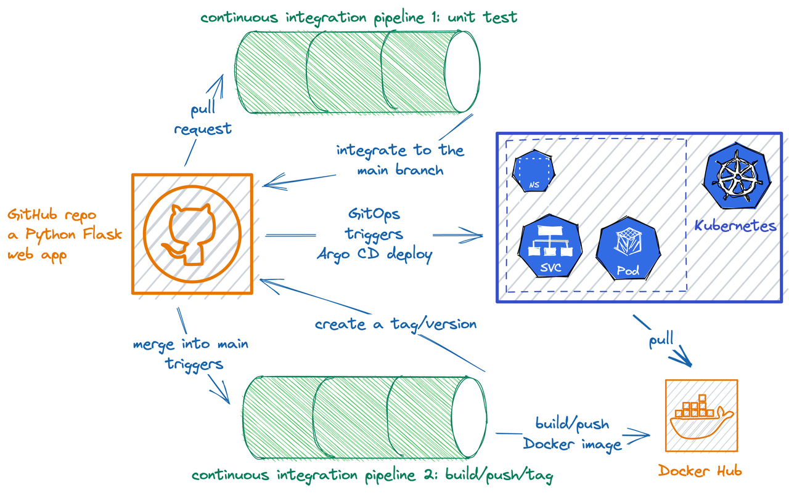

# Overview

## Is This for Me?

- Are you creating a web application/backend API microservice?
- Are you using GitHub to store your source code? 
- Are you eager to deploy your service fast and automatically in your development/test environment to have your work up and running in no time?

If the answers to these questions are all "YES", the combo "GitHub Actions + Argo CD + Python + Flask" might just be the right tools for you.

To be more specific, read on.

---

## Is This Really for Me?

This combo, "GitHub + GitHub Actions + Argo CD + Python + Flask" (could also be GitLab + GitLab CI), if installed/managed/integrated properly, might form the best DevOps platform for you, if:

- You choose GitHub as your source code management (SCM) system. It can be either:
    - GitHub cloud, or
    - GitHub Enterprise (on-premise)
- Since you are using GitHub as SCM and CI interacts a lot with code repositories, using GitHub Actions as your choice of CI is convenient.
    - You can, of course, choose other CI, such as Travis CI, CircleCI, etc., which require a little integration with GitHub; while using GitHub Actions, there is essentially little to no integration required.
    - Plus, many users are already using it, so if you meet some issues while using it, chances are others have already met them, and you can easily find the solution based on a simple Google search.
- You want fast and automatic deployment in your development environment.
    - GitOps might be the best choice for you because it's fast and automatic.
    - You don't have many environments, which eliminates some tricky issues like version propagation you might have if you use GitOps with many environments.
- You want to build some backend API-typed applications.
    - According to one popularity ranking, Python is now the most popular programming language in the world. Programming languages' popularity rises and falls over time, of course. But according to [TIOBE](https://www.tiobe.com/tiobe-index/), a Dutch software quality assurance company, which has been tracking the popularity of programming languages, notes that "for the first time in more than 20 years, we have a new leader of the pack: the Python programming language. The long-standing hegemony of Java and C is over." While Python might not be the perfect choice in every case, when you don't have all the necessary information and must make a guess, choosing the most popular language won't be the worst idea.
    - Flask is a small and lightweight Python web framework that provides valuable tools, including a fast debugger, a built-in development server, and features that make creating web applications in Python easy.

---

## The Big Picture (Literally)

We want to build a DevOps platform around these tools, and what this platform can do could be complicated.

A picture is worth a thousand words:

If you still prefer words to pictures (I know some people do), here's the story we want to implement:

- A repository is created automatically in your GitHub account, with generated code (a Python Flask app, with Dockerfile and helm chart and stuff).
- Continuous integration (CI) pipelines created, so that:
    - When a pull request is created, a job will be triggered to run unit test.
    - When a pull request is merged into the main branch, another job will be triggered to build the Docker image, push it to Dockerhub, and trigger the deployment process
- Argo CD is installed for continuous deployment (CD).
- CD is triggered in a GitOps fashion: when a pull request is merged into the main branch, it deploys the application into the Kubernetes cluster.

OK, then let's just build that.

---

## Prerequisites

1. A working Kubernetes cluster, serving as the infrastructure to deploy tools needed for GitOps, and as well as your development environment.
2. A GitHub account & an access token for API access, and a Dockerhub account & an access token.
