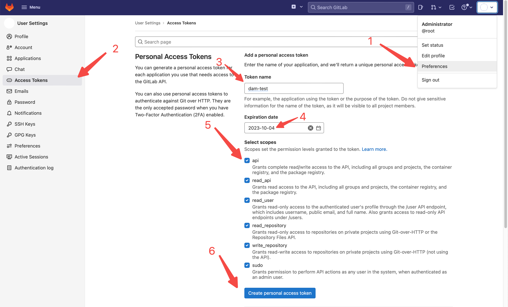
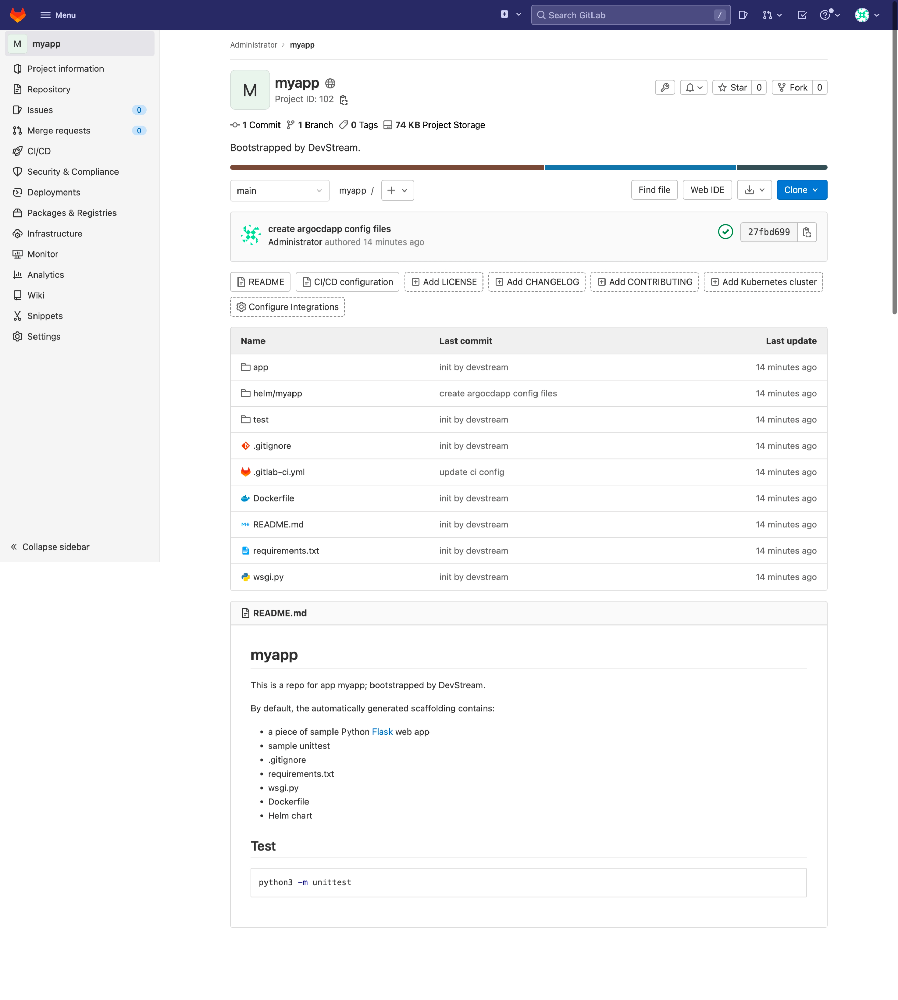
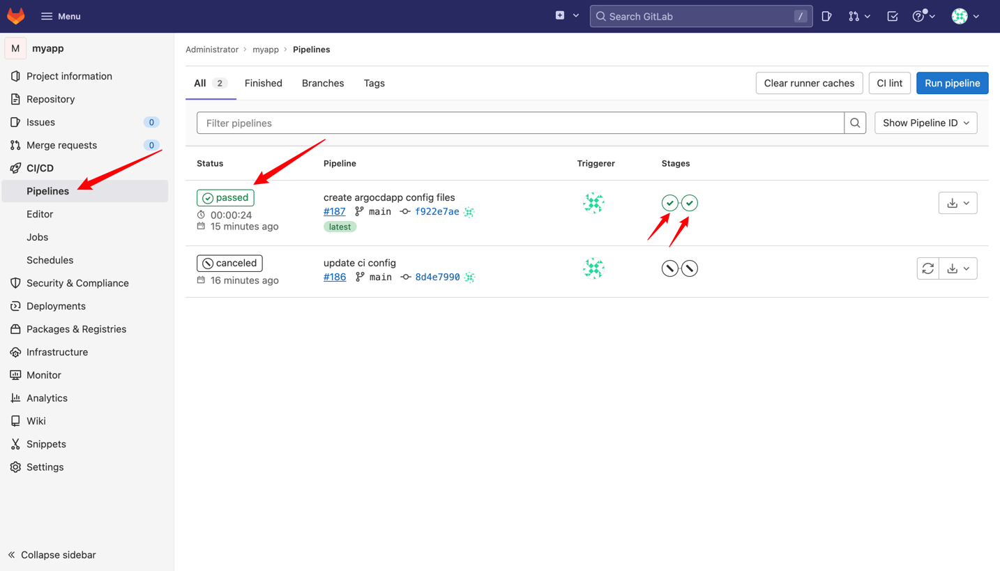

# 用 DevStream 搭建 Gitlab CI + Argo CD 工具链，管理 Python Flask 项目(GitLab + GitLab CI with DTM Apps)

## 0 目标

在本教程中，我们将尝试通过 DevStream 来实现以下目标：

1. 使用 Docker 安装 GitLab，作为代码仓库（如果你的服务器上已经安装了 GitLab，可以跳过这一步）；
2. 在 GitLab 上创建一个 Python Web 应用程序仓库，基于 [Flask](https://flask.palletsprojects.com/en/2.2.x/) 框架；
3. 使用 GitHub CI 为我们创建的仓库设置基本的 CI 流水线；
4. 在 _一个已有的 Kubernetes 集群_ 中安装 [Argo CD](https://argo-cd.readthedocs.io/en/stable/) 以实现 GitOps；
5. 创建一个 Argo CD 应用程序，用于部署第 1 步中生成的 Web 应用程序。

> 先决条件：
>
> - [Docker](https://www.docker.com/) (GitLab 使用 Docker 来安装)
> - Kubernetes 集群(Argo CD 安装在 Kubernetes 集群中)

> 如果你想跟着本教程自己尝试一下，但不知道如何在本地启动和运行 Kubernetes 集群，下面的博客（也来自 DevStream）可能会有所帮助：
>
> - [用 Kind 从零开始快速搭建本地 Kubernetes 测试环节](https://blog.devstream.io/posts/%E7%94%A8kind%E9%83%A8%E7%BD%B2k8s%E7%8E%AF%E5%A2%83/)
> - [minikube结合阿里云镜像搭建本地开发测试环境](https://blog.devstream.io/posts/%E4%BD%BF%E7%94%A8minikube%E5%92%8C%E9%98%BF%E9%87%8C%E4%BA%91%E9%95%9C%E5%83%8F%E5%AE%89%E8%A3%85k8s/)

---

## 1 概览

DevStream 将使用下面的插件来实现[第 0 节](#)中描述的目标：

1. [gitlab-ce-docker](../../plugins/gitlab-ce-docker.md)：用于在 Docker 中安装 GitLab；
2. [repo-scaffolding](../../plugins/repo-scaffolding.md): 用于在 GitLab 上创建一个 Python Web 应用程序仓库；
3. [gitlab-ci](../../plugins/gitlab-ci.md)：用于为我们创建的仓库设置基本的 CI 流水线；
4. [helm-installer](../../plugins/helm-installer/helm-installer.md): 用于在 Kubernetes 集群中安装 Argo CD；
5. [argocdapp](../../plugins/argocdapp.md): 用于创建一个 Argo CD 应用程序，来部署第 1 步中生成的 Web 应用程序。

我们将分成两个步骤来完成这些目标：

1. 编写一个配置文件，完成工具的安装，GitLab 和 Argo CD；
2. 编写一个配置文件，完成后续流水线的创建、代码仓库的创建，并将其部署到 Argo CD 中。

> 说明：实际上，DevOps 工具的安装和配置可以在同一个配置文件中完成，但 GitLab 较为特殊，需要在安装完成之后由用户手动创建 token，因此我们将工具的安装单独拆分出来了。

## 2 启程：下载 DevStream (`dtm`)

为本教程创建一个临时工作目录：

```bash
mkdir test
cd test/
```

接着，在新创建的目录下，运行下面的命令：

```shell
sh -c "$(curl -fsSL https://download.devstream.io/download.sh)
```

这个脚本会根据你的操作系统来下载对应的 `dtm` 二进制文件，保存到当前目录。然后，赋予其可执行权限。

> 可选：你可以把 `dtm` 移动到 $PATH 环境变量中的某个目录下。例如：`mv dtm /usr/local/bin/`。这样，你就可以直接运行 `dtm` 而不需要再加上 `./` 前缀了。
>
> 更多安装方式详见[安装 dtm](../../install.zh.md)。

## 2 安装 GitLab 和 Argo CD

### 2.1 配置准备

创建 `config-tools.yaml` 文件，你可以修改 `vars` 中的值来适应你的环境：

```yaml title="config-tools.yaml"
config:
  state:
    backend: local
    options:
      stateFile: devstream-1.state
vars:
  gitlabHostname: gitlab.example.com
  gitlabSSHPort: 30022
  gitlabHttpPort: 80
  gitlabHttpsPort: 30443
tools:
  - name: gitlab-ce-docker
    instanceID: default
    dependsOn: []
    options:
      hostname: [[ gitlabHostname ]]
      gitlabHome: /srv/gitlab
      sshPort: [[ gitlabSSHPort ]]
      httpPort: [[ gitlabHttpPort ]]
      httpsPort: [[ gitlabHttpsPort ]]
      rmDataAfterDelete: false
      imageTag: "rc"
  - name: helm-installer
    instanceID: argocd
```

并修改服务器的 `/etc/hosts` 文件，添加 `gitlab.example.com` 的域名解析。如果你的服务器 ip 是 44.33.22.11，就可以这样配置：

```text title="/etc/hosts"
44.33.22.11 gitlab.example.com
```

### 2.2 初始化（Init）

运行下面的命令来下载安装 GitLab 和 Argo CD 所需的插件：

```shell
dtm init -f config-tools.yaml -y
```

### 2.3 应用（Apply）

运行下面的命令来通过配置文件来安装 GitLab 和 Argo CD：

```shell
dtm apply -f config-tools.yaml -y
```

你会看到类似于下面的输出：

<script id="asciicast-wxdTxqwycg12UurbRqZpMvSym" src="https://asciinema.org/a/wxdTxqwycg12UurbRqZpMvSym.js" async autoplay=true></script>

### 2.4 检查安装结果

#### 2.4.1 访问 GitLab

你可以在自己的 PC 里配置 `44.33.22.11 gitlab.example.com` 静态域名解析记录，然后在浏览器里通过 `http://gitlab.example.com` 访问到 GitLab（如果浏览器报了：

<figure markdown>
  { width="1000" }
  <figcaption>GitLab 登录界面</figcaption>
</figure>

通过执行如下命令，你可以设置 GitLab 的 root 密码：

```shell title="get GitLab root Password"
docker exec -it gitlab bash # 进入容器
gitlab-rake "gitlab:password:reset" # 执行后按照提示输入用户名 root，回车后输入密码
```

<script id="asciicast-547097" src="https://asciinema.org/a/547097.js" async></script>

拿到 root 密码后，你可以尝试用 root/YOUR_PASSWORD 来登录 GitLab。因为后面你还需要用到 GitLab 的 token，所以这时候你可以顺手先创建一个 token：

<figure markdown>
  { width="1000" }
  <figcaption>Generate GitLab token</figcaption>
</figure>

#### 2.4.2 查看 Argo CD

可以看到 Argo CD 已经被安装到了 Kubernetes 的 `argocd` 命名空间中：

```bash
[root@ip-10-18-13-200 devstream]# kubectl get ns
NAME              STATUS   AGE
argocd            Active   36s
default           Active   6d4h
kube-node-lease   Active   6d4h
kube-public       Active   6d4h
kube-system       Active   6d4h
[root@ip-10-18-13-200 devstream]# kubectl get pods -n argocd
NAME                                                READY   STATUS    RESTARTS   AGE
argocd-application-controller-0                     1/1     Running   0          49s
argocd-applicationset-controller-7f4577c5fd-8z926   1/1     Running   0          49s
argocd-dex-server-7cdb45c7c9-nspgz                  1/1     Running   0          49s
argocd-notifications-controller-65b77fb646-phdwh    1/1     Running   0          49s
argocd-redis-577c6c8f5c-nf5xm                       1/1     Running   0          49s
argocd-repo-server-7bd9fd899c-7f6cp                 1/1     Running   0          49s
argocd-server-6686bbcf68-fms5w                      1/1     Running   0          49s
```

## 3 创建、部署应用程序

### 3.1 配置准备

创建 `config-apps.yaml` 文件，你可以修改 `vars` 中的值来适应你的环境（尤其是`dockerhubUser`这个配置)：

```yaml title="config-apps.yaml"
config:
  state:
    backend: local
    options:
      stateFile: devstream-2.state
vars:
  appName: myapp
  gitlabURL: http://gitlab.example.com
  defaultBranch: main
  dockerhubUser: DOCKERHUB_USER
apps:
  - name: [[ appName ]]
    spec:
      language: python
      framework: flask
    repo:
      url: [[ gitlabURL ]]/root/[[ appName ]].git
      branch: [[ defaultBranch ]]
      token: [[ env GITLAB_TOKEN ]] # use "GITLAB_TOKEN" env var
    repoTemplate:
      url: https://github.com/devstream-io/dtm-repo-scaffolding-python-flask.git
    ci:
    - type: template
      templateName: ci-pipeline
    cd:
    - type: argocdapp
pipelineTemplates:
  - name: ci-pipeline
    type: gitlab-ci
    options:
      runner:
        enable: true
      imageRepo:
        user: [[ dockerhubUser ]]
        password: [[ env DOCKERHUB_TOKEN ]] # use "DOCKERHUB_TOKEN" env var
```

你可能已经注意到了，上面的配置中有形如 `[[ env XXX ]]` 的内容，这表示我们引用了 "XXX" 环境变量来填充配置。所以我们还需要设置如下两个环境变量：

```bash
export GITLAB_TOKEN="YOUR_GITLAB_TOKEN_HERE"
export DOCKERHUB_TOKEN="YOUR_DOCKERHUB_TOKEN_HERE"
```

> 提示：
>
> 如果你不知道如何创建 DockerHub 的 token，可以参考：[Manage access tokens](https://docs.docker.com/docker-hub/access-tokens/)

### 3.2 初始化（Init）

同样地，我们需要下载第二个配置文件中所需的插件，运行：

```bash
dtm init -f config-apps.yaml
```

### 3.3 应用（Apply）

运行：

```bash
dtm apply -f config-apps.yaml -y
```

你会看到类似下面的输出：

<script id="asciicast-547096" src="https://asciinema.org/a/547096.js" async></script>

### 3.4 查看结果

#### 3.4.1 查看 在 GitLab 上创建的 Flask 仓库

<figure markdown>
  { width="1000" }
  <figcaption>Flask 仓库</figcaption>
</figure>

#### 3.4.2 基于 GitLab CI 的 CI 流水线

通过浏览器访问 `http://gitlab.example.com`，依次点击 `CI/CD`、`Pipelines`：

<figure markdown>
  { width="1000" }
  <figcaption>GitLab CI 概览</figcaption>
</figure>

#### 3.4.3 基于 Argo CD 的持续交付/部署

CI 流水线已经构建了一个 Docker 镜像并推送到了 Dockerhub，而 DevStream 创建的 Argo CD 应用也部署了这个应用：

```bash
[root@ip-10-18-13-200 devstream]# kubectl get deployment -n default
NAME         READY   UP-TO-DATE   AVAILABLE   AGE
myapp        1/1     1            1           101s
[root@ip-10-18-13-200 devstream]# kubectl get pods -n default
NAME                         READY   STATUS    RESTARTS   AGE
myapp-b65774f56-8cmjc        1/1     Running   0          106s
[root@ip-10-18-13-200 devstream]# kubectl get services -n default
NAME         TYPE        CLUSTER-IP       EXTERNAL-IP   PORT(S)    AGE
kubernetes   ClusterIP   10.96.0.1        <none>        443/TCP    12d
myapp        ClusterIP   10.101.148.66    <none>        8080/TCP   110s
```

我们可以通过端口转发来访问这个应用：

```bash
kubectl port-forward -n default svc/myapp 8080:8080
```

在浏览器中访问 `localhost:8080`，你可以看到应用返回了一个 "Hello, World!"。大功告成！

## 4 清理

### 4.1 删除 Web 应用

运行：

```bash
dtm delete -f config-apps.yaml -y
```

### 4.2 删除 GitLab 和 Argo CD

运行：

```bash
dtm delete -f config-tools.yaml -y
```

### 4.3 删除其他文件

```bash
cd ../
rm -rf test/
rm -rf ~/.devstream/
```
