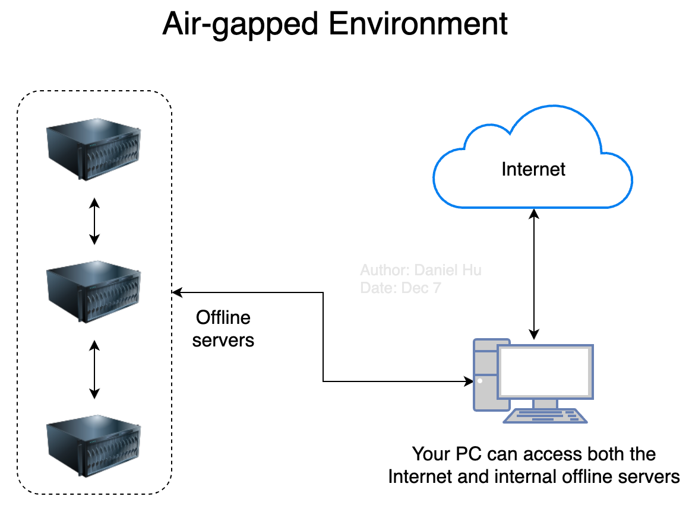

# 在离线环境使用 DevStream 搭建 GitLab + Jenkins + Harbor 工具链，管理 Java Spring Boot 项目开发生命周期全流程

在“[这个文档](./gitlab-jenkins-harbor-java-springboot.zh.md)”里我们介绍了怎样通过 DevStream 在本地部署 `GitLab + Jenkins + Harbor` 工具链，并且以 Java Spring Boot 项目为例，演示如何使用 DevStream 快速创建 Java Spring Boot 项目脚手架，同时在 Jenkins 上自动创建对应的 Pipeline 实现 Java Spring Boot 项目的 CI 流程。

本文将要演示的流水线最终效果与上面这个文档中介绍的几乎完全一致，唯一的区别就是本文假设你的服务器是离线的，你只有一台可以访问互联网的 PC，这台 PC 可以通过企业内部网络访问到你要使用 DevStream 的服务器，类似下图这样：

<figure markdown>
  { width="500" }
  <figcaption></figcaption>
</figure>

!!! info "提醒"

    关于本文最终将要搭建的流水线及其工作效果，请查看“[这个文档](./gitlab-jenkins-harbor-java-springboot.zh.md)”。

## 1、下载 dtm 和 DevStream Plugins

首先你需要下载 DevStream 的命令行（CLI）工具 `dtm` 和所需的 DevStream 插件（plugins）。

### 1.1、下载 dtm

如果你的 PC 和服务器操作系统以及 CPU 架构一致，比如都是 Linux/amd64，那么你可以直接在 PC 上运行如下命令完成 dtm 的下载：

```shell
sh -c "$(curl -fsSL https://download.devstream.io/download.sh)"
```

如果使用的 shell 不是 bash，可能会执行上述命令失败，这时候你也可以选择直接用 curl 下载 dtm。这时候你需要先访问 DevStream 的 [Release](https://github.com/devstream-io/devstream/releases/) 页面找到当前最新版本 `dtm`，然后找到和你的服务器匹配的版本。当前 `dtm` 提供了多个版本，分别是：

1. Darwin/arm64
2. Darwin/amd64
3. Linux/amd64

这时候，相信你可以很容易拼接出类似下面这个命令：

```shell
curl -o dtm https://download.devstream.io/v0.10.2/dtm-linux-amd64
```

注意：这里的版本、系统类型、CPU 架构等信息需要灵活调整。

等 dtm 下载到你的 PC 后，你需要通过内网将其传输到某一台内部服务器上，移入包含在"$PATH"的目录里并赋予其可执行权限，比如在 Linux 上你可以执行如下命令完成这些操作：

```shell
chmod +x dtm
mv dtm /usr/local/bin/
```

然后在服务器上你可以通过如下命令验证 dtm 的权限以及版本等是否正确：

```shell
$ dtm version
0.10.2
```

### 1.2、下载 plugins

继续在你的 PC 上执行如下命令来下载 DevStream plugins：

```shell
dtm init --download-only --plugins="gitlab-ce-docker, helm-installer, repo-scaffolding, jenkins-pipeline" -d=plugins
```

这条命令执行成功后，你可以在本地 plugins 目录下看到如下文件：

```shell
$ ls plugins/
gitlab-ce-docker-linux-amd64_0.10.2.md5
helm-installer-linux-amd64_0.10.2.md5
jenkins-pipeline-linux-amd64_0.10.2.md5
repo-scaffolding-linux-amd64_0.10.2.md5
gitlab-ce-docker-linux-amd64_0.10.2.so
helm-installer-linux-amd64_0.10.2.so
jenkins-pipeline-linux-amd64_0.10.2.so
repo-scaffolding-linux-amd64_0.10.2.so
```

## 2、下载镜像

因为 DevStream 需要使用容器化方式部署 GitLab、Jenkins 和 Harbor，那么在开始离线部署前，你需要先下载这几个工具对应的容器镜像。DevStream 提供了这几个工具对应的镜像列表，并且帮你准备了工具脚本从而更加容易地完成镜像离线工作：

1. [GitLab CE images](../plugins/gitlab-ce-docker/gitlab-ce-images.txt)
2. [Jenkins images](../plugins/helm-installer/jenkins/jenkins-images.txt)
3. [Harbor images](../plugins/helm-installer/harbor/harbor-images.txt)

你可以通过如下命令将镜像列表下载到本地：

```shell
curl -o jenkins-images.txt https://raw.githubusercontent.com/devstream-io/devstream/main/docs/plugins/helm-installer/jenkins/jenkins-images.txt
curl -o harbor-images.txt https://raw.githubusercontent.com/devstream-io/devstream/main/docs/plugins/helm-installer/harbor/harbor-images.txt
curl -o jenkins-images.txt https://raw.githubusercontent.com/devstream-io/devstream/main/docs/plugins/gitlab-ce-docker/gitlab-ce-images.txt
```

可以通过如下命令下载 DevStream 提供的工具脚本，这个脚本可以帮助你快速将这些镜像下载到本地并且上传到私有镜像仓库：

```shell
curl -o image-pull-push.sh https://raw.githubusercontent.com/devstream-io/devstream/main/hack/image-pull-push.sh
chmod +x image-pull-push.sh
```

如果你还没有一个私有镜像仓库，可以参考[这篇文章](./image-registry.zh.md)快速部署一个 Docker Registry。

接下来，你就可以通过下述命令快速完成镜像的下载和上传了：

```shell
# 查看工具脚本的使用方法和注意事项等
./image-pull-push.sh -h # (1)
# 设置镜像仓库地址，按需修改
export IMAGE_REPO_ADDR=registry.devstream.io
# 下载 xxx-images.txt 中所有镜像并保存到本地压缩包中
./image-pull-push.sh -f harbor-images.txt -r ${IMAGE_REPO_ADDR} -s
./image-pull-push.sh -f jenkins-images.txt -r ${IMAGE_REPO_ADDR} -s
./image-pull-push.sh -f gitlab-ce-images.txt -r ${IMAGE_REPO_ADDR} -s
# 从压缩包中 load 镜像并 push 到私有镜像仓库（如果镜像仓库需要登录，则需要先手动执行 docker login）
./image-pull-push.sh -f harbor-images.txt -r ${IMAGE_REPO_ADDR} -l -u
./image-pull-push.sh -f jenkins-images.txt -r ${IMAGE_REPO_ADDR} -l -u
./image-pull-push.sh -f gitlab-ce-images.txt -r ${IMAGE_REPO_ADDR} -l -u
```

1. 强烈建议你先看下本脚本的使用说明和示例

!!! note "注意"

    如果你下载镜像的机器和内部私有镜像仓库之间网络隔离，那么你可以在镜像下载到本地压缩包后，先将该压缩包复制到能够访问镜像仓库的机器上，然后再执行 load 和 push 等操作。

## 3、下载 Helm Chart 包

你可以通过如下命令下载 Harbor 和 Jenkins 的 Helm chart 包：

```shell
helm repo add harbor https://helm.goharbor.io
helm repo update
helm search repo harbor -l
helm pull harbor/harbor --version=1.10.0
```

```shell
helm repo add jenkins https://charts.jenkins.io
helm repo update
helm search repo jenkins -l
helm pull jenkins/jenkins --version=4.2.5
```

执行完上述命令后，你可以在本地看到如下文件：

```shell
$ ls
harbor-1.10.0.tgz jenkins-4.2.5.tgz
```

## 4、准备配置文件

这时候需要联网下载的各种“物料”你就准备好了。接着你可以开始编写 DevStream 的配置文件了：

```yaml title="DevStream Config"
config:
  state:
    backend: local
    options:
      stateFile: devstream.state
vars:
  imageRepo: registry.devstream.io
  gitlabHostname: gitlab.example.com
  jenkinsHostname: jenkins.example.com
  harborHostname: harbor.example.com
  harborURL: http://harbor.example.com
  jenkinsAdminUser: admin
  jenkinsAdminPassword: changeme
  gitlabSSHPort: 30022
  gitlabHttpPort: 30080
  gitlabHttpsPort: 30443

tools:
- name: gitlab-ce-docker
  instanceID: default
  dependsOn: []
  options:
    hostname: [[ gitlabHostname ]]
    gitlabHome: /srv/gitlab
    sshPort: [[ gitlabSSHPort ]]
    httpPort: [[ gitlabHttpPort ]]
    httpsPort: [[ gitlabHttpsPort ]]
    rmDataAfterDelete: false
    imageTag: "rc"
- name: helm-installer
  instanceID: jenkins-001
  dependsOn: []
  options:
    chartPath: "./jenkins-4.2.5.tgz"
    valuesYaml: |
      serviceAccount:
        create: true
        name: jenkins
      controller:
        image: [[ imageRepo ]]/devstreamdev/jenkins
        tag: 2.361.1-jdk11-dtm-0.1
        imagePullPolicy: "IfNotPresent"
        sidecars:
          configAutoReload:
            image: [[ imageRepo ]]/kiwigrid/k8s-sidecar:1.15.0
        adminUser: [[ jenkinsAdminUser ]]
        adminPassword: [[ jenkinsAdminPassword ]]
        ingress:
          enabled: true
          hostName: [[ jenkinsHostname ]]
      enableRawHtmlMarkupFormatter: true
      JCasC:
        defaultConfig: true
- name: helm-installer
  instanceID: harbor-001
  dependsOn: []
  options:
    chartPath: "./harbor-1.10.0.tgz"
    valuesYaml: |
      externalURL: [[ harborURL ]]
      expose:
        type: ingress
        tls:
          enabled: false
        ingress:
          hosts:
            core: [[ harborHostname ]]
      nginx:
        image:
          repository: [[ imageRepo ]]/goharbor/nginx-photon
          tag: v2.5.3
      portal:
        image:
          repository: [[ imageRepo ]]/goharbor/harbor-portal
          tag: v2.5.3
      core:
        image:
          repository: [[ imageRepo ]]/goharbor/harbor-core
          tag: v2.5.3
      jobservice:
        image:
          repository: [[ imageRepo ]]/goharbor/harbor-jobservice
          tag: v2.5.3
      registry:
        registry:
          image:
            repository: [[ imageRepo ]]/goharbor/registry-photon
            tag: v2.5.3
        controller:
          image:
            repository: [[ imageRepo ]]/goharbor/harbor-registryctl
            tag: v2.5.3
      chartmuseum:
          enabled: false
          image:
            repository: [[ imageRepo ]]/goharbor/chartmuseum-photon
            tag: v2.5.3
      trivy:
        enabled: false
        image:
          repository: [[ imageRepo ]]/goharbor/trivy-adapter-photon
          tag: v2.5.3
      notary:
        enabled: false
        server:
          image:
            repository: [[ imageRepo ]]/goharbor/notary-server-photon
            tag: v2.5.3
        signer:
          image:
            repository: [[ imageRepo ]]/goharbor/notary-signer-photon
            tag: v2.5.3
      database:
        internal:
          image:
            repository: [[ imageRepo ]]/goharbor/harbor-db
            tag: v2.5.3
      redis:
        internal:
          image:
            repository: [[ imageRepo ]]/goharbor/redis-photon
            tag: v2.5.3
      exporter:
        image:
          repository: [[ imageRepo ]]/goharbor/harbor-exporter
          tag: v2.5.3
      persistence:
        persistentVolumeClaim:
          registry:
            storageClass: ""
            accessMode: ReadWriteOnce
            size: 5Gi
          jobservice:
            storageClass: ""
            accessMode: ReadWriteOnce
            size: 1Gi
          database:
            storageClass: ""
            accessMode: ReadWriteOnce
            size: 1Gi
          redis:
            storageClass: ""
            accessMode: ReadWriteOnce
            size: 1Gi
```

## 5、开始部署

现在你可以通过如下命令开始部署 Jenkins 和 Harbor 了：

```shell
dtm apply -f config.yaml -y
```

剩下的步骤就联网部署没有什么区别了，你可以查看“[这个文档](./gitlab-jenkins-harbor-java-springboot.zh.md)”继续学习如何验证或清理这条工具链。
